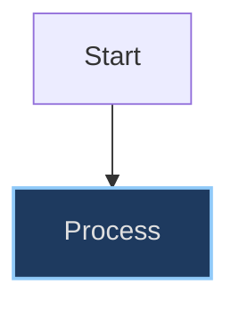
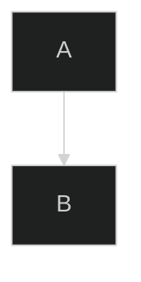

## Overview

Continuation material extracted from `mermaid-theming.md` to keep .llm files within the 300-line budget.

## Solution

## Inline Style Directives

Mermaid also supports inline `style` directives for individual nodes:



### The Problem with Hardcoded Colors

Inline style directives with hardcoded hex colors (e.g., `fill:#1e3a5f,color:#e0e0e0`) are designed for dark backgrounds. In light mode, these create:

- **Poor contrast**: Dark fill colors blend into light backgrounds
- **Illegible text**: Light text colors become invisible on light backgrounds
- **Inconsistent appearance**: Some nodes follow theme, others don't

### Recommendations

1. **Prefer no inline styles**: Let the global theme configuration handle all colors
1. **Use semantic class names** when custom styling is needed (if supported by renderer)
1. **If inline styles are unavoidable**: Document the trade-off and ensure adequate contrast in both themes

> **Note**: Unlike init directives, inline style directives cannot be automatically stripped by the mermaid-config.js script. Exercise caution when adding custom node styles.

## Validation

Check for forbidden per-diagram theme directives in ALL markdown files:

```bash
# Find Mermaid theme directives in ALL markdown files
grep -rn --include='*.md' "%%{init.*theme" .
```

A successful validation produces no output. If any matches appear (showing filename, line number, and the offending directive), remove the `%%{init: {'theme': '...'}}%%` line from each matching diagram.

### Additional validation for README.md

```bash
# Specifically check README.md
grep -n "%%{init" README.md
```

## The mermaid-config.js Script

The script in `docs/javascripts/mermaid-config.js` provides:

### Light Theme Colors

Semantic colors optimized for white/light backgrounds:

- **Primary**: Blue (`#e3f2fd` background, `#1565c0` text)
- **Secondary**: Green (`#e8f5e9` background, `#2e7d32` text)
- **Tertiary**: Orange (`#fff3e0` background, `#c43e00` text)
- **Quaternary**: Red (`#ffebee` background, `#b71c1c` text)
- **Quinary**: Purple (`#f3e5f5` background, `#4a148c` text)

### Dark Theme Colors

Semantic colors optimized for dark backgrounds:

- **Primary**: Blue (`#1e3a5f` background, `#90caf9` text)
- **Secondary**: Green (`#1b3d2e` background, `#81c784` text)
- **Tertiary**: Orange (`#3d2e1a` background, `#ffb74d` text)
- **Quaternary**: Red (`#3d1a1a` background, `#ef9a9a` text)
- **Quinary**: Purple (`#2d1f3d` background, `#ce93d8` text)

### Theme Detection

The script detects the current theme by checking the `data-md-color-scheme` attribute on the body element:

```javascript
function isDarkTheme() {
  const scheme = document.body.getAttribute("data-md-color-scheme");
  return scheme === "slate";
}
```

### Init Directive Stripping

As a safety net, the script strips per-diagram init directives before rendering:

```javascript
// Matches %%{init:...}%% directives (gims: global, case-insensitive, multiline, dotAll)
// Uses [ \t]* for spaces/tabs only (not \s* which includes newlines) to preserve line separation
const INIT_DIRECTIVE_PATTERN = /^[ \t]*%%\{init:.*?\}%%[ \t]*\r?\n?/gims;

function stripInitDirectives(source) {
  return source.replace(INIT_DIRECTIVE_PATTERN, "");
}
```

The regex uses four flags: `g` (global) replaces all occurrences, `i` (case-insensitive) matches regardless of case, `m` (multiline) makes `^` match the start of each line, and `s` (dotAll) allows `.*?` to match newlines in multi-line directives. We use `[ \t]*` instead of `\s*` around the directive to avoid consuming newlines, which would concatenate adjacent diagram lines and break Mermaid syntax. The optional `\r?\n?` at the end consumes just the line ending of the directive line itself.

## Common Mistakes

### Using Init Directives in docs/

````markdown
<!-- ❌ WRONG: This bypasses theme switching -->


````

The `%%{init: {'theme': 'dark'}}%%` directive overrides the automatic theme detection. Remove this line entirely to allow the mermaid-config.js script to handle theming dynamically.

### Forgetting to Check After Adding Diagrams

After adding new Mermaid diagrams, always run the validation command to ensure no init directives were accidentally included.

## See Also

- [Markdown Compatibility Guidelines](markdown-compatibility.md) - Full list of forbidden MkDocs-specific syntax
- [Documentation Style Guide](documentation-style-guide.md) - General documentation standards and formatting conventions

## References

- [Mermaid Theming Documentation](https://mermaid.js.org/config/theming.html)
- [MkDocs Material Theme Switching](https://squidfunk.github.io/mkdocs-material/setup/changing-the-colors/)

## Changelog

| Version | Date       | Changes                                                                  |
| ------- | ---------- | ------------------------------------------------------------------------ |
| 1.1.0   | 2026-01-29 | Added critical guidance against hardcoded themes; updated README.md rule |
| 1.0.0   | 2026-01-29 | Extracted from markdown-compatibility.md                                 |

## Related Links

- [Mermaid Diagram Theming](./mermaid-theming.md)
