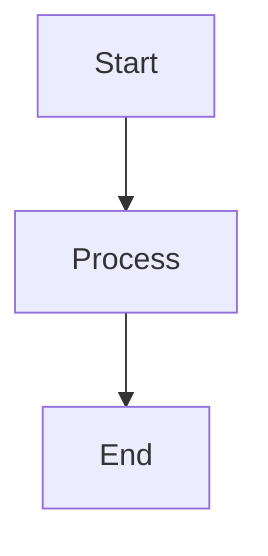
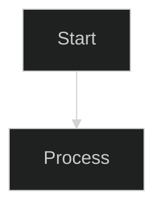
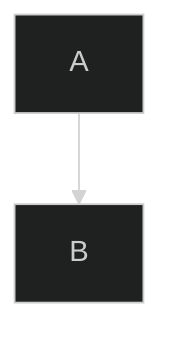
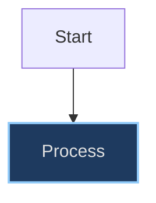

# Mermaid Diagram Theming

> **One-line summary**: Never use `%%{init: {'theme': '...'}}%%` directives in any markdown file; let renderers (GitHub, VS Code, MkDocs) automatically detect user theme preferences.

## Overview

This project uses Mermaid diagrams for visualizing architecture and message flows. Theming must be handled correctly to support both light and dark modes in MkDocs Material.

## Critical: Never Hardcode Dark Themes

> **⚠️ NEVER use `%%{init: {'theme': 'dark'}}%%` in ANY markdown file** - not in `docs/`, not in `README.md`, nowhere.

### Why This Matters

GitHub and VS Code now respect `prefers-color-scheme` automatically for Mermaid diagrams. Hardcoding `'theme': 'dark'` causes these problems:

1. **Breaks light-mode users**: Users with light theme preferences see dark-themed diagrams with poor contrast
1. **Ignores user preferences**: Modern renderers detect system/browser theme automatically
1. **Creates inconsistency**: Some diagrams follow user theme, others don't
1. **Reduces accessibility**: Low contrast combinations harm users with visual impairments

### The Solution

**Omit init directives entirely.** Let the renderer (GitHub, VS Code, MkDocs) choose the appropriate theme based on user preferences.

````markdown
<!-- ✅ CORRECT: No init directive -->


````

````markdown
<!-- ❌ FORBIDDEN: Hardcoded dark theme -->


````

## The Problem

Mermaid supports per-diagram theme configuration via init directives:



While this works for static rendering (GitHub, VS Code), it creates a critical issue in MkDocs Material:

1. **MkDocs Material has dynamic theme switching** - Users can toggle between light and dark modes
1. **Per-diagram directives override global configuration** - The `mermaid-config.js` script manages theme switching, but init directives bypass it completely
1. **Result**: Diagrams with hardcoded `'theme': 'dark'` render incorrectly in light mode (poor contrast, unreadable text)

## docs/ Files vs README.md

The same rule applies to ALL markdown files: **omit init directives entirely**.

| Location    | Viewer          | Theming Approach                                               |
| ----------- | --------------- | -------------------------------------------------------------- |
| `docs/`     | MkDocs Material | **No per-diagram directives** - use global `mermaid-config.js` |
| `README.md` | GitHub/VS Code  | **No per-diagram directives** - rely on automatic theming      |
| Any `.md`   | Any renderer    | **No per-diagram directives** - let renderer choose theme      |

### Why automatic theming is preferred everywhere

- **MkDocs Material** dynamically loads `mermaid-config.js` which detects theme changes and re-renders diagrams with appropriate colors. Per-diagram directives interfere with this.
- **GitHub** automatically respects `prefers-color-scheme` and renders diagrams in the user's preferred theme. Hardcoded themes override this.
- **VS Code** preview respects the editor's color theme. Hardcoded dark themes look poor in light-themed editors.

## How Global Theming Works

The `docs/javascripts/mermaid-config.js` script:

1. Detects the current MkDocs Material theme (`data-md-color-scheme` attribute)
1. Initializes Mermaid with semantic color variables for light or dark mode
1. Observes theme changes and re-renders all diagrams
1. **Strips any `%%{init:...}%%` directives** from diagram source before rendering (as a safety net)

This ensures diagrams always match the user's preferred theme.

## Solution

### ✅ Correct: docs/ Files (MkDocs)

````markdown

````

No init directive needed. The global configuration handles theming automatically.

### ✅ Correct: README.md (GitHub/VS Code)

````markdown

````

No init directive needed. GitHub and VS Code automatically detect user theme preferences.

### ❌ Forbidden: Any File with Hardcoded Theme Directive

````markdown

````

This bypasses automatic theme detection and causes poor rendering for users with different theme preferences. Never use `'theme': 'dark'`, `'theme': 'forest'`, or any hardcoded theme value.

## Inline Style Directives

Mermaid also supports inline `style` directives for individual nodes:



### The Problem with Hardcoded Colors

Inline style directives with hardcoded hex colors (e.g., `fill:#1e3a5f,color:#e0e0e0`) are designed for dark backgrounds. In light mode, these create:

- **Poor contrast**: Dark fill colors blend into light backgrounds
- **Illegible text**: Light text colors become invisible on light backgrounds
- **Inconsistent appearance**: Some nodes follow theme, others don't

### Recommendations

1. **Prefer no inline styles**: Let the global theme configuration handle all colors
1. **Use semantic class names** when custom styling is needed (if supported by renderer)
1. **If inline styles are unavoidable**: Document the trade-off and ensure adequate contrast in both themes

> **Note**: Unlike init directives, inline style directives cannot be automatically stripped by the mermaid-config.js script. Exercise caution when adding custom node styles.

## Validation

Check for forbidden per-diagram theme directives in ALL markdown files:

```bash
# Find Mermaid theme directives in ALL markdown files
grep -rn --include='*.md' "%%{init.*theme" .
```

A successful validation produces no output. If any matches appear (showing filename, line number, and the offending directive), remove the `%%{init: {'theme': '...'}}%%` line from each matching diagram.

### Additional validation for README.md

```bash
# Specifically check README.md
grep -n "%%{init" README.md
```

## The mermaid-config.js Script

The script in `docs/javascripts/mermaid-config.js` provides:

### Light Theme Colors

Semantic colors optimized for white/light backgrounds:

- **Primary**: Blue (`#e3f2fd` background, `#1565c0` text)
- **Secondary**: Green (`#e8f5e9` background, `#2e7d32` text)
- **Tertiary**: Orange (`#fff3e0` background, `#c43e00` text)
- **Quaternary**: Red (`#ffebee` background, `#b71c1c` text)
- **Quinary**: Purple (`#f3e5f5` background, `#4a148c` text)

### Dark Theme Colors

Semantic colors optimized for dark backgrounds:

- **Primary**: Blue (`#1e3a5f` background, `#90caf9` text)
- **Secondary**: Green (`#1b3d2e` background, `#81c784` text)
- **Tertiary**: Orange (`#3d2e1a` background, `#ffb74d` text)
- **Quaternary**: Red (`#3d1a1a` background, `#ef9a9a` text)
- **Quinary**: Purple (`#2d1f3d` background, `#ce93d8` text)

### Theme Detection

The script detects the current theme by checking the `data-md-color-scheme` attribute on the body element:

```javascript
function isDarkTheme() {
  const scheme = document.body.getAttribute("data-md-color-scheme");
  return scheme === "slate";
}
```

### Init Directive Stripping

As a safety net, the script strips per-diagram init directives before rendering:

```javascript
// Matches single-line and multi-line %%{init:...}%% directives
const INIT_DIRECTIVE_PATTERN = /^\s*%%\{init:.*?\}%%\s*/gims;

function stripInitDirectives(source) {
  return source.replace(INIT_DIRECTIVE_PATTERN, "");
}
```

The `s` flag enables dotAll mode, allowing `.*?` to match newlines in multi-line directives.

## Common Mistakes

### Using Init Directives in docs/

````markdown
<!-- ❌ WRONG: This bypasses theme switching -->


````

The `%%{init: {'theme': 'dark'}}%%` directive overrides the automatic theme detection. Remove this line entirely to allow the mermaid-config.js script to handle theming dynamically.

### Forgetting to Check After Adding Diagrams

After adding new Mermaid diagrams, always run the validation command to ensure no init directives were accidentally included.

## See Also

- [Markdown Compatibility Guidelines](markdown-compatibility.md) - Full list of forbidden MkDocs-specific syntax
- [Documentation Style Guide](documentation-style-guide.md) - General documentation standards and formatting conventions

## References

- [Mermaid Theming Documentation](https://mermaid.js.org/config/theming.html)
- [MkDocs Material Theme Switching](https://squidfunk.github.io/mkdocs-material/setup/changing-the-colors/)

## Changelog

| Version | Date       | Changes                                                                  |
| ------- | ---------- | ------------------------------------------------------------------------ |
| 1.1.0   | 2026-01-29 | Added critical guidance against hardcoded themes; updated README.md rule |
| 1.0.0   | 2026-01-29 | Extracted from markdown-compatibility.md                                 |
