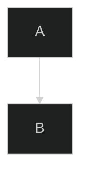
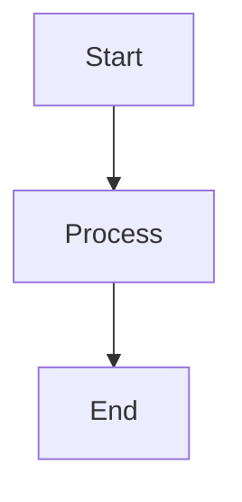
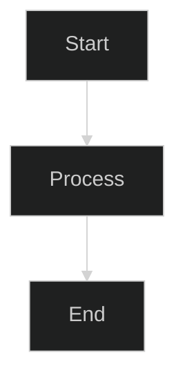
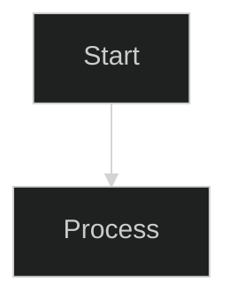

# Mermaid Diagram Theming

> **One-line summary**: Do not use `%%{init: {'theme': '...'}}%%` directives in docs/ files; use the global `mermaid-config.js` for theme-aware rendering.

## Overview

This project uses Mermaid diagrams for visualizing architecture and message flows. Theming must be handled correctly to support both light and dark modes in MkDocs Material.

## The Problem

Mermaid supports per-diagram theme configuration via init directives:



While this works for static rendering (GitHub, VS Code), it creates a critical issue in MkDocs Material:

1. **MkDocs Material has dynamic theme switching** - Users can toggle between light and dark modes
1. **Per-diagram directives override global configuration** - The `mermaid-config.js` script manages theme switching, but init directives bypass it completely
1. **Result**: Diagrams with hardcoded `'theme': 'dark'` render incorrectly in light mode (poor contrast, unreadable text)

## docs/ Files vs README.md

Different rules apply depending on where the markdown file will be rendered:

| Location    | Viewer          | Theming Approach                                               |
| ----------- | --------------- | -------------------------------------------------------------- |
| `docs/`     | MkDocs Material | **No per-diagram directives** - use global `mermaid-config.js` |
| `README.md` | GitHub/VS Code  | Per-diagram directives are acceptable (optional)               |

### Why the difference?

- **MkDocs Material** dynamically loads `mermaid-config.js` which detects theme changes and re-renders diagrams with appropriate colors. Per-diagram directives interfere with this.
- **GitHub/VS Code** render diagrams statically with no theme switching, so per-diagram directives provide consistent appearance.

## How Global Theming Works

The `docs/javascripts/mermaid-config.js` script:

1. Detects the current MkDocs Material theme (`data-md-color-scheme` attribute)
1. Initializes Mermaid with semantic color variables for light or dark mode
1. Observes theme changes and re-renders all diagrams
1. **Strips any `%%{init:...}%%` directives** from diagram source before rendering (as a safety net)

This ensures diagrams always match the user's preferred theme.

## Solution

### ✅ Correct: docs/ Files (MkDocs)

````markdown

````

No init directive needed. The global configuration handles theming automatically.

### ✅ Correct: README.md (GitHub/VS Code)

````markdown

````

Per-diagram directive is acceptable for static rendering contexts.

### ❌ Forbidden: docs/ Files with Theme Directive

````markdown

````

This bypasses theme switching and causes poor rendering in light mode.

## Validation

Check for forbidden per-diagram theme directives in docs/:

```bash
# Find Mermaid theme directives in docs/ markdown files
grep -rn --include='*.md' "%%{init.*theme" docs/
```

A successful validation produces no output. If any matches appear (showing filename, line number, and the offending directive), remove the `%%{init: {'theme': '...'}}%%` line from each matching diagram.

## The mermaid-config.js Script

The script in `docs/javascripts/mermaid-config.js` provides:

### Light Theme Colors

Semantic colors optimized for white/light backgrounds:

- **Primary**: Blue (`#e3f2fd` background, `#1565c0` text)
- **Secondary**: Green (`#e8f5e9` background, `#2e7d32` text)
- **Tertiary**: Orange (`#fff3e0` background, `#c43e00` text)
- **Quaternary**: Red (`#ffebee` background, `#b71c1c` text)
- **Quinary**: Purple (`#f3e5f5` background, `#4a148c` text)

### Dark Theme Colors

Semantic colors optimized for dark backgrounds:

- **Primary**: Blue (`#1e3a5f` background, `#90caf9` text)
- **Secondary**: Green (`#1b3d2e` background, `#81c784` text)
- **Tertiary**: Orange (`#3d2e1a` background, `#ffb74d` text)
- **Quaternary**: Red (`#3d1a1a` background, `#ef9a9a` text)
- **Quinary**: Purple (`#2d1f3d` background, `#ce93d8` text)

### Theme Detection

The script detects the current theme by checking the `data-md-color-scheme` attribute on the body element:

```javascript
function isDarkTheme() {
  const scheme = document.body.getAttribute("data-md-color-scheme");
  return scheme === "slate";
}
```

### Init Directive Stripping

As a safety net, the script strips per-diagram init directives before rendering:

```javascript
// Matches single-line and multi-line %%{init:...}%% directives
const INIT_DIRECTIVE_PATTERN = /^\s*%%\{init:.*?\}%%\s*/gims;

function stripInitDirectives(source) {
  return source.replace(INIT_DIRECTIVE_PATTERN, "");
}
```

The `s` flag enables dotAll mode, allowing `.*?` to match newlines in multi-line directives.

## Common Mistakes

### Using Init Directives in docs/

````markdown
<!-- ❌ WRONG: This bypasses theme switching -->


````

The `%%{init: {'theme': 'dark'}}%%` directive overrides the automatic theme detection. Remove this line entirely to allow the mermaid-config.js script to handle theming dynamically.

### Forgetting to Check After Adding Diagrams

After adding new Mermaid diagrams, always run the validation command to ensure no init directives were accidentally included.

## See Also

- [Markdown Compatibility Guidelines](markdown-compatibility.md) - Full list of forbidden MkDocs-specific syntax
- [Documentation Style Guide](documentation-style-guide.md)

## References

- [Mermaid Theming Documentation](https://mermaid.js.org/config/theming.html)
- [MkDocs Material Theme Switching](https://squidfunk.github.io/mkdocs-material/setup/changing-the-colors/)

## Changelog

| Version | Date       | Changes                                  |
| ------- | ---------- | ---------------------------------------- |
| 1.0.0   | 2026-01-29 | Extracted from markdown-compatibility.md |
