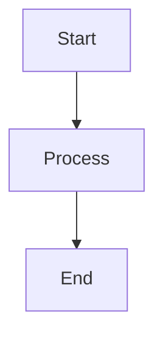
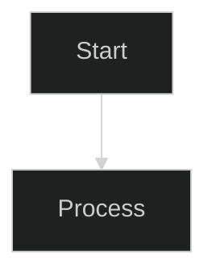
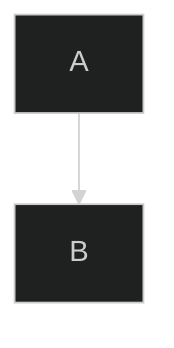

# Mermaid Diagram Theming

> **One-line summary**: Never use `%%{init: {'theme': '...'}}%%` directives in any markdown file; let renderers (GitHub, VS Code, MkDocs) automatically detect user theme preferences.

## Overview

This project uses Mermaid diagrams for visualizing architecture and message flows. Theming must be handled correctly to support both light and dark modes in MkDocs Material.

## Critical: Never Hardcode Dark Themes

> **⚠️ NEVER use `%%{init: {'theme': 'dark'}}%%` in ANY markdown file** - not in `docs/`, not in `README.md`, nowhere.

### Why This Matters

GitHub and VS Code now respect `prefers-color-scheme` automatically for Mermaid diagrams. Hardcoding `'theme': 'dark'` causes these problems:

1. **Breaks light-mode users**: Users with light theme preferences see dark-themed diagrams with poor contrast
1. **Ignores user preferences**: Modern renderers detect system/browser theme automatically
1. **Creates inconsistency**: Some diagrams follow user theme, others don't
1. **Reduces accessibility**: Low contrast combinations harm users with visual impairments

### The Solution

**Omit init directives entirely.** Let the renderer (GitHub, VS Code, MkDocs) choose the appropriate theme based on user preferences.

````markdown
<!-- ✅ CORRECT: No init directive -->


```mermaid
flowchart TD
    A[Start] --> B[Process]
    B --> C[End]
```
````

````markdown
<!-- ❌ FORBIDDEN: Hardcoded dark theme -->


```mermaid
%%{init: {'theme': 'dark'}}%%
flowchart TD
    A[Start] --> B[Process]
```
````

## The Problem

Mermaid supports per-diagram theme configuration via init directives:


```mermaid
%%{init: {'theme': 'dark'}}%%
flowchart TD
    A --> B
```

While this works for static rendering (GitHub, VS Code), it creates a critical issue in MkDocs Material:

1. **MkDocs Material has dynamic theme switching** - Users can toggle between light and dark modes
1. **Per-diagram directives override global configuration** - The `mermaid-config.js` script manages theme switching, but init directives bypass it completely
1. **Result**: Diagrams with hardcoded `'theme': 'dark'` render incorrectly in light mode (poor contrast, unreadable text)

## docs/ Files vs README.md

The same rule applies to ALL markdown files: **omit init directives entirely**.

| Location    | Viewer          | Theming Approach                                               |
| ----------- | --------------- | -------------------------------------------------------------- |
| `docs/`     | MkDocs Material | **No per-diagram directives** - use global `mermaid-config.js` |
| `README.md` | GitHub/VS Code  | **No per-diagram directives** - rely on automatic theming      |
| Any `.md`   | Any renderer    | **No per-diagram directives** - let renderer choose theme      |

### Why automatic theming is preferred everywhere

- **MkDocs Material** dynamically loads `mermaid-config.js` which detects theme changes and re-renders diagrams with appropriate colors. Per-diagram directives interfere with this.
- **GitHub** automatically respects `prefers-color-scheme` and renders diagrams in the user's preferred theme. Hardcoded themes override this.
- **VS Code** preview respects the editor's color theme. Hardcoded dark themes look poor in light-themed editors.

## How Global Theming Works

The `docs/javascripts/mermaid-config.js` script:

1. Detects the current MkDocs Material theme (`data-md-color-scheme` attribute)
1. Initializes Mermaid with semantic color variables for light or dark mode
1. Observes theme changes and re-renders all diagrams
1. **Strips any `%%{init:...}%%` directives** from diagram source before rendering (as a safety net)

This ensures diagrams always match the user's preferred theme.

## Solution

### ✅ Correct: docs/ Files (MkDocs)

````markdown

```mermaid
flowchart TD
    A[Start] --> B[Process]
    B --> C[End]
```
````

No init directive needed. The global configuration handles theming automatically.

### ✅ Correct: README.md (GitHub/VS Code)

````markdown

```mermaid
flowchart TD
    A[Start] --> B[Process]
    B --> C[End]
```
````

No init directive needed. GitHub and VS Code automatically detect user theme preferences.

### ❌ Forbidden: Any File with Hardcoded Theme Directive

````markdown

```mermaid
%%{init: {'theme': 'dark'}}%%
flowchart TD
    A[Start] --> B[Process]
```
````

This bypasses automatic theme detection and causes poor rendering for users with different theme preferences. Never use `'theme': 'dark'`, `'theme': 'forest'`, or any hardcoded theme value.

## See Also

- [mermaid theming part 1](./mermaid-theming-part-1.md)
