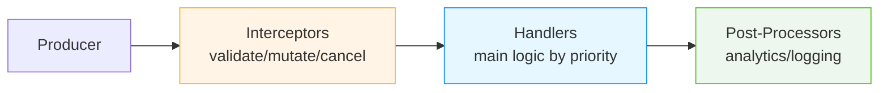

# DxMessaging Documentation Hub

**Welcome!** This is your complete guide to DxMessaging — a high-performance, type-safe messaging system for Unity.

## 🚀 New to DxMessaging?

**Never used a messaging system before?** Start here:

1. **[Visual Guide](VisualGuide.md)** 🎨 ⭐ — Beginner-friendly visual introduction (5 min)
2. **[Getting Started Guide](GettingStarted.md)** — Comprehensive guide with examples (10 min)
3. **[Quick Start](QuickStart.md)** — Your first working message (5 min)
4. **[Overview](Overview.md)** — What DxMessaging is and why it exists (5 min)

## 📚 Learning Path

### For Absolute Beginners (Never Used Messaging Before)

1. Read [Visual Guide](VisualGuide.md) (5 min) 🎨 — Pictures and analogies!
2. Read [Getting Started](GettingStarted.md) (10 min) — Complete introduction
3. Try [Quick Start](QuickStart.md) (5 min) — Hands-on tutorial
4. Understand [Message Types](MessageTypes.md) (10 min) — When to use what
5. Study [Common Patterns](Patterns.md) (15 min) — Real examples

### For Advanced Users

1. Master [Interceptors & Ordering](InterceptorsAndOrdering.md)
2. Explore [Listening Patterns](ListeningPatterns.md)
3. Deep dive into [Design & Architecture](DesignAndArchitecture.md)
4. Review [Advanced Topics](Advanced.md)

## 📖 Core Documentation

### Essentials

- **[Visual Guide](VisualGuide.md)** 🎨 — Beginner-friendly visual introduction with pictures and analogies
- **[Getting Started](GettingStarted.md)** — Complete beginner's guide with mental models
- **[Overview](Overview.md)** — What and why
- **[Quick Start](QuickStart.md)** — First message in 5 minutes
- **[Message Types](MessageTypes.md)** — When to use Untargeted/Targeted/Broadcast
- **[Comparisons](Comparisons.md)** — DxMessaging vs C# Events, UnityEvents, SendMessage

### Core Concepts

- **[Interceptors & Ordering](InterceptorsAndOrdering.md)** — Validate, transform, control execution
- **[Listening Patterns](ListeningPatterns.md)** — All the ways to receive messages
- **[Targeting & Context](TargetingAndContext.md)** — GameObject vs Component
- **[Patterns](Patterns.md)** — Real-world usage patterns

### Unity Integration

- **[Unity Integration](UnityIntegration.md)** — MessagingComponent, MessageAwareComponent
- **[Diagnostics](Diagnostics.md)** — Inspector tools, debugging, observability

### Architecture & Performance

- **[Design & Architecture](DesignAndArchitecture.md)** ⭐ — Deep dive into internals and optimizations
- **[Performance Benchmarks](Performance.md)** — OS-specific tables auto-generated by tests
- **[Advanced](Advanced.md)** — Lifecycles, safety, manual control

## 🔧 Reference

### Quick Lookups

- **[Quick Reference](QuickReference.md)** — API cheat sheet
- **[API Reference](Reference.md)** — Complete API documentation
- **[FAQ](FAQ.md)** — Common questions
- **[Troubleshooting](Troubleshooting.md)** — Solving common issues

### Tools & Utilities

- **[Helpers](Helpers.md)** — Source generators, attributes, extensions
- **[String Messages](StringMessages.md)** — Prototyping and debugging
- **[Compatibility](Compatibility.md)** — Unity versions and render pipelines
- **[Install](Install.md)** — Installation guide

## 💡 Examples & Samples

### Code Examples

- **[End-to-End Example](EndToEnd.md)** — Complete feature walkthrough
- **[Scene Transitions Example](EndToEndSceneTransitions.md)** — Scene management pattern
- **[Mini Combat Sample](Samples/MiniCombat/README.md)** — Interactive combat demo

### Real-World Patterns

From [Patterns.md](Patterns.md):
- Scene-wide events (Untargeted)
- Directed commands (Targeted)
- Observability (Broadcast)
- Validation with Interceptors
- Analytics with Post-Processors
- Local bus islands for testing

## 🎯 By Use Case

### "I want to..."

- **Decouple my systems** → Start with [Getting Started](GettingStarted.md)
- **Replace C# events** → See [Comparisons](Comparisons.md)
- **Send a command to one object** → Use [Targeted Messages](MessageTypes.md#targeted-messages)
- **Broadcast an event** → Use [Broadcast Messages](MessageTypes.md#broadcast-messages)
- **Notify globally** → Use [Untargeted Messages](MessageTypes.md#untargeted-messages)
- **Validate messages before execution** → Learn [Interceptors](InterceptorsAndOrdering.md)
- **Track all damage/events** → See [Listening Without Context](ListeningPatterns.md)
- **Debug message flow** → Use [Diagnostics](Diagnostics.md)
- **Optimize performance** → Read [Performance Tips](DesignAndArchitecture.md#performance-tuning-tips)
- **Isolate tests** → Create [Local Bus Islands](DesignAndArchitecture.md#local-bus-islands)

## 📊 Visual: Message Pipeline

Every message flows through 3 stages:

## 🎓 Learning Resources

### Must-Read Docs (In Order)

1. **[Getting Started](GettingStarted.md)** — Start here! (10 min)
2. **[Message Types](MessageTypes.md)** — Choose the right type (10 min)
3. **[Patterns](Patterns.md)** — See real examples (15 min)
4. **[Diagnostics](Diagnostics.md)** — Debug like a pro (10 min)
5. **[Design & Architecture](DesignAndArchitecture.md)** — Understand the internals (30 min)

### Feature-Specific

- **Priority & Ordering** → [Interceptors & Ordering](InterceptorsAndOrdering.md)
- **Global Observers** → [Listening Patterns](ListeningPatterns.md)
- **Unity Lifecycle** → [Unity Integration](UnityIntegration.md)
- **Performance** → [Design & Architecture](DesignAndArchitecture.md)

## 🆚 Comparison Charts

### DxMessaging vs Alternatives

From [Comparisons.md](Comparisons.md):

| Feature | DxMessaging | C# Events | UnityEvents | Static Bus |
|---------|-------------|-----------|-------------|------------|
| Decoupling | ✅ Full | ❌ Tight | ⚠️ Hidden | ✅ Yes |
| Lifecycle Safety | ✅ Auto | ❌ Manual | ⚠️ Unity | ❌ Manual |
| Execution Order | ✅ Priority | ❌ Random | ❌ Random | ❌ Random |
| Observability | ✅ Built-in | ❌ No | ❌ No | ❌ No |
| Performance | ✅ Zero-alloc | ✅ Good | ⚠️ Boxing | ✅ Good |

## 🔍 Search by Topic

### Concepts

- **Messages** → [Message Types](MessageTypes.md), [Getting Started](GettingStarted.md)
- **Handlers** → [Listening Patterns](ListeningPatterns.md), [Unity Integration](UnityIntegration.md)
- **Lifecycle** → [Advanced](Advanced.md), [Unity Integration](UnityIntegration.md)
- **Performance** → [Design & Architecture](DesignAndArchitecture.md)
- **Testing** → [Patterns](Patterns.md), [Design & Architecture](DesignAndArchitecture.md#local-bus-islands)

### Features

- **Interceptors** → [Interceptors & Ordering](InterceptorsAndOrdering.md)
- **Post-Processors** → [Interceptors & Ordering](InterceptorsAndOrdering.md)
- **Priorities** → [Interceptors & Ordering](InterceptorsAndOrdering.md)
- **Global Accept-All** → [Listening Patterns](ListeningPatterns.md)
- **Diagnostics** → [Diagnostics](Diagnostics.md)
- **Local Buses** → [Design & Architecture](DesignAndArchitecture.md)

### Components

- **MessageBus** → [Design & Architecture](DesignAndArchitecture.md#the-message-bus)
- **MessageHandler** → [API Reference](Reference.md)
- **MessageRegistrationToken** → [Unity Integration](UnityIntegration.md), [Advanced](Advanced.md)
- **MessageAwareComponent** → [Unity Integration](UnityIntegration.md), [Getting Started](GettingStarted.md)
- **MessagingComponent** → [Unity Integration](UnityIntegration.md)

## 📦 Complete Document List

### Getting Started
- [Visual Guide](VisualGuide.md) 🎨 ⭐ NEW! Perfect for beginners
- [Getting Started Guide](GettingStarted.md) ⭐
- [Overview](Overview.md)
- [Quick Start](QuickStart.md)
- [Install](Install.md)

### Core Concepts
- [Message Types](MessageTypes.md)
- [Interceptors & Ordering](InterceptorsAndOrdering.md)
- [Listening Patterns](ListeningPatterns.md)
- [Targeting & Context](TargetingAndContext.md)

### Unity
- [Unity Integration](UnityIntegration.md)
- [Diagnostics](Diagnostics.md)
- [Patterns](Patterns.md)

### Deep Dives
- [Design & Architecture](DesignAndArchitecture.md) ⭐
- [Advanced](Advanced.md)
- [Comparisons](Comparisons.md)

### Reference
- [Quick Reference](QuickReference.md)
- [API Reference](Reference.md)
- [Helpers](Helpers.md)
- [FAQ](FAQ.md)
- [Troubleshooting](Troubleshooting.md)

### Miscellaneous
- [String Messages](StringMessages.md)
- [Compatibility](Compatibility.md)
- [End-to-End Example](EndToEnd.md)
- [Scene Transitions Example](EndToEndSceneTransitions.md)
- [Mini Combat Sample](Samples/MiniCombat/README.md)

---

## 🎯 Quick Start Path

**Absolute Beginner?** Follow this 30-minute path:

1. ⏱️ 5 min: [Visual Guide](VisualGuide.md) 🎨 — Start here for pictures & analogies!
2. ⏱️ 10 min: [Getting Started](GettingStarted.md) — Deep dive
3. ⏱️ 5 min: [Quick Start](QuickStart.md) — Hands-on code
4. ⏱️ 10 min: Try a [Sample](Samples/MiniCombat/README.md) — See it in action

**Want to go deep?** Continue with:

5. ⏱️ 15 min: [Patterns](Patterns.md)
6. ⏱️ 20 min: [Interceptors & Ordering](InterceptorsAndOrdering.md)
7. ⏱️ 30 min: [Design & Architecture](DesignAndArchitecture.md)

---

**Happy messaging!** 🚀

Need help? Check [FAQ](FAQ.md) or [Troubleshooting](Troubleshooting.md).
