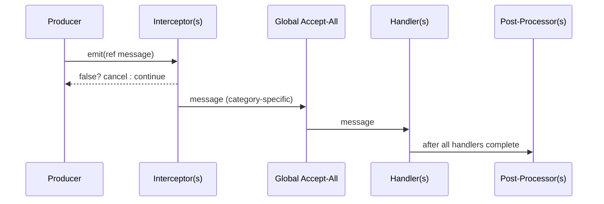

# Interceptors, Ordering, and Post‑Processing

Execution order (precise)

DxMessaging runs emissions through a fixed pipeline. This section documents the exact order used at runtime for every category. Unless otherwise noted:

- Priority: lower numbers run earlier.
- Same priority: registration order is preserved.
- Within a priority group, fast handlers (by‑ref) run before action handlers.
- Each category (Untargeted, Targeted, Broadcast) has its own pipeline.

Untargeted pipeline

1) Interceptors for `T` (ascending priority; within priority by registration order)
2) Global Accept‑All Untargeted handlers (in the MessageHandler that registered them)
3) Untargeted handlers for `T` (ascending priority; within priority by registration order)
4) Untargeted Post‑Processors for `T` (ascending priority; within priority by registration order)

Targeted pipeline

1) Interceptors for `T` (ascending priority)
2) Global Accept‑All Targeted handlers (receive `(target, ITargetedMessage)`)
3) Targeted handlers for `T` registered for the specific `target`
4) Targeted‑Without‑Targeting handlers for `T` (listen for all targets)
5) Targeted Post‑Processors for `T` registered for the specific `target`
6) Targeted‑Without‑Targeting Post‑Processors for `T` (listen for all targets)

Broadcast pipeline

1) Interceptors for `T` (ascending priority)
2) Global Accept‑All Broadcast handlers (receive `(source, IBroadcastMessage)`)
3) Broadcast handlers for `T` registered for the specific `source`
4) Broadcast‑Without‑Source handlers for `T` (listen for all sources)
5) Broadcast Post‑Processors for `T` registered for the specific `source`
6) Broadcast‑Without‑Source Post‑Processors for `T` (listen for all sources)

Notes on handler groups

- Fast vs Action: At a given priority, fast handlers (by‑ref delegates) are invoked before action handlers, and within each group the registration order is preserved.
- “Without Targeting/Source” registrations run in their own groups and do not replace the specific target/source groups.

Visual overview

```mermaid
flowchart TD
  subgraph Untargeted
    U1[Interceptors<T>] --> U2[Global Accept‑All Untargeted]
    U2 --> U3[Handlers<T>]
    U3 --> U4[Post‑Processors<T>]
  end

  subgraph Targeted
    T1[Interceptors<T>] --> T2[Global Accept‑All Targeted]
    T2 --> T3[Handlers<T> @ target]
    T3 --> T4[Handlers<T> (All Targets)]
    T4 --> T5[Post‑Processors<T> @ target]
    T5 --> T6[Post‑Processors<T> (All Targets)]
  end

  subgraph Broadcast
    B1[Interceptors<T>] --> B2[Global Accept‑All Broadcast]
    B2 --> B3[Handlers<T> @ source]
    B3 --> B4[Handlers<T> (All Sources)]
    B4 --> B5[Post‑Processors<T> @ source]
    B5 --> B6[Post‑Processors<T> (All Sources)]
  end
```

Example sequence



Interceptors

- Mutate or cancel messages before any handler runs. Return `false` to cancel.
- Define per category: `RegisterUntargetedInterceptor<T>`, `RegisterTargetedInterceptor<T>`, `RegisterBroadcastInterceptor<T>`.
- Useful for validation, normalization, enrichment, and short‑circuiting.

```csharp
using DxMessaging.Core;               // MessageHandler, InstanceId
using DxMessaging.Core.MessageBus;    // IMessageBus

// Cancel <=0 damage and clamp high values
var bus = MessageHandler.MessageBus;
_ = bus.RegisterTargetedInterceptor<TookDamage>(
    (ref InstanceId target, ref TookDamage m) =>
    {
        if (m.amount <= 0) return false;
        m = new TookDamage(Math.Min(m.amount, 999));
        return true;
    },
    priority: 0
);
```

Post‑processors

- Observe after handlers. Great for logging, analytics, or follow‑up emission.
- Per category and scope (per target/source or all):
  - Untargeted: `RegisterUntargetedPostProcessor<T>`
  - Targeted (specific): `RegisterTargetedPostProcessor<T>(target, ...)`
  - Targeted (all): `RegisterTargetedWithoutTargetingPostProcessor<T>(...)`
  - Broadcast (specific): `RegisterBroadcastPostProcessor<T>(source, ...)`
  - Broadcast (all): `RegisterBroadcastWithoutSourcePostProcessor<T>(...)`

Global Accept‑All

- Register once and observe all messages on a handler.
- Overloads exist for action and fast handlers.
- Runs between interceptors and type‑specific handlers.

Related

- [Message Types](MessageTypes.md)
- [Listening Patterns](ListeningPatterns.md)
