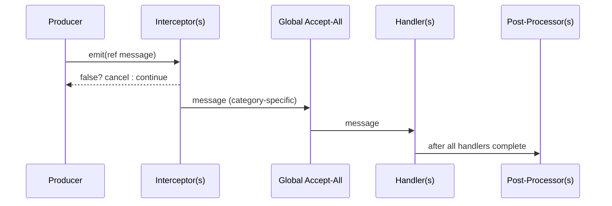

# Interceptors, Ordering, and Post‑Processing

## Snapshot Semantics: Frozen Listener Lists

**IMPORTANT:** DxMessaging uses snapshot semantics for message emissions. When a message is emitted, the system creates a snapshot of all current listeners (interceptors, handlers, and post-processors). This snapshot is "frozen" for the duration of that emission.

### What this means

- Listeners added during emission will **not** be invoked for the current message
- Newly registered listeners will only become active starting with the **next** emission
- Listeners removed during emission will still complete their execution for the current message
- This behavior applies to all registration types: handlers, interceptors, and post-processors
- This behavior applies to all message categories: Untargeted, Targeted, and Broadcast

#### Example

```csharp
// Handler adds a new listener during emission
_ = token.RegisterUntargeted<GameEvent>(msg => {
    DoWork();
    // This new listener will NOT run for this emission
    _ = token.RegisterUntargeted<GameEvent>(newMsg => ProcessLater());
});

// First emission: only the original handler runs
new GameEvent().Emit();  // DoWork() executes, ProcessLater() does NOT

// Second emission: both handlers run
new GameEvent().Emit();  // Both DoWork() and ProcessLater() execute
```

##### Why this matters

- Prevents infinite loops (a handler that registers itself won't recurse)
- Guarantees predictable execution order
- Ensures all listeners see a consistent view of the registration state
- Makes debugging and reasoning about message flow easier

This snapshot behavior is extensively tested in `MutationDuringEmissionTests.cs`.

---

Execution order (precise)

DxMessaging runs emissions through a fixed pipeline. This section documents the exact order used at runtime for every category. Unless otherwise noted:

- Priority: lower numbers run earlier.
- Same priority: registration order is preserved.
- Within a priority group, fast handlers (by‑ref) run before action handlers.
- Each category (Untargeted, Targeted, Broadcast) has its own pipeline.

Untargeted pipeline

1. Interceptors for `T` (ascending priority; within priority by registration order)
1. Global Accept‑All Untargeted handlers (in the MessageHandler that registered them)
1. Untargeted handlers for `T` (ascending priority; within priority by registration order)
1. Untargeted Post‑Processors for `T` (ascending priority; within priority by registration order)

Targeted pipeline

1. Interceptors for `T` (ascending priority)
1. Global Accept‑All Targeted handlers (receive `(target, ITargetedMessage)`)
1. Targeted handlers for `T` registered for the specific `target`
1. Targeted‑Without‑Targeting handlers for `T` (listen for all targets)
1. Targeted Post‑Processors for `T` registered for the specific `target`
1. Targeted‑Without‑Targeting Post‑Processors for `T` (listen for all targets)

Broadcast pipeline

1. Interceptors for `T` (ascending priority)
1. Global Accept‑All Broadcast handlers (receive `(source, IBroadcastMessage)`)
1. Broadcast handlers for `T` registered for the specific `source`
1. Broadcast‑Without‑Source handlers for `T` (listen for all sources)
1. Broadcast Post‑Processors for `T` registered for the specific `source`
1. Broadcast‑Without‑Source Post‑Processors for `T` (listen for all sources)

Notes on handler groups

- Fast vs Action: At a given priority, fast handlers (by‑ref delegates) are invoked before action handlers, and within each group the registration order is preserved.
- “Without Targeting/Source” registrations run in their own groups and do not replace the specific target/source groups.

Visual overview

```mermaid
flowchart TB
  subgraph Untargeted["<b>Untargeted Messages</b>"]
    direction LR
    U1["Interceptors&lt;T&gt;"] --> U2[Global Accept‑All Untargeted]
    U2 --> U3["Handlers&lt;T&gt;"]
    U3 --> U4["Post‑Processors&lt;T&gt;"]
  end

  subgraph Targeted["<b>Targeted Messages</b>"]
    direction LR
    T1["Interceptors&lt;T&gt;"] --> T2[Global Accept‑All Targeted]
    T2 --> T3["Handlers&lt;T&gt; @ target"]
    T3 --> T4["Handlers&lt;T&gt; (All Targets)"]
    T4 --> T5["Post‑Processors&lt;T&gt; @ target"]
    T5 --> T6["Post‑Processors&lt;T&gt; (All Targets)"]
  end

  subgraph Broadcast["<b>Broadcast Messages</b>"]
    direction LR
    B1["Interceptors&lt;T&gt;"] --> B2[Global Accept‑All Broadcast]
    B2 --> B3["Handlers&lt;T&gt; @ source"]
    B3 --> B4["Handlers&lt;T&gt; (All Sources)"]
    B4 --> B5["Post‑Processors&lt;T&gt; @ source"]
    B5 --> B6["Post‑Processors&lt;T&gt; (All Sources)"]
  end

  style Untargeted fill:#f0f0f0,stroke:#666,stroke-width:2px,color:#000
  style Targeted fill:#f0f0f0,stroke:#666,stroke-width:2px,color:#000
  style Broadcast fill:#f0f0f0,stroke:#666,stroke-width:2px,color:#000

  style U1 fill:#ffe7ba,stroke:#d48806,stroke-width:2px,color:#000
  style U2 fill:#d3adf7,stroke:#531dab,stroke-width:2px,color:#000
  style U3 fill:#91d5ff,stroke:#096dd9,stroke-width:2px,color:#000
  style U4 fill:#95de64,stroke:#237804,stroke-width:2px,color:#000
  style T1 fill:#ffe7ba,stroke:#d48806,stroke-width:2px,color:#000
  style T2 fill:#d3adf7,stroke:#531dab,stroke-width:2px,color:#000
  style T3 fill:#91d5ff,stroke:#096dd9,stroke-width:2px,color:#000
  style T4 fill:#91d5ff,stroke:#096dd9,stroke-width:2px,color:#000
  style T5 fill:#95de64,stroke:#237804,stroke-width:2px,color:#000
  style T6 fill:#95de64,stroke:#237804,stroke-width:2px,color:#000
  style B1 fill:#ffe7ba,stroke:#d48806,stroke-width:2px,color:#000
  style B2 fill:#d3adf7,stroke:#531dab,stroke-width:2px,color:#000
  style B3 fill:#91d5ff,stroke:#096dd9,stroke-width:2px,color:#000
  style B4 fill:#91d5ff,stroke:#096dd9,stroke-width:2px,color:#000
  style B5 fill:#95de64,stroke:#237804,stroke-width:2px,color:#000
  style B6 fill:#95de64,stroke:#237804,stroke-width:2px,color:#000
```



Example sequence



Interceptors

- Mutate or cancel messages before any handler runs. Return `false` to cancel.
- Define per category: `RegisterUntargetedInterceptor<T>`, `RegisterTargetedInterceptor<T>`, `RegisterBroadcastInterceptor<T>`.
- Useful for validation, normalization, enrichment, and short‑circuiting.

```csharp
using DxMessaging.Core;               // MessageHandler, InstanceId
using DxMessaging.Core.MessageBus;    // IMessageBus

// Cancel <=0 damage and clamp high values
var bus = MessageHandler.MessageBus;
_ = bus.RegisterTargetedInterceptor<TookDamage>(
    (ref InstanceId target, ref TookDamage m) =>
    {
        if (m.amount <= 0) return false;
        m = new TookDamage(Math.Min(m.amount, 999));
        return true;
    },
    priority: 0
);
```

Post‑processors

- Observe after handlers. Great for logging, analytics, or follow‑up emission.
- Per category and scope (per target/source or all):
  - Untargeted: `RegisterUntargetedPostProcessor<T>`
  - Targeted (specific): `RegisterTargetedPostProcessor<T>(target, ...)`
  - Targeted (all): `RegisterTargetedWithoutTargetingPostProcessor<T>(...)`
  - Broadcast (specific): `RegisterBroadcastPostProcessor<T>(source, ...)`
  - Broadcast (all): `RegisterBroadcastWithoutSourcePostProcessor<T>(...)`

Global Accept‑All

- Register once and observe all messages on a handler.
- Overloads exist for action and fast handlers.
- Runs between interceptors and type‑specific handlers.

Related

- [Message Types](MessageTypes.md)
- [Listening Patterns](ListeningPatterns.md)
