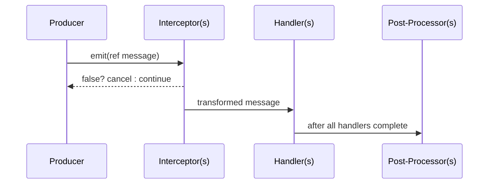

# Interceptors, Ordering, and Post‑Processing

Execution order

1) Interceptors for the specific message type (by priority, then registration order)
2) Handlers for the type (by priority, then registration order)
3) Post‑Processors for the type (by priority, then registration order)

Priority: lower numbers run earlier. Same priority resolves by registration order. This applies independently to Untargeted, Targeted, and Broadcast categories.

Interceptors

- Mutate or cancel messages before any handler runs. Return `false` to cancel.
- Define per category: `RegisterUntargetedInterceptor<T>`, `RegisterTargetedInterceptor<T>`, `RegisterBroadcastInterceptor<T>`.
- Useful for validation, normalization, enrichment, and short‑circuiting.

```csharp
using DxMessaging.Core;               // MessageHandler, InstanceId
using DxMessaging.Core.MessageBus;    // IMessageBus

// Cancel <=0 damage and clamp high values
var bus = MessageHandler.MessageBus;
_ = bus.RegisterTargetedInterceptor<TookDamage>(
    (ref InstanceId target, ref TookDamage m) =>
    {
        if (m.amount <= 0) return false;
        m = new TookDamage(Math.Min(m.amount, 999));
        return true;
    },
    priority: 0
);
```

Post‑processors

- Observe after handlers. Great for logging, analytics, or follow‑up emission.
- Per category and scope (per target/source or all):
  - Untargeted: `RegisterUntargetedPostProcessor<T>`
  - Targeted (specific): `RegisterTargetedPostProcessor<T>(target, ...)`
  - Targeted (all): `RegisterTargetedWithoutTargetingPostProcessor<T>(...)`
  - Broadcast (specific): `RegisterBroadcastPostProcessor<T>(source, ...)`
  - Broadcast (all): `RegisterBroadcastWithoutSourcePostProcessor<T>(...)`

Visual



Related

- [Message Types](Docs/MessageTypes.md)
- [Listening Patterns](Docs/ListeningPatterns.md)
