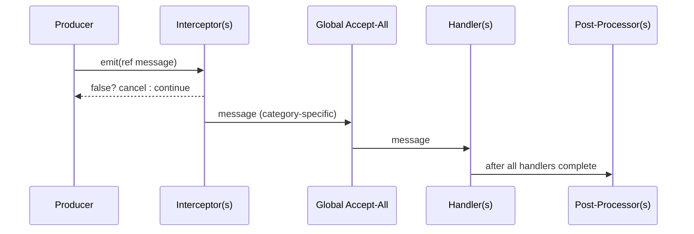

# Interceptors, Ordering, and Post‑Processing

## Snapshot Semantics: Frozen Listener Lists

**IMPORTANT:** DxMessaging uses snapshot semantics for message emissions. When a message is emitted, the system creates a snapshot of all current listeners (interceptors, handlers, and post-processors). This snapshot is "frozen" for the duration of that emission.

### What this means

- Listeners added during emission will **not** be invoked for the current message
- Newly registered listeners will only become active starting with the **next** emission
- Listeners removed during emission will still complete their execution for the current message
- This behavior applies to all registration types: handlers, interceptors, and post-processors
- This behavior applies to all message categories: Untargeted, Targeted, and Broadcast

#### Example

```csharp
// Handler adds a new listener during emission
_ = token.RegisterUntargeted<GameEvent>(msg => {
    DoWork();
    // This new listener will NOT run for this emission
    _ = token.RegisterUntargeted<GameEvent>(newMsg => ProcessLater());
});

// First emission: only the original handler runs
new GameEvent().Emit();  // DoWork() executes, ProcessLater() does NOT

// Second emission: both handlers run
new GameEvent().Emit();  // Both DoWork() and ProcessLater() execute
```

##### Why this matters

- Prevents infinite loops (a handler that registers itself won't recurse)
- Guarantees predictable execution order
- Ensures all listeners see a consistent view of the registration state
- Makes debugging and reasoning about message flow easier

This snapshot behavior is extensively tested in `MutationDuringEmissionTests.cs`.

---

Execution order (precise)

DxMessaging runs emissions through a fixed pipeline. This section documents the exact order used at runtime for every category. Unless otherwise noted:

- Priority: lower numbers run earlier.
- Same priority: registration order is preserved.
- Within a priority group, fast handlers (by‑ref) run before action handlers.
- Each category (Untargeted, Targeted, Broadcast) has its own pipeline.

Untargeted pipeline

1. Interceptors for `T` (ascending priority; within priority by registration order)
1. Global Accept‑All Untargeted handlers (in the MessageHandler that registered them)
1. Untargeted handlers for `T` (ascending priority; within priority by registration order)
1. Untargeted Post‑Processors for `T` (ascending priority; within priority by registration order)

Targeted pipeline

1. Interceptors for `T` (ascending priority)
1. Global Accept‑All Targeted handlers (receive `(target, ITargetedMessage)`)
1. Targeted handlers for `T` registered for the specific `target`
1. Targeted‑Without‑Targeting handlers for `T` (listen for all targets)
1. Targeted Post‑Processors for `T` registered for the specific `target`
1. Targeted‑Without‑Targeting Post‑Processors for `T` (listen for all targets)

Broadcast pipeline

1. Interceptors for `T` (ascending priority)
1. Global Accept‑All Broadcast handlers (receive `(source, IBroadcastMessage)`)
1. Broadcast handlers for `T` registered for the specific `source`
1. Broadcast‑Without‑Source handlers for `T` (listen for all sources)
1. Broadcast Post‑Processors for `T` registered for the specific `source`
1. Broadcast‑Without‑Source Post‑Processors for `T` (listen for all sources)

Notes on handler groups

- Fast vs Action: At a given priority, fast handlers (by‑ref delegates) are invoked before action handlers, and within each group the registration order is preserved.
- “Without Targeting/Source” registrations run in their own groups and do not replace the specific target/source groups.

Visual overview

```mermaid
flowchart LR
  subgraph Untargeted["<b>Untargeted Messages</b>"]
    direction TB
    U1["Interceptors&lt;T&gt;"] --> U2[Global Accept‑All Untargeted]
    U2 --> U3["Handlers&lt;T&gt;"]
    U3 --> U4["Post‑Processors&lt;T&gt;"]
  end

  subgraph Targeted["<b>Targeted Messages</b>"]
    direction TB
    T1["Interceptors&lt;T&gt;"] --> T2[Global Accept‑All Targeted]
    T2 --> T3["Handlers&lt;T&gt; @ target"]
    T3 --> T4["Handlers&lt;T&gt; (All Targets)"]
    T4 --> T5["Post‑Processors&lt;T&gt; @ target"]
    T5 --> T6["Post‑Processors&lt;T&gt; (All Targets)"]
  end

  subgraph Broadcast["<b>Broadcast Messages</b>"]
    direction TB
    B1["Interceptors&lt;T&gt;"] --> B2[Global Accept‑All Broadcast]
    B2 --> B3["Handlers&lt;T&gt; @ source"]
    B3 --> B4["Handlers&lt;T&gt; (All Sources)"]
    B4 --> B5["Post‑Processors&lt;T&gt; @ source"]
    B5 --> B6["Post‑Processors&lt;T&gt; (All Sources)"]
  end

  style Untargeted fill:#f0f0f0,stroke:#666,stroke-width:2px,color:#000
  style Targeted fill:#f0f0f0,stroke:#666,stroke-width:2px,color:#000
  style Broadcast fill:#f0f0f0,stroke:#666,stroke-width:2px,color:#000

  style U1 fill:#ffe7ba,stroke:#d48806,stroke-width:2px,color:#000
  style U2 fill:#d3adf7,stroke:#531dab,stroke-width:2px,color:#000
  style U3 fill:#91d5ff,stroke:#096dd9,stroke-width:2px,color:#000
  style U4 fill:#95de64,stroke:#237804,stroke-width:2px,color:#000
  style T1 fill:#ffe7ba,stroke:#d48806,stroke-width:2px,color:#000
  style T2 fill:#d3adf7,stroke:#531dab,stroke-width:2px,color:#000
  style T3 fill:#91d5ff,stroke:#096dd9,stroke-width:2px,color:#000
  style T4 fill:#91d5ff,stroke:#096dd9,stroke-width:2px,color:#000
  style T5 fill:#95de64,stroke:#237804,stroke-width:2px,color:#000
  style T6 fill:#95de64,stroke:#237804,stroke-width:2px,color:#000
  style B1 fill:#ffe7ba,stroke:#d48806,stroke-width:2px,color:#000
  style B2 fill:#d3adf7,stroke:#531dab,stroke-width:2px,color:#000
  style B3 fill:#91d5ff,stroke:#096dd9,stroke-width:2px,color:#000
  style B4 fill:#91d5ff,stroke:#096dd9,stroke-width:2px,color:#000
  style B5 fill:#95de64,stroke:#237804,stroke-width:2px,color:#000
  style B6 fill:#95de64,stroke:#237804,stroke-width:2px,color:#000
```



Example sequence



Interceptors

- Mutate or cancel messages before any handler runs. Return `false` to cancel.
- Define per category: `RegisterUntargetedInterceptor<T>`, `RegisterTargetedInterceptor<T>`, `RegisterBroadcastInterceptor<T>`.
- Useful for validation, normalization, enrichment, and short‑circuiting.

```csharp
using DxMessaging.Core;               // MessageHandler, InstanceId
using DxMessaging.Core.MessageBus;    // IMessageBus

// Cancel <=0 damage and clamp high values
var bus = MessageHandler.MessageBus;
_ = bus.RegisterTargetedInterceptor<TookDamage>(
    (ref InstanceId target, ref TookDamage m) =>
    {
        if (m.amount <= 0) return false;
        m = new TookDamage(Math.Min(m.amount, 999));
        return true;
    },
    priority: 0
);
```

Real‑World Use Cases

###### State‑Based Message Cancellation

Prevent UI messages from being processed based on current UI state:

```csharp
using DxMessaging.Core;
using DxMessaging.Core.MessageBus;

[DxUntargetedMessage]
[DxAutoConstructor]
public readonly partial struct OpenMenu
{
    public readonly string menuName;
}

[DxUntargetedMessage]
[DxAutoConstructor]
public readonly partial struct ShowDialog
{
    public readonly string dialogText;
}

public class UIStateManager
{
    private bool _isInCutscene;
    private bool _isPaused;
    private bool _isLoading;

    public void RegisterInterceptors()
    {
        var bus = MessageHandler.MessageBus;

        // Block all UI interactions during cutscenes, loading, or when paused
        _ = bus.RegisterUntargetedInterceptor<OpenMenu>(
            (ref OpenMenu m) => !_isInCutscene && !_isLoading,
            priority: -100  // Run early
        );

        _ = bus.RegisterUntargetedInterceptor<ShowDialog>(
            (ref ShowDialog m) => !_isInCutscene && !_isPaused,
            priority: -100
        );
    }

    public void EnterCutscene() => _isInCutscene = true;
    public void ExitCutscene() => _isInCutscene = false;
}

// Usage: UI messages automatically blocked during cutscenes
var uiManager = new UIStateManager();
uiManager.RegisterInterceptors();
uiManager.EnterCutscene();

new OpenMenu("inventory").Emit();  // Cancelled by interceptor
new ShowDialog("Hello!").Emit();   // Cancelled by interceptor
```

###### Value Clamping and Normalization

Ensure message data stays within valid ranges:

```csharp
using DxMessaging.Core;
using DxMessaging.Core.MessageBus;
using UnityEngine;

[DxUntargetedMessage]
[DxAutoConstructor]
public readonly partial struct MovementInput
{
    public readonly Vector2 direction;
    public readonly float speed;
}

public class InputNormalizer
{
    public void RegisterInterceptors()
    {
        var bus = MessageHandler.MessageBus;

        // Normalize and clamp movement input
        _ = bus.RegisterUntargetedInterceptor<MovementInput>(
            (ref MovementInput m) =>
            {
                // Normalize direction vector
                var normalized = m.direction.normalized;

                // Clamp speed to valid range
                var clampedSpeed = Mathf.Clamp(m.speed, 0f, 10f);

                // Mutate the message with cleaned values
                m = new MovementInput(normalized, clampedSpeed);
                return true;
            },
            priority: 0
        );
    }
}

// Usage: all movement input is automatically normalized
var normalizer = new InputNormalizer();
normalizer.RegisterInterceptors();

// Even invalid input gets cleaned
new MovementInput(new Vector2(100, 200), 9999f).Emit();
// Handlers receive: direction=(0.45, 0.89), speed=10.0
```

###### Permission and Authorization Checks

Block messages that violate game rules or permissions:

```csharp
using DxMessaging.Core;
using DxMessaging.Core.MessageBus;

[DxTargetedMessage]
[DxAutoConstructor]
public readonly partial struct SpendCurrency
{
    public readonly int amount;
}

[DxTargetedMessage]
[DxAutoConstructor]
public readonly partial struct UnlockAchievement
{
    public readonly string achievementId;
}

public class PermissionSystem
{
    private readonly IPlayerDataService _playerData;

    public PermissionSystem(IPlayerDataService playerData)
    {
        _playerData = playerData;
    }

    public void RegisterInterceptors()
    {
        var bus = MessageHandler.MessageBus;

        // Block currency spending if player doesn't have enough
        _ = bus.RegisterTargetedInterceptor<SpendCurrency>(
            (ref InstanceId playerId, ref SpendCurrency m) =>
            {
                var balance = _playerData.GetCurrencyBalance(playerId);
                if (balance < m.amount)
                {
                    Debug.LogWarning($"Player {playerId} attempted to spend {m.amount} but only has {balance}");
                    return false;  // Cancel the message
                }
                return true;
            },
            priority: -50
        );

        // Block achievement unlocks if already unlocked (idempotency)
        _ = bus.RegisterTargetedInterceptor<UnlockAchievement>(
            (ref InstanceId playerId, ref UnlockAchievement m) =>
            {
                if (_playerData.HasAchievement(playerId, m.achievementId))
                {
                    return false;  // Already unlocked, skip
                }
                return true;
            },
            priority: -50
        );
    }
}

// Usage: invalid operations automatically blocked
var permissions = new PermissionSystem(playerDataService);
permissions.RegisterInterceptors();

// This will be blocked if player doesn't have 100 currency
new SpendCurrency(100).EmitTargeted(playerId);

// This will be blocked if achievement is already unlocked
new UnlockAchievement("first_boss").EmitTargeted(playerId);
```

###### Message Enrichment and Context Addition

Add contextual data to messages as they flow through the system:

```csharp
using DxMessaging.Core;
using DxMessaging.Core.MessageBus;
using System;

[DxTargetedMessage]
[DxAutoConstructor]
public readonly partial struct PlayerAction
{
    public readonly string actionType;
    [DxOptionalParameter]
    public readonly long timestamp;  // Added by interceptor
    [DxOptionalParameter]
    public readonly string sessionId; // Added by interceptor
}

public class TelemetryEnricher
{
    private readonly string _currentSessionId;

    public TelemetryEnricher(string sessionId)
    {
        _currentSessionId = sessionId;
    }

    public void RegisterInterceptors()
    {
        var bus = MessageHandler.MessageBus;

        // Enrich player actions with timestamp and session context
        _ = bus.RegisterTargetedInterceptor<PlayerAction>(
            (ref InstanceId playerId, ref PlayerAction m) =>
            {
                // Add timestamp and session ID to every action
                m = new PlayerAction(
                    m.actionType,
                    DateTimeOffset.UtcNow.ToUnixTimeMilliseconds(),
                    _currentSessionId
                );
                return true;
            },
            priority: -100  // Run very early to enrich before other interceptors
        );
    }
}

// Usage: messages automatically enriched with context
var enricher = new TelemetryEnricher(Guid.NewGuid().ToString());
enricher.RegisterInterceptors();

// Emit without timestamp/session - interceptor adds them
new PlayerAction("jump").EmitTargeted(playerId);
// Handlers receive fully enriched message with timestamp and sessionId
```

###### Cooldown and Rate Limiting

Prevent message spam by enforcing cooldowns:

```csharp
using DxMessaging.Core;
using DxMessaging.Core.MessageBus;
using System;
using System.Collections.Generic;

[DxTargetedMessage]
[DxAutoConstructor]
public readonly partial struct CastSpell
{
    public readonly string spellName;
}

public class CooldownManager
{
    private readonly Dictionary<(InstanceId, string), DateTime> _lastCastTimes = new();
    private readonly TimeSpan _globalCooldown = TimeSpan.FromSeconds(1.5);

    public void RegisterInterceptors()
    {
        var bus = MessageHandler.MessageBus;

        _ = bus.RegisterTargetedInterceptor<CastSpell>(
            (ref InstanceId casterId, ref CastSpell m) =>
            {
                var key = (casterId, m.spellName);
                var now = DateTime.UtcNow;

                if (_lastCastTimes.TryGetValue(key, out var lastCast))
                {
                    if (now - lastCast < _globalCooldown)
                    {
                        // Still on cooldown
                        return false;
                    }
                }

                _lastCastTimes[key] = now;
                return true;
            },
            priority: -10
        );
    }
}

// Usage: rapid spell casts automatically throttled
var cooldowns = new CooldownManager();
cooldowns.RegisterInterceptors();

new CastSpell("fireball").EmitTargeted(playerId);  // ✓ Allowed
new CastSpell("fireball").EmitTargeted(playerId);  // ✗ Blocked (too soon)
// ... wait 1.5s ...
new CastSpell("fireball").EmitTargeted(playerId);  // ✓ Allowed
```

When to Use Interceptors

✅ **Good use cases:**

- Input validation and sanitization
- Value clamping and normalization
- Permission and authorization checks
- State‑based message filtering
- Rate limiting and cooldown enforcement
- Message enrichment (adding timestamps, session IDs, etc.)
- Early exit for duplicate or redundant messages
- Logging suspicious or invalid message attempts

⚠️ **Key principles:**

- **Run before handlers**: Interceptors execute before any type‑specific handlers, making them perfect for preprocessing
- **Can mutate**: Unlike post‑processors, interceptors can modify message data
- **Can cancel**: Return `false` to prevent the message from reaching handlers
- **Priority matters**: Lower priority values run first (use negative priorities for early interceptors)

❌ **Avoid for:**

- Read‑only observation (use handlers or post‑processors instead)
- Actions that should run after message processing (use post‑processors)
- Heavy computation that doesn't need to block the message

Post‑processors

- Observe after handlers. Great for logging, analytics, or follow‑up emission.
- Per category and scope (per target/source or all):
  - Untargeted: `RegisterUntargetedPostProcessor<T>`
  - Targeted (specific): `RegisterTargetedPostProcessor<T>(target, ...)`
  - Targeted (all): `RegisterTargetedWithoutTargetingPostProcessor<T>(...)`
  - Broadcast (specific): `RegisterBroadcastPostProcessor<T>(source, ...)`
  - Broadcast (all): `RegisterBroadcastWithoutSourcePostProcessor<T>(...)`

Global Accept‑All

- Register once and observe all messages on a handler.
- Overloads exist for action and fast handlers.
- Runs between interceptors and type‑specific handlers.

Related

- [Message Types](MessageTypes.md)
- [Listening Patterns](ListeningPatterns.md)
