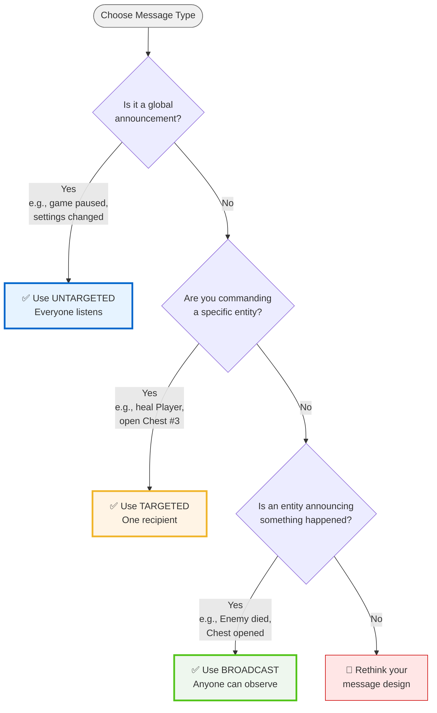

# Message Types: When and How to Use

[← Back to Index](Index.md) | [Getting Started](GettingStarted.md) | [Patterns](Patterns.md) | [Visual Guide](VisualGuide.md)

---

This guide introduces the three message categories in DxMessaging with concepts, when to use them, and practical code.

## Overview

- Untargeted: global notifications anyone can listen to (e.g., world regenerated).
- Targeted: directed at one recipient (e.g., heal Player by 10).
- Broadcast: emitted from a source for anyone to observe (e.g., Enemy took 5 damage).

### Quick Decision Guide



## Untargeted Messages

- Use for cross‑cutting notifications: settings changed, scene loaded, world regenerated.
- Any listener can subscribe; no specific sender/recipient required.
- Define as immutable structs; prefer generic interface for zero‑boxing.

```csharp
using DxMessaging.Core.Messages;
using DxMessaging.Core.Attributes;
using DxMessaging.Core.Extensions;

[DxUntargetedMessage]
[DxAutoConstructor]
public readonly partial struct SceneLoaded
{
    public readonly int buildIndex;
}

// Emit (bind struct to a variable)
var sceneLoaded = new SceneLoaded(UnityEngine.SceneManagement.SceneManager.GetActiveScene().buildIndex);
sceneLoaded.Emit();
```

## Targeted Messages

- Use for commands/events directed at one entity: Heal, EquipWeapon, OpenDoor.
- You address a specific `InstanceId` (e.g., a player GameObject/component).
- Ideal when only one recipient should act.

```csharp
using DxMessaging.Core.Messages;
using DxMessaging.Core.Attributes;
using DxMessaging.Core.Extensions;
using UnityEngine;

[DxTargetedMessage]
[DxAutoConstructor]
public readonly partial struct Heal
{
    public readonly int amount;
}

// Emit to one target (GameObject)
var heal = new Heal(10);
heal.EmitGameObjectTargeted(playerGameObject);
```

## Broadcast Messages

- Use for reactionary “facts” about a specific source: TookDamage, PickedUpItem.
- Many systems can observe and react independently.
- Distinct from targeted: the source is the sender; listeners decide if they care.

```csharp
using DxMessaging.Core.Messages;
using DxMessaging.Core.Attributes;
using DxMessaging.Core.Extensions;
using UnityEngine;

[DxBroadcastMessage]
[DxAutoConstructor]
public readonly partial struct TookDamage
{
    public readonly int amount;
}

// Emit from a source (GameObject)
var hit = new TookDamage(5);
hit.EmitGameObjectBroadcast(enemyGameObject);
```

## Organizing Messages with Nested Types

Group related messages inside a container class for better organization:

```csharp
using DxMessaging.Core.Attributes;

public partial class CombatEvents
{
    [DxTargetedMessage]
    [DxAutoConstructor]
    public readonly partial struct Heal
    {
        public readonly int amount;
        [DxOptionalParameter(false)]  // Custom default value
        public readonly bool showEffect;
    }

    [DxBroadcastMessage]
    [DxAutoConstructor]
    public readonly partial struct TookDamage
    {
        public readonly int amount;
        [DxOptionalParameter(Expression = "DamageType.Physical")]  // Enum default
        public readonly DamageType type;
    }
}

// Usage:
var heal = new CombatEvents.Heal(10, showEffect: true);
heal.EmitComponentTargeted(player);

var damage = new CombatEvents.TookDamage(5);  // Uses DamageType.Physical
damage.EmitGameObjectBroadcast(enemy);
```

### Benefits

- Reduces namespace pollution
- Makes message relationships clear
- Works with all message types (Untargeted, Targeted, Broadcast)
- Full source generator support

## Listening to everything in a category

- All targeted of a type (any target): `RegisterTargetedWithoutTargeting<T>` or post‑process with `RegisterTargetedWithoutTargetingPostProcessor<T>`.
- All broadcast of a type (any source): `RegisterBroadcastWithoutSource<T>` or post‑process with `RegisterBroadcastWithoutSourcePostProcessor<T>`.

```csharp
using DxMessaging.Core;
using DxMessaging.Core.Messages;

// Observe every Heal regardless of target
_ = token.RegisterTargetedWithoutTargeting<Heal>(OnAnyHeal);
void OnAnyHeal(ref InstanceId target, ref Heal m) => Audit(target, m);

// Observe every TookDamage regardless of source
_ = token.RegisterBroadcastWithoutSource<TookDamage>(OnAnyTookDamage);
void OnAnyTookDamage(ref InstanceId source, ref TookDamage m) => Track(source, m);
```

## Choosing the right type

- Start with Broadcast for “X happened at Y” facts others may observe.
- Use Targeted when one specific recipient must act.
- Use Untargeted for global state changes anyone might care about.

## Do's

- Keep messages small, immutable, and specific.
- Use attributes + `DxAutoConstructor` for clarity and onboarding.
- Use GameObject/Component helpers (`EmitGameObject*`/`EmitComponent*`) instead of manual `InstanceId` casts.
- Organize related messages using nested types for better structure.
- Use internal visibility for implementation-only messages.

## Don’ts

- Don’t use Untargeted for per‑entity commands; prefer Targeted.
- Don’t overload Broadcast for commands; commands need a recipient (Targeted).
- Avoid deep inheritance trees; messages should be small, flat data.
- Don’t emit from temporaries; bind structs to a variable before `Emit*`.

---

## Related Documentation

### Prerequisites

- → [Getting Started](GettingStarted.md) — Understand the basics first
- → [Visual Guide](VisualGuide.md) — See the 3 types visualized

#### Next Steps

- → [Patterns](Patterns.md) — Real-world examples of each type
- → [Listening Patterns](ListeningPatterns.md) — All the ways to receive messages
- → [Interceptors & Ordering](InterceptorsAndOrdering.md) — Control message flow

##### Try It

- → [Quick Start](QuickStart.md) — Working example
- → [Mini Combat sample](../Samples~/Mini%20Combat/README.md) — See all 3 types in action
