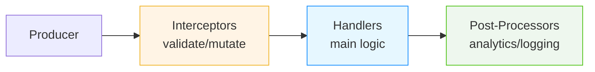

# DxMessaging for Unity — The Modern Event System

[](https://unity.com/releases/editor)<br/>
[](LICENSE.md)<br/>
[](package.json)<br/>
[](Docs/Performance.md)<br/>
[](https://github.com/wallstop/DxMessaging/actions/workflows/markdown-link-validity.yml)<br/>
[](https://github.com/wallstop/DxMessaging/actions/workflows/markdown-link-text-check.yml)

**DxMessaging is a high‑performance, type‑safe messaging system** that replaces sprawling C# events, brittle UnityEvents, and global static event buses with a clean, observable, and predictable communication pattern.

Think of it as **the event system Unity should have built-in** — one that actually scales.

## Table of Contents

- [30-Second Elevator Pitch](#30-second-elevator-pitch)
- [Quick Start (5 Minutes)](#quick-start-5-minutes)
- [Is DxMessaging Right for You?](#is-dxmessaging-right-for-you)
- [Why DxMessaging?](#why-dxmessaging)
- [Killer Features](#killer-features)
- [The DxMessaging Solution](#the-dxmessaging-solution)
- [Real-World Examples](#real-world-examples)
- [Performance](#performance)
- [Comparison Table](#comparison-table)
- [Samples](#samples)
- [Documentation](#documentation)
- [Requirements](#requirements)
- [Contributing](#contributing)
- [Links](#links)

---

## 30-Second Elevator Pitch

### If you've ever

- Forgotten to unsubscribe from an event and spent hours debugging memory leaks
- Had UI code tangled with 15 different game systems
- Wondered "which event fired when?" with no way to see message flow
- Copy-pasted event boilerplate dozens of times

#### Then DxMessaging solves your problems

- **Zero memory leaks** - automatic lifecycle management, no manual unsubscribe
- **Zero coupling** - systems communicate without knowing each other exist
- **Full visibility** - see every message in the Inspector with timestamps and payloads
- **Complete control** - priority-based ordering, validation, and interception

##### Three simple message types

1. **Untargeted** - "Everyone listen!" (pause game, settings changed)
1. **Targeted** - "Tell Player to heal" (commands to specific entities)
1. **Broadcast** - "Enemy took damage" (events others can observe)

**One line:** It's the event system Unity should have shipped with - type-safe, leak-proof, and actually debuggable. 🚀

---

## Quick Start (5 Minutes)

**New to messaging?** Start with the [Visual Guide](Docs/VisualGuide.md) (5 min) for a beginner-friendly introduction!

### 1. Install

Via Unity Package Manager → Add package from git URL:

```text
https://github.com/wallstop/DxMessaging.git
```

### 2. Define Your First Message

```csharp
using DxMessaging.Core.Attributes;

[DxTargetedMessage]
[DxAutoConstructor]  // Auto-generates constructor
public readonly partial struct OpenChest {
    public readonly int chestId;
    [DxOptionalParameter(true)]  // Optional with custom default
    public readonly bool playSound;
}
```

### 3. Listen for It

```csharp
using DxMessaging.Unity;

public class ChestController : MessageAwareComponent {
    protected override void RegisterMessageHandlers() {
        base.RegisterMessageHandlers();
        _ = Token.RegisterComponentTargeted<OpenChest>(this, OnOpen);
    }

    void OnOpen(ref OpenChest msg) {
        Debug.Log($"Opening chest {msg.chestId}");
    }
}
```

### 4. Send It

```csharp
// From anywhere:
var msg = new OpenChest(chestId: 42);
msg.EmitComponentTargeted(chestComponent);
```

**Done!** No manual unsubscribe, no leaks, full type safety.

**Stuck?** See [Troubleshooting](Docs/Troubleshooting.md) or [FAQ](Docs/FAQ.md)

---

## Is DxMessaging Right for You

### ✅ Use DxMessaging When

- **You have cross-system communication** - UI needs to react to gameplay, achievements track events, analytics observe everything
- **You're building for scale** - 10+ systems that need to communicate, or growing from prototype to production
- **Memory leaks are a concern** - You've been bitten by forgotten event unsubscribes before
- **You value observability** - Need to debug "what fired when?" or track message flow
- **Teams/long-term maintenance** - Multiple developers, or you'll maintain this code for years
- **You want decoupling** - Hate when UI classes need references to 15 different game systems

### ❌ Don't Use DxMessaging When

- **Tiny prototypes/game jams** - If your game is <1000 lines and will be done in a week, C# events are fine
- **Simple, local communication** - A single button calling a single method? Just use UnityEvents or direct references
- **Performance is THE constraint** - Building a physics engine or ECS with millions of events/frame? Raw delegates are faster
- **Team is unfamiliar** - Learning curve exists; if the team isn't on board, it won't be used correctly
- **You need synchronous return values** - DxMessaging is fire-and-forget; if you need bidirectional request/response, consider other patterns

### ⚠️ Maybe Use DxMessaging (Start Small)

- **Existing large codebase** - Migrate incrementally: start with new features, refactor old code gradually (see [Migration Guide](Docs/MigrationGuide.md))
- **Small team learning** - Try it for one system (e.g., achievements) before going all-in
- **Mid-size projects (5-20k lines)** - Evaluate after trying it for one complex interaction (e.g., combat or scene transitions)

### Decision Flow

```text
Does your project have 3+ systems that need to talk to each other?
  NO → Stick with C# events or direct references
  YES ↓

Are you okay with a small upfront learning investment?
  NO → Stick with what you know
  YES ↓

Do you need observable, decoupled, lifecycle-safe messaging?
  YES → ✅ Use DxMessaging
  NO → ❌ Keep it simple
```

**Rule of thumb:** If you're reading this README and thinking "wow, this would solve SO many problems," then DxMessaging is for you. If you're thinking "this seems complicated," start with the [Visual Guide](Docs/VisualGuide.md) or stick with simpler patterns.

**New to messaging?** Start with the [Visual Guide](Docs/VisualGuide.md) (5 min) for a beginner-friendly introduction!

Looking for hard numbers? See OS-specific [Performance Benchmarks](Docs/Performance.md).

## Why DxMessaging

### The Problems You've Probably Hit

#### Scenario 1: The Memory Leak Nightmare

You write this innocent-looking code:

```csharp
public class GameUI : MonoBehaviour {
    void OnEnable() {
        GameManager.Instance.OnScoreChanged += UpdateScore;
    }
    // Oops, forgot OnDisable... leak! 💀
}
```

Months later: "Why is our game using 2GB of RAM after an hour?"

##### Scenario 2: The Spaghetti Mess

```csharp
public class GameUI : MonoBehaviour {
    [SerializeField] private Player player;
    [SerializeField] private EnemySpawner spawner;
    [SerializeField] private InventorySystem inventory;
    [SerializeField] private QuestSystem quests;
    [SerializeField] private AudioManager audio;
    // ... 15 more SerializeFields ...

    void Awake() {
        player.OnHealthChanged += UpdateHealth;
        spawner.OnWaveStart += ShowWave;
        inventory.OnItemAdded += RefreshInventory;
        quests.OnQuestCompleted += ShowQuestNotification;
        // ... 20 more subscriptions ...
    }
}
```

**Your UI now depends on EVERYTHING.** Good luck refactoring that.

###### Scenario 3: The Debugging Black Hole

Player reports: "My health bar didn't update!"

You think: "Okay, which of the 47 events touching health failed? And in what order?"

**30 minutes later:** Still setting breakpoints everywhere...

### Common Problems

- ❌ **Memory leaks** from forgotten unsubscribes (every Unity dev's nightmare)
- ❌ **Tight coupling** making refactoring terrifying ("change one thing, break five others")
- ❌ **No execution order control** ("why does the UI update before the player takes damage?")
- ❌ **Impossible to debug** ("what fired when?" has no answer)
- ❌ **Boilerplate overload** (write 50 lines for 3 events)

### The DxMessaging Solution

#### Same scenarios, zero pain

##### Scenario 1: No More Memory Leaks

```csharp
public class GameUI : MessageAwareComponent {
    protected override void RegisterMessageHandlers() {
        base.RegisterMessageHandlers();
        _ = Token.RegisterUntargeted<ScoreChanged>(UpdateScore);
    }
    // That's it! No manual cleanup needed.
    // Token automatically handles OnEnable/OnDisable/OnDestroy
}
```

**Automatic lifecycle = impossible to leak.** 🎉

###### Scenario 2: No More Coupling

```csharp
public class GameUI : MessageAwareComponent {
    // Zero SerializeFields! Zero references!

    protected override void RegisterMessageHandlers() {
        base.RegisterMessageHandlers();
        _ = Token.RegisterUntargeted<HealthChanged>(OnHealth);
        _ = Token.RegisterUntargeted<WaveStarted>(OnWave);
        _ = Token.RegisterUntargeted<ItemAdded>(OnItem);
        // Listen to anything, from anywhere, no coupling
    }
}
```

**Your UI is now independent.** Swap systems freely without breaking anything.

###### Scenario 3: Debugging is Built In

Open any `MessageAwareComponent` in the Inspector:

```text
Message History (last 50):
[12:34:56] HealthChanged (amount: 25) → Priority: 0
[12:34:55] ItemAdded (id: 42, count: 1) → Priority: 5
[12:34:54] WaveStarted (wave: 3) → Priority: 0

Active Registrations:
✓ HealthChanged (5 handlers)
✓ ItemAdded (2 handlers)
```

**See exactly what fired, when, and who handled it.** No guesswork.

### How It Transforms Your Code

```csharp
// 1. Define messages (clean, typed, discoverable)
[DxTargetedMessage]
[DxAutoConstructor]
public readonly partial struct Heal { public readonly int amount; }

// 2. Listen (automatic lifecycle - zero leaks)
public class Player : MessageAwareComponent {
    protected override void RegisterMessageHandlers() {
        base.RegisterMessageHandlers();
        _ = Token.RegisterComponentTargeted<Heal>(this, OnHeal);
    }

    void OnHeal(ref Heal m) {
        health += m.amount;
        Debug.Log($"Healed {m.amount}!");
    }
}

// 3. Send (from anywhere - zero coupling)
var heal = new Heal(50);
heal.EmitComponentTargeted(playerComponent);
```

#### What you get

- ✅ **Zero memory leaks** - tokens clean up automatically when components are destroyed
- ✅ **Zero coupling** - no SerializeFields, no GetComponent, no direct references
- ✅ **Full visibility** - see message flow in Inspector with timestamps and payloads
- ✅ **Predictable order** - priority-based execution (no more mystery race conditions)
- ✅ **Type-safe** - compile-time guarantees, refactor with confidence
- ✅ **Intercept & validate** - enforce rules before handlers run (clamp damage, block invalid input)
- ✅ **Extension points everywhere** - interceptors, handlers, post-processors with priorities

## Killer Features

Why DxMessaging is different:

### 🚀 Performance: Zero-Allocation, Zero-Leak Design

**The problem with normal events:** Boxing allocations, GC spikes, memory leaks from forgotten unsubscribes.

#### DxMessaging solution

```csharp
void OnDamage(ref TookDamage msg) {  // Pass by ref = zero allocations
    health -= msg.amount;            // No boxing, no GC pressure
}
// Automatic cleanup = zero leaks, guaranteed
```

**Real-world impact:** A game emitting 1000 messages/second uses **zero GC** with DxMessaging vs. 40KB/sec with boxed events.

### 🎯 Three Message Types That Actually Make Sense

Most event systems force you into one pattern. DxMessaging gives you the right tool for each job:

```csharp
// Untargeted: "Everyone, listen up!" (global announcements)
[DxUntargetedMessage]
public struct GamePaused { }
// ↳ Perfect for: settings, scene transitions, global state

// Targeted: "Hey Player, do this!" (commands to specific entities)
[DxTargetedMessage]
public struct Heal { public int amount; }
// ↳ Perfect for: UI actions, direct commands, player input

// Broadcast: "I took damage!" (events others can observe)
[DxBroadcastMessage]
public struct TookDamage { public int amount; }
// ↳ Perfect for: achievements, analytics, UI updates from entities
```

**Why this matters:** You're not forcing everything through one generic "Event<T>" pattern. Each message type has clear semantics.

### 🔄 The Message Pipeline

Every message flows through 3 stages with priority control:



### 🎭 Global Observers: Listen to EVERYTHING (Unique Feature!)

**The problem with normal events:** To track all player damage, enemy damage, and NPC damage, you need 3 separate event subscriptions.

**DxMessaging's superpower:** Subscribe ONCE to a message type, receive ALL instances with source information:

```csharp
// Track ALL damage from ANY source (players, enemies, NPCs, environment)
_ = token.RegisterBroadcastWithoutSource<TookDamage>(
    (InstanceId source, TookDamage msg) => {
        Debug.Log($"{source} took {msg.amount} damage!");
        Analytics.LogDamage(source, msg.amount);
        CheckAchievements(source, msg.amount);
    }
);
```

#### Real-world use cases

- **Achievement system:** Track all kills, deaths, damage across the entire game
- **Combat log:** "Player took 25 damage, Enemy3 took 50 damage, Boss took 100 damage"
- **Analytics:** Aggregate stats from all entities without knowing about them upfront
- **Debug tools:** Watch ALL messages in the Inspector without instrumenting code

**Why this is revolutionary:** Traditional event buses require you to know entity types upfront. DxMessaging lets you observe dynamically.

### 🛡️ Interceptors: Validate Before Execution (Safety Built In)

**The problem with normal events:** Validation logic duplicated in every handler, or bugs when you forget.

**DxMessaging solution:** Validate ONCE before ANY handler runs:

```csharp
// ONE interceptor protects ALL handlers
_ = token.RegisterBroadcastInterceptor<TookDamage>(
    (ref InstanceId src, ref TookDamage msg) => {
        if (msg.amount <= 0) return false;               // Cancel invalid
        if (msg.amount > 999) {
            msg = new TookDamage(999);                   // Clamp excessive
        }
        if (IsGodModeActive(src)) return false;          // Block damage
        return true;
    },
    priority: -100  // Run FIRST
);

// Now ALL handlers receive clean, validated data
_ = token.RegisterComponentTargeted<TookDamage>(player, OnDamage);
void OnDamage(ref TookDamage msg) {
    // No validation needed - interceptor guarantees validity!
    health -= msg.amount;
}
```

#### Real-world use cases

- Clamp/normalize values (damage, healing, speeds)
- Enforce game rules ("can't heal above max health")
- Block messages during cutscenes
- Log/audit sensitive actions

### 🔍 Built-in Inspector Diagnostics (Actually Debuggable!)

**The problem with normal events:** "Which event fired? When? Who handled it? In what order?" = 🤷

**DxMessaging solution:** Click any `MessageAwareComponent` in the Inspector:

```text
┌─────────────────────────────────────────────────────┐
│ Message History (last 50)                           │
├─────────────────────────────────────────────────────┤
│ [12:34:56.123] HealthChanged                        │
│   → amount: 25                                       │
│   → priority: 0                                      │
│   → handlers: 3                                      │
│                                                      │
│ [12:34:55.987] ItemAdded                            │
│   → itemId: 42, count: 1                            │
│   → priority: 5                                      │
│   → handlers: 2                                      │
├─────────────────────────────────────────────────────┤
│ Active Registrations                                │
├─────────────────────────────────────────────────────┤
│ ✓ HealthChanged (priority: 0, called: 847 times)   │
│ ✓ ItemAdded (priority: 5, called: 23 times)        │
│ ✓ TookDamage (priority: 10, called: 1,203 times)   │
└─────────────────────────────────────────────────────┘
```

#### Real-world debugging scenarios

- "Did my message fire?" → Check history, see timestamp
- "Why didn't my handler run?" → Check registrations, see if it's active
- "What's firing too often?" → Sort by call count
- "What's the execution order?" → Sort by priority

**No more:** Setting 50 breakpoints and stepping through code for 30 minutes.

### 🏝️ Local Bus Islands for Testing (Actually Testable!)

**The problem with normal events:** Global static events contaminate tests. Mock hell. Flaky tests.

**DxMessaging solution:** Each test gets its own isolated message bus:

```csharp
[Test]
public void TestAchievementSystem() {
    // Create isolated bus - zero global state
    var testBus = new MessageBus();
    var handler = new MessageHandler(new InstanceId(1)) { active = true };
    var token = MessageRegistrationToken.Create(handler, testBus);

    // Test in isolation
    _ = token.RegisterBroadcastWithoutSource<EnemyKilled>(achievements.OnKill);

    var msg = new EnemyKilled("Boss");
    msg.EmitGameObjectBroadcast(enemy, testBus);  // Only this test sees it

    Assert.IsTrue(achievements.Unlocked("BossSlayer"));
}
// Bus destroyed, zero cleanup needed
```

#### Why this matters

- Tests don't interfere with each other
- No "arrange/act/cleanup" boilerplate
- No mocking frameworks needed
- Parallel test execution works perfectly

## Documentation

### 🎓 Learn

- **New here?** Start with [Getting Started Guide](Docs/GettingStarted.md) (10 min read)
- **Want patterns?** See [Common Patterns](Docs/Patterns.md)
- **Deep dive?** Read [Design & Architecture](Docs/DesignAndArchitecture.md)

### 📚 Core Concepts

- [Overview](Docs/Overview.md) — What and why
- [Quick Start](Docs/QuickStart.md) — First message in 5 minutes
- [Message Types](Docs/MessageTypes.md) — When to use Untargeted/Targeted/Broadcast
- [Interceptors & Ordering](Docs/InterceptorsAndOrdering.md) — Control execution flow
- [Listening Patterns](Docs/ListeningPatterns.md) — All the ways to receive messages

### 🔧 Unity Integration

- [Unity Integration](Docs/UnityIntegration.md) — MessagingComponent deep dive
- [Targeting & Context](Docs/TargetingAndContext.md) — GameObject vs Component
- [Diagnostics](Docs/Diagnostics.md) — Inspector tools and debugging

Important: Inheritance with MessageAwareComponent

- If you override lifecycle or registration hooks, call the base method.
- Use `base.RegisterMessageHandlers()` to keep default string‑message registrations.
- Use `base.OnEnable()` / `base.OnDisable()` to preserve token enable/disable.
- If you need to opt out of string demos, override `RegisterForStringMessages => false` instead of skipping the base call.
- Don’t hide Unity methods with `new` (e.g., `new void OnEnable()`); always `override` and call `base.*`.

### 🆚 Comparisons

- [Compare with Other Unity Messaging Frameworks](Docs/Comparisons.md) — In-depth comparison with UniRx, MessagePipe, Zenject Signals, C# events, UnityEvents, and more

**Quick Framework Comparison:**

| Framework          | Best For                          | Key Strength               | Learning Curve |
| ------------------ | --------------------------------- | -------------------------- | -------------- |
| **DxMessaging**    | Unity pub/sub with lifecycle mgmt | Inspector debugging        | ⭐⭐⭐         |
| **UniRx**          | Complex event stream transforms   | Reactive operators (LINQ)  | ⭐⭐           |
| **MessagePipe**    | High-performance DI messaging     | Best-in-class performance  | ⭐⭐⭐⭐       |
| **Zenject Signals**| DI-integrated messaging           | Zenject ecosystem          | ⭐⭐           |
| **C# Events**      | Simple, local communication       | Zero overhead              | ⭐⭐⭐⭐⭐     |

**Choose DxMessaging when you want:**
- Unity-first design with GameObject/Component targeting
- Automatic lifecycle management (zero memory leaks)
- Inspector debugging to see message flow
- Execution order control (priority-based)
- Message validation/interception pipeline
- No dependencies, plug-and-play setup

See [full comparison](Docs/Comparisons.md) for detailed analysis with code examples, performance benchmarks, and decision guides.

### 📖 Reference

- [Glossary](Docs/Glossary.md) — All terms explained in plain English
- [Quick Reference](Docs/QuickReference.md) — Cheat sheet
- [API Reference](Docs/Reference.md) — Complete API
- [Helpers](Docs/Helpers.md) — Source generators and utilities
- [FAQ](Docs/FAQ.md) — Common questions
- [Troubleshooting](Docs/Troubleshooting.md)

### 📦 Full Documentation

Browse all docs: [Documentation Hub](Docs/Index.md)

## Real-World Examples

### Scene Transitions

```csharp
[DxUntargetedMessage]
[DxAutoConstructor]
public readonly partial struct SceneTransition {
    public readonly string sceneName;
}

// Multiple systems react independently
public class AudioSystem : MessageAwareComponent {
    protected override void RegisterMessageHandlers() {
        base.RegisterMessageHandlers();
        _ = Token.RegisterUntargeted<SceneTransition>(OnScene, priority: 0);
    }
    void OnScene(ref SceneTransition m) => FadeOutMusic();
}

public class SaveSystem : MessageAwareComponent {
    protected override void RegisterMessageHandlers() {
        base.RegisterMessageHandlers();
        _ = Token.RegisterUntargeted<SceneTransition>(OnScene, priority: 0);
    }
    void OnScene(ref SceneTransition m) => SaveGame();
}
```

### Achievement System

```csharp
// Listen to ALL events for achievement tracking
public class AchievementTracker : MessageAwareComponent {
    protected override void RegisterMessageHandlers() {
        base.RegisterMessageHandlers();
        _ = Token.RegisterGlobalAcceptAll(
            onUntargeted: (ref IUntargetedMessage m) => Check(m),
            onTargeted: (ref InstanceId t, ref ITargetedMessage m) => Check(m),
            onBroadcast: (ref InstanceId s, ref IBroadcastMessage m) => Check(m)
        );
    }
}
```

## Performance

- **Zero GC allocations** for struct messages
- **~10ns overhead** per handler (compared to C# events)
- **Type-indexed caching** for O(1) lookups
- **Optimized for hot paths** with aggressive inlining

See [Design & Architecture](Docs/DesignAndArchitecture.md#performance-optimizations) for details.

For OS-specific benchmark tables generated by PlayMode tests, see [Performance Benchmarks](Docs/Performance.md).

## Comparison Table

### Comparison with Unity Messaging Frameworks

| Feature                | DxMessaging   | UniRx        | MessagePipe  | Zenject Signals |
| ---------------------- | ------------- | ------------ | ------------ | --------------- |
| **Decoupling**         | ✅ Full       | ✅ Full      | ✅ Full      | ✅ Full         |
| **Lifecycle Safety**   | ✅ Auto       | ⚠️ Manual    | ⚠️ Manual    | ⚠️ DI-managed   |
| **Execution Order**    | ✅ Priority   | ❌ None      | ❌ None      | ❌ None         |
| **Type Safety**        | ✅ Strong     | ✅ Strong    | ✅ Strong    | ✅ Strong       |
| **Inspector Debug**    | ✅ Built-in   | ❌ No        | ❌ No        | ❌ No           |
| **GameObject Targeting**| ✅ Yes       | ❌ No        | ❌ No        | ❌ No           |
| **Stream Operators**   | ❌ No         | ✅ Extensive | ❌ No        | ⚠️ With UniRx   |
| **Performance**        | ✅ Excellent  | ⭐⭐⭐       | ✅ Best      | ⭐⭐⭐         |
| **Dependencies**       | ✅ None       | ✅ None      | ⚠️ Package   | ❌ Zenject      |

### Comparison with Traditional Approaches

| Feature                | DxMessaging   | C# Events    | UnityEvents   | Static Event Bus |
| ---------------------- | ------------- | ------------ | ------------- | ---------------- |
| **Decoupling**         | ✅ Full       | ❌ Tight     | ⚠️ Hidden     | ✅ Yes           |
| **Lifecycle Safety**   | ✅ Auto       | ❌ Manual    | ⚠️ Unity-only | ❌ Manual        |
| **Execution Order**    | ✅ Priority   | ❌ Undefined | ❌ Undefined  | ❌ Undefined     |
| **Type Safety**        | ✅ Strong     | ✅ Strong    | ⚠️ Weak       | ⚠️ Weak          |
| **Context (Who/What)** | ✅ Rich       | ❌ None      | ❌ None       | ❌ None          |
| **Interception**       | ✅ Yes        | ❌ No        | ❌ No         | ❌ No            |
| **Observability**      | ✅ Built-in   | ❌ No        | ❌ No         | ❌ No            |
| **Performance**        | ✅ Zero-alloc | ✅ Good      | ⚠️ Boxing     | ✅ Good          |

## Samples

Import samples from Package Manager:

- **[Mini Combat](Samples~/Mini%20Combat/README.md)** — Simple combat with Heal/Damage messages
- **[UI Buttons + Inspector](Samples~/UI%20Buttons%20%2B%20Inspector/README.md)** — Interactive diagnostics demo

## Requirements

- Unity 2021.3 or later
- .NET Standard 2.1
- Works with all render pipelines (URP, HDRP, Built-in)

See [Compatibility](Docs/Compatibility.md) for details.

## Contributing

Contributions welcome! See [Contributing](CONTRIBUTING.md).

## License

MIT License - see [License](LICENSE.md)

## Credits

Created and maintained by [wallstop studios](https://wallstopstudios.com)

## Links

- 📦 [Package on GitHub](https://github.com/wallstop/DxMessaging)
- 🐛 [Report Issues](https://github.com/wallstop/DxMessaging/issues)
- 📘 [Full Documentation](Docs/Index.md)

---

**Stop fighting events. Start messaging.** 🚀
