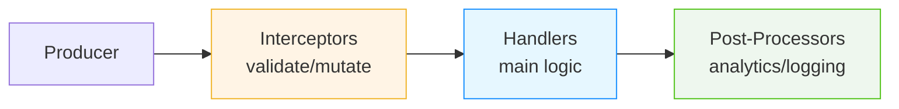

# DxMessaging for Unity — The Modern Event System

[](https://unity3d.com/get-unity/download)<br/>
[](LICENSE.md)<br/>
[](package.json)<br/>
[](Docs/Performance.md)<br/>
[](https://github.com/wallstop/DxMessaging/actions/workflows/markdown-link-validity.yml)<br/>
[](https://github.com/wallstop/DxMessaging/actions/workflows/markdown-link-text-check.yml)

**DxMessaging is a high‑performance, type‑safe messaging system** that replaces sprawling C# events, brittle UnityEvents, and global static event buses with a clean, observable, and predictable communication pattern.

Think of it as **the event system Unity should have built-in** — one that actually scales.

## 30-Second Elevator Pitch

**Problem:** In Unity, you're stuck with manual event management (memory leaks!), tight coupling (everything knows everything!), or messy global event buses (no context, no control!).

**Solution:** DxMessaging gives you three simple message types:
1. **Untargeted** - "Hey everyone!" (global events)
2. **Targeted** - "Hey YOU!" (commands to specific objects)
3. **Broadcast** - "I did something!" (events from sources)

**Result:** Zero memory leaks (automatic lifecycle), zero coupling (no references needed), full observability (see everything in Inspector), and predictable execution (priority-based ordering).

**One line:** It's like C# events, but with superpowers and no footguns. 🚀

## Is DxMessaging Right for You?

### ✅ Use DxMessaging When:

- **You have cross-system communication** - UI needs to react to gameplay, achievements track events, analytics observe everything
- **You're building for scale** - 10+ systems that need to communicate, or growing from prototype to production
- **Memory leaks are a concern** - You've been bitten by forgotten event unsubscribes before
- **You value observability** - Need to debug "what fired when?" or track message flow
- **Teams/long-term maintenance** - Multiple developers, or you'll maintain this code for years
- **You want decoupling** - Hate when UI classes need references to 15 different game systems

### ❌ Don't Use DxMessaging When:

- **Tiny prototypes/game jams** - If your game is <1000 lines and will be done in a week, C# events are fine
- **Simple, local communication** - A single button calling a single method? Just use UnityEvents or direct references
- **Performance is THE constraint** - Building a physics engine or ECS with millions of events/frame? Raw delegates are faster
- **Team is unfamiliar** - Learning curve exists; if the team isn't on board, it won't be used correctly
- **You need synchronous return values** - DxMessaging is fire-and-forget; if you need bidirectional request/response, consider other patterns

### ⚠️ Maybe Use DxMessaging (Start Small):

- **Existing large codebase** - Migrate incrementally: start with new features, refactor old code gradually (see [Migration Guide](Docs/MigrationGuide.md))
- **Small team learning** - Try it for one system (e.g., achievements) before going all-in
- **Mid-size projects (5-20k lines)** - Evaluate after trying it for one complex interaction (e.g., combat or scene transitions)

### Decision Flow:

```
Does your project have 3+ systems that need to talk to each other?
  NO → Stick with C# events or direct references
  YES ↓

Are you okay with a small upfront learning investment?
  NO → Stick with what you know
  YES ↓

Do you need observable, decoupled, lifecycle-safe messaging?
  YES → ✅ Use DxMessaging
  NO → ❌ Keep it simple
```

**Rule of thumb:** If you're reading this README and thinking "wow, this would solve SO many problems," then DxMessaging is for you. If you're thinking "this seems complicated," start with the [Visual Guide](Docs/VisualGuide.md) or stick with simpler patterns.

**New to messaging?** Start with the [Visual Guide](Docs/VisualGuide.md) (5 min) for a beginner-friendly introduction!

Looking for hard numbers? See OS-specific [Performance Benchmarks](Docs/Performance.md).

## Why DxMessaging?

### The Problem You Know

```csharp
// C# Events: Manual lifecycle hell
public class GameUI : MonoBehaviour {
    [SerializeField] private Player player;
    [SerializeField] private EnemySpawner spawner;

    void Awake() {
        player.OnHealthChanged += UpdateHealth;
        spawner.OnWaveStart += ShowWave;
    }

    void OnDestroy() {
        // Easy to forget = memory leaks
        player.OnHealthChanged -= UpdateHealth;
        spawner.OnWaveStart -= ShowWave;
    }
}
```

Problems:
- ❌ Manual subscribe/unsubscribe (memory leaks waiting to happen)
- ❌ Tight coupling (UI needs references to every system)
- ❌ No execution order control
- ❌ Impossible to debug ("which event fired when?")

### The DxMessaging Solution

```csharp
using DxMessaging.Core.Attributes;
using DxMessaging.Core.Extensions;
using DxMessaging.Unity;

// 1. Define messages (clean, typed, immutable)
[DxTargetedMessage]
[DxAutoConstructor]
public readonly partial struct Heal { public readonly int amount; }

// 2. Listen (automatic lifecycle - zero leaks)
public class GameUI : MessageAwareComponent {
    protected override void RegisterMessageHandlers() {
        base.RegisterMessageHandlers();
        _ = Token.RegisterComponentTargeted<Heal>(this, OnHeal);
    }

    void OnHeal(ref Heal m) => UpdateHealthBar(m.amount);
}

// 3. Send (discoverable, type-safe)
var heal = new Heal(10);
heal.EmitGameObjectTargeted(gameObject);
```

Benefits:
- ✅ **Zero memory leaks** - automatic lifecycle via tokens
- ✅ **Full decoupling** - no direct references needed
- ✅ **Predictable order** - priority-based execution
- ✅ **Type-safe** - compile-time guarantees
- ✅ **Observable** - built-in Inspector diagnostics
- ✅ **Intercept & validate** - enforce rules before handlers run

## Killer Features

### 🚀 Performance: Zero-Allocation Design
Messages are `readonly struct` types passed by `ref` — no boxing, no GC pressure.

```csharp
void OnDamage(ref TookDamage msg) {  // No allocations!
    health -= msg.amount;
}
```

### 🎯 Three Message Types That Make Sense

```csharp
// Untargeted: Global events anyone can hear
[DxUntargetedMessage] public struct GamePaused { }

// Targeted: Commands to specific entities
[DxTargetedMessage] public struct Heal { public int amount; }

// Broadcast: Events from a source that others observe
[DxBroadcastMessage] public struct TookDamage { public int amount; }
```

### 🔄 The Message Pipeline
Every message flows through 3 stages with priority control:



### 🎭 Listen to "All Targets" or "All Sources"

Perfect for analytics, achievements, and debugging:

```csharp
// Track ALL damage, regardless of source
_ = token.RegisterBroadcastWithoutSource<TookDamage>(
    (InstanceId source, TookDamage msg) => {
        Analytics.LogDamage(source, msg.amount);
    }
);
```

### 🛡️ Interceptors: Validate Before Execution

```csharp
// Clamp damage before any handler sees it
_ = token.RegisterBroadcastInterceptor<TookDamage>(
    (ref InstanceId src, ref TookDamage msg) => {
        if (msg.amount <= 0) return false; // Cancel
        msg = new TookDamage(Math.Min(msg.amount, 999)); // Clamp
        return true;
    }
);
```

### 🔍 Built-in Inspector Diagnostics

See message history, handler counts, and registrations live in the Unity Inspector. For screenshots and details, see Unity Integration → Diagnostics.

### 🏝️ Local Bus Islands for Testing

Isolate subsystems with their own message buses:

```csharp
var testBus = new MessageBus();
var token = MessageRegistrationToken.Create(handler, testBus);
// Messages here don't affect the global bus!
```

## Quick Start (5 Minutes)

### 1. Install

Via Unity Package Manager → Add package from git URL:
```
https://github.com/wallstop/DxMessaging.git
```

### 2. Define Your First Message

```csharp
using DxMessaging.Core.Attributes;

[DxTargetedMessage]
[DxAutoConstructor]  // Auto-generates constructor
public readonly partial struct OpenChest {
    public readonly int chestId;
}
```

### 3. Listen for It

```csharp
using DxMessaging.Unity;

public class ChestController : MessageAwareComponent {
    protected override void RegisterMessageHandlers() {
        base.RegisterMessageHandlers();
        _ = Token.RegisterComponentTargeted<OpenChest>(this, OnOpen);
    }

    void OnOpen(ref OpenChest msg) {
        Debug.Log($"Opening chest {msg.chestId}");
    }
}
```

### 4. Send It

```csharp
// From anywhere:
var msg = new OpenChest(chestId: 42);
msg.EmitComponentTargeted(chestComponent);
```

Done! No manual unsubscribe, no leaks, full type safety.

## Documentation

### 🎓 Learn

- **New here?** Start with [Getting Started Guide](Docs/GettingStarted.md) (10 min read)
- **Want patterns?** See [Common Patterns](Docs/Patterns.md)
- **Deep dive?** Read [Design & Architecture](Docs/DesignAndArchitecture.md)

### 📚 Core Concepts

- [Overview](Docs/Overview.md) — What and why
- [Quick Start](Docs/QuickStart.md) — First message in 5 minutes
- [Message Types](Docs/MessageTypes.md) — When to use Untargeted/Targeted/Broadcast
- [Interceptors & Ordering](Docs/InterceptorsAndOrdering.md) — Control execution flow
- [Listening Patterns](Docs/ListeningPatterns.md) — All the ways to receive messages

### 🔧 Unity Integration

- [Unity Integration](Docs/UnityIntegration.md) — MessagingComponent deep dive
- [Targeting & Context](Docs/TargetingAndContext.md) — GameObject vs Component
- [Diagnostics](Docs/Diagnostics.md) — Inspector tools and debugging

Important: Inheritance with MessageAwareComponent

- If you override lifecycle or registration hooks, call the base method.
- Use `base.RegisterMessageHandlers()` to keep default string‑message registrations.
- Use `base.OnEnable()` / `base.OnDisable()` to preserve token enable/disable.
- If you need to opt out of string demos, override `RegisterForStringMessages => false` instead of skipping the base call.
- Don’t hide Unity methods with `new` (e.g., `new void OnEnable()`); always `override` and call `base.*`.

### 🆚 Comparisons

- [vs C# Events / UnityEvents / SendMessage](Docs/Comparisons.md)

### 📖 Reference

- [API Reference](Docs/Reference.md) — Complete API
- [Quick Reference](Docs/QuickReference.md) — Cheat sheet
- [Helpers](Docs/Helpers.md) — Source generators and utilities
- [FAQ](Docs/FAQ.md) — Common questions
- [Troubleshooting](Docs/Troubleshooting.md)

### 📦 Full Documentation

Browse all docs: [Documentation Hub](Docs/Index.md)

## Real-World Examples

### Scene Transitions
```csharp
[DxUntargetedMessage]
[DxAutoConstructor]
public readonly partial struct SceneTransition {
    public readonly string sceneName;
}

// Multiple systems react independently
public class AudioSystem : MessageAwareComponent {
    protected override void RegisterMessageHandlers() {
        base.RegisterMessageHandlers();
        _ = Token.RegisterUntargeted<SceneTransition>(OnScene, priority: 0);
    }
    void OnScene(ref SceneTransition m) => FadeOutMusic();
}

public class SaveSystem : MessageAwareComponent {
    protected override void RegisterMessageHandlers() {
        base.RegisterMessageHandlers();
        _ = Token.RegisterUntargeted<SceneTransition>(OnScene, priority: 0);
    }
    void OnScene(ref SceneTransition m) => SaveGame();
}
```

### Achievement System
```csharp
// Listen to ALL events for achievement tracking
public class AchievementTracker : MessageAwareComponent {
    protected override void RegisterMessageHandlers() {
        base.RegisterMessageHandlers();
        _ = Token.RegisterGlobalAcceptAll(
            onUntargeted: (ref IUntargetedMessage m) => Check(m),
            onTargeted: (ref InstanceId t, ref ITargetedMessage m) => Check(m),
            onBroadcast: (ref InstanceId s, ref IBroadcastMessage m) => Check(m)
        );
    }
}
```

## Performance

- **Zero GC allocations** for struct messages
- **~10ns overhead** per handler (compared to C# events)
- **Type-indexed caching** for O(1) lookups
- **Optimized for hot paths** with aggressive inlining

See [Design & Architecture](Docs/DesignAndArchitecture.md#performance-optimizations) for details.

For OS-specific benchmark tables generated by PlayMode tests, see [Performance Benchmarks](Docs/Performance.md).

## Comparison Table

| Feature | DxMessaging | C# Events | UnityEvents | Static Event Bus |
|---------|-------------|-----------|-------------|------------------|
| **Decoupling** | ✅ Full | ❌ Tight | ⚠️ Hidden | ✅ Yes |
| **Lifecycle Safety** | ✅ Auto | ❌ Manual | ⚠️ Unity-only | ❌ Manual |
| **Execution Order** | ✅ Priority | ❌ Undefined | ❌ Undefined | ❌ Undefined |
| **Type Safety** | ✅ Strong | ✅ Strong | ⚠️ Weak | ⚠️ Weak |
| **Context (Who/What)** | ✅ Rich | ❌ None | ❌ None | ❌ None |
| **Interception** | ✅ Yes | ❌ No | ❌ No | ❌ No |
| **Observability** | ✅ Built-in | ❌ No | ❌ No | ❌ No |
| **Performance** | ✅ Zero-alloc | ✅ Good | ⚠️ Boxing | ✅ Good |

## Samples

Import samples from Package Manager:
- **[Mini Combat](Samples~/Mini%20Combat/README.md)** — Simple combat with Heal/Damage messages
- **[UI Buttons + Inspector](Samples~/UI%20Buttons%20%2B%20Inspector/README.md)** — Interactive diagnostics demo

## Requirements

- Unity 2021.3 or later
- .NET Standard 2.1
- Works with all render pipelines (URP, HDRP, Built-in)

See [Compatibility](Docs/Compatibility.md) for details.

## Contributing

Contributions welcome! See [Contributing](CONTRIBUTING.md).

## License

MIT License - see [License](LICENSE.md)

## Credits

Created and maintained by [wallstop studios](https://wallstopstudios.com)

## Links

- 📦 [Package on GitHub](https://github.com/wallstop/DxMessaging)
- 🐛 [Report Issues](https://github.com/wallstop/DxMessaging/issues)
- 📘 [Full Documentation](Docs/Index.md)

---

**Stop fighting events. Start messaging.** 🚀
