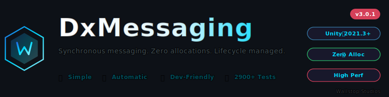
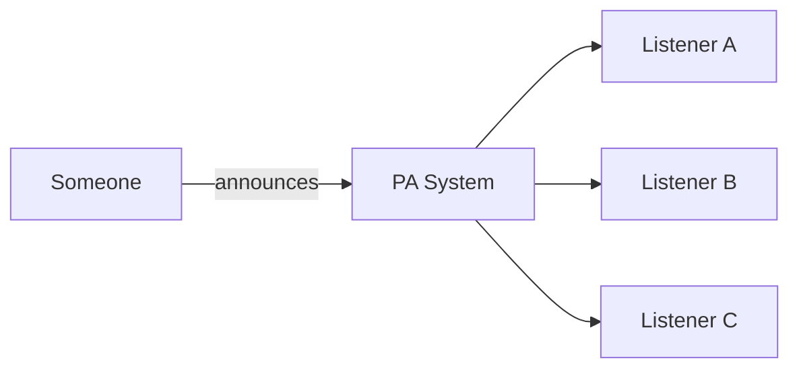
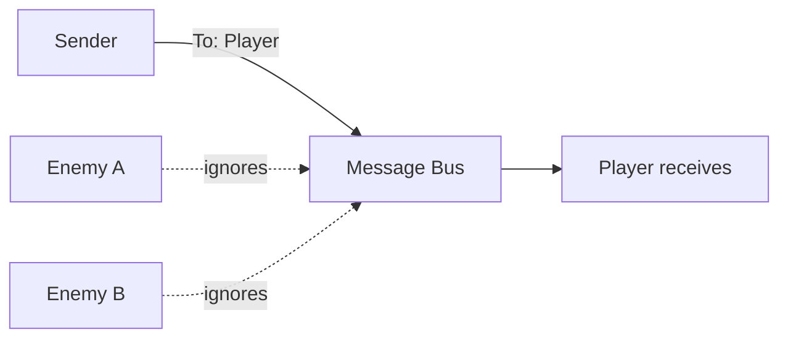
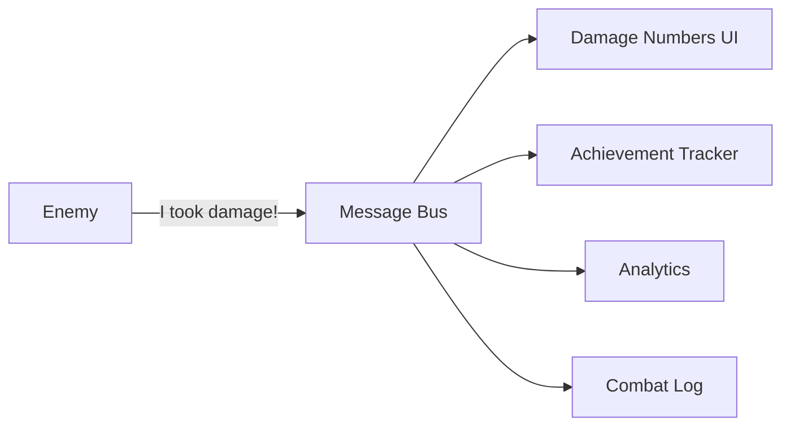
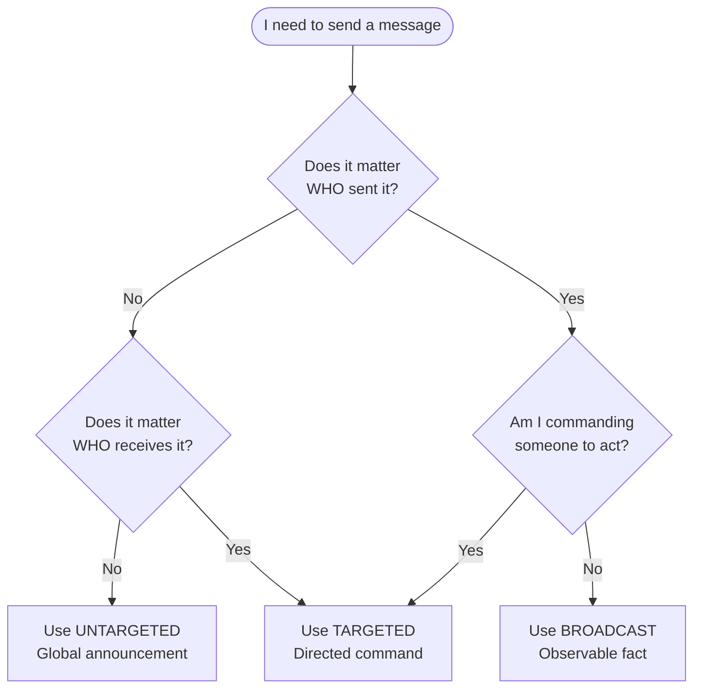
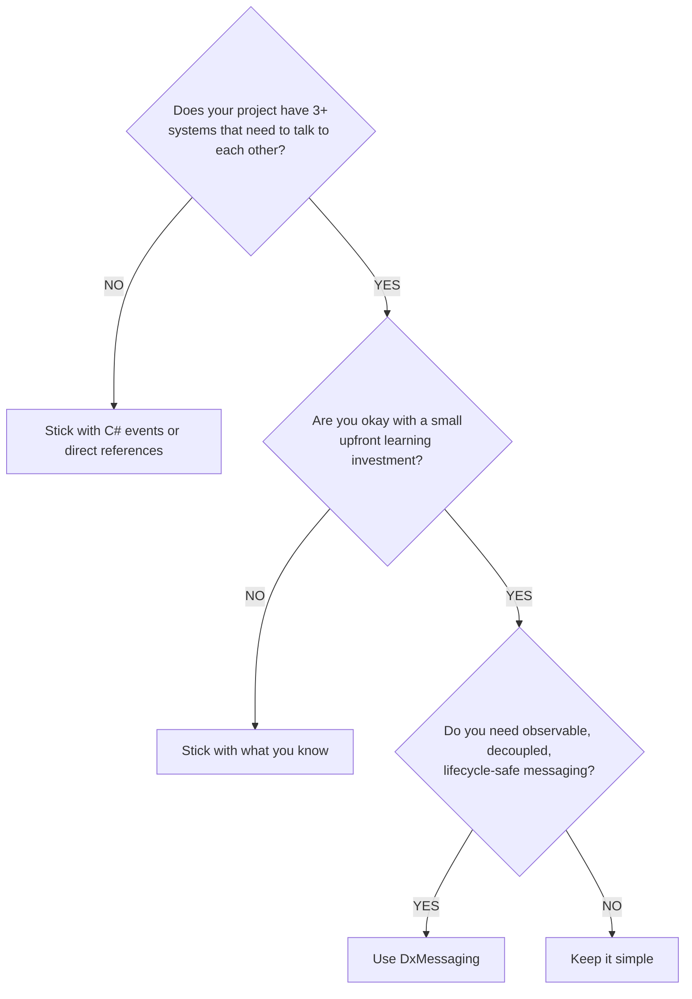
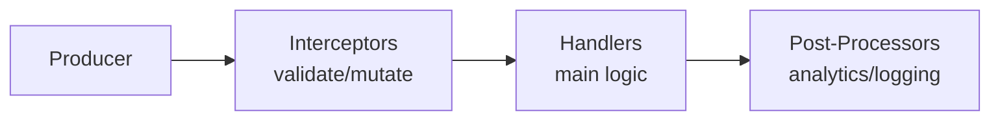

# DxMessaging for Unity

<p align="center">
  
</p>

<p align="center">
  <a href="https://ambiguous-interactive.github.io/DxMessaging/">
    
  </a>
</p>

[](https://unity.com/releases/editor)<br/>
[](LICENSE.md)<br/>
[](https://openupm.com/packages/com.wallstop-studios.dxmessaging/)<br/>
[](https://www.npmjs.com/package/com.wallstop-studios.dxmessaging)<br/>
[](docs/architecture/performance.md)<br/>
[](https://github.com/Ambiguous-Interactive/DxMessaging/actions/workflows/markdown-link-validity.yml)<br/>
[](https://github.com/Ambiguous-Interactive/DxMessaging/actions/workflows/markdown-link-text-check.yml)

> **🤖 AI Assistance Disclosure:**
>
> This project has been actively developed and maintained by human authors for over a decade. Recent versions have utilized AI assistance for documentation, test coverage, and performance optimizations.

**DxMessaging is a type-safe messaging system** that replaces sprawling C# events, brittle UnityEvents, and global static event buses with an observable and lifecycle-managed communication pattern.

Think of it as: A messaging system designed for decoupled game systems.

Need install instructions? Try [OpenUPM](https://openupm.com/packages/com.wallstop-studios.dxmessaging/) (recommended) or see the [Install Guide](docs/getting-started/install.md) for Git URLs, scoped registries, and more.

## Table of Contents

- [30-Second Elevator Pitch](#30-second-elevator-pitch)
- [Mental Model: How to Think About DxMessaging](#mental-model-how-to-think-about-dxmessaging)
- [Quick Start (5 Minutes)](#quick-start-5-minutes)
- [Dependency Injection (DI) Compatible](#dependency-injection-di-compatible)
- [Is DxMessaging Right for You?](#is-dxmessaging-right-for-you)
- [Why DxMessaging](#why-dxmessaging)
- [Key Features](#key-features)
- [The DxMessaging Solution](#the-dxmessaging-solution)
- [Real-World Examples](#real-world-examples)
- [Performance](#performance)
- [Comparison Table](#comparison-table)
- [Samples](#samples)
- [Documentation](#documentation)
- [Requirements](#requirements)
- [Contributing](#contributing)
- [Links](#links)
- [AI Agent Integration](#ai-agent-integration)

---

## 30-Second Elevator Pitch

### If you've ever

- Forgotten to unsubscribe from an event and spent hours debugging memory leaks
- Had UI code tangled with 15 different game systems
- Wondered "which event fired when?" with no way to see message flow
- Copy-pasted event boilerplate dozens of times

#### Then DxMessaging can help address these challenges

- **Automatic lifecycle management** - manages subscription lifecycle automatically, no manual unsubscribe
- **Zero coupling** - systems communicate without knowing each other exist
- **Full visibility** - see every message in the Inspector with timestamps and payloads
- **Complete control** - priority-based ordering, validation, and interception

##### Three simple message types

1. **Untargeted** - Global announcements
1. **Targeted** - Commands to specific entities
1. **Broadcast** - Observable facts from a source

See [Mental Model](#mental-model-how-to-think-about-dxmessaging) for how to choose the right type.

**One line:** It's a type-safe messaging system with automatic lifecycle management and built-in inspection tools.

---

## Mental Model: How to Think About DxMessaging

### The Core Idea

DxMessaging is built around one principle: **it gets out of your way**.

You have data. You need to pass it around. That's the problem. DxMessaging provides fast, simple primitives as building blocks. You model changes as message types with optional context, using game primitives (GameObjects, components) as that context.

**You don't build your game INTO the messaging system.** It's opt-in and optional -- a tool you reach for when it helps.

### The Three Message Types: Real-World Analogies

> 💡 _Diagrams below require Mermaid support. If they don't render, try viewing this file directly on [GitHub](https://github.com/Ambiguous-Interactive/DxMessaging)._

Each message type maps to a real-world communication pattern:

#### 1. Untargeted = PA System


```mermaid
flowchart LR
    S[Someone] -->|announces| PA[PA System]
    PA --> L1[Listener A]
    PA --> L2[Listener B]
    PA --> L3[Listener C]
```

Announcements with no specific recipient. Everyone who cares can hear it.

**Examples:** "The game is paused", "Settings changed", "Scene finished loading"

#### 2. Targeted = Addressed Letter


```mermaid
flowchart LR
    S[Sender] -->|"To: Player"| Letter[Message Bus]
    Letter --> Player[Player receives]
    Other1[Enemy A] -.->|ignores| Letter
    Other2[Enemy B] -.->|ignores| Letter
```

Commands to a specific recipient. Only that entity receives them.

**Examples:** "Player, heal for 10 HP", "Door #7, open", "This enemy, take 25 damage"

#### 3. Broadcast = Radio Station


```mermaid
flowchart LR
    Source[Enemy] -->|"I took damage!"| Radio[Message Bus]
    Radio --> L1[Damage Numbers UI]
    Radio --> L2[Achievement Tracker]
    Radio --> L3[Analytics]
    Radio --> L4[Combat Log]
```

Facts emitted by a specific source. No intended recipient -- just an origin. Anyone can tune in.

**Examples:** "This enemy took 25 damage", "The player picked up item X", "This chest opened"

### Choosing the Right Message Type


```mermaid
flowchart TD
    Start([I need to send a message])
    Start --> Q1{Does it matter<br/>WHO sent it?}

    Q1 -->|No| Q2{Does it matter<br/>WHO receives it?}
    Q2 -->|No| Untargeted[Use UNTARGETED<br/>Global announcement]
    Q2 -->|Yes| Targeted[Use TARGETED<br/>Directed command]

    Q1 -->|Yes| Q3{Am I commanding<br/>someone to act?}
    Q3 -->|Yes| Targeted
    Q3 -->|No| Broadcast[Use BROADCAST<br/>Observable fact]
```

| Question                            | Untargeted | Targeted | Broadcast |
| ----------------------------------- | :--------: | :------: | :-------: |
| Has a specific sender that matters? |     No     |    No    |    Yes    |
| Has a specific recipient?           |     No     |   Yes    |    No     |
| Is it a command?                    |     No     |   Yes    |    No     |
| Is it an observable fact?           |   Maybe    |    No    |    Yes    |
| Is it a global announcement?        |    Yes     |    No    |    No     |

> **Common Mistakes:**
>
> - **Forgetting to enable the token** -- Messages won't be received. Use `MessageAwareComponent` (auto-enables) or call `Token.Enable()` manually.
> - **Targeting Component when you meant GameObject** -- These are distinct registration paths. Component-targeted messages won't reach GameObject-level handlers.
> - **Using Broadcast when you need Targeted** -- Broadcasts have no recipient, just an origin. Use Targeted when commanding a specific entity.
> - **Missing `[Dx*Message]` attribute** -- The source generator won't process the struct without the marker attribute.
>
> 📖 See [Troubleshooting](docs/reference/troubleshooting.md) for solutions to these and other issues.

**Want more depth?** See the full [Mental Model documentation](docs/concepts/mental-model.md) for detailed examples, lifecycle patterns, and edge cases.

**Ready to code?** Jump to [Quick Start](#quick-start-5-minutes) to send your first message!

---

## Quick Start (5 Minutes)

**New to messaging?** Start with the [Visual Guide](docs/getting-started/visual-guide.md) (5 min) for a beginner-friendly introduction!

### 1. Install

#### Via OpenUPM (Recommended)

```bash
openupm add com.wallstop-studios.dxmessaging
```

#### Or via Git URL

```bash
# Unity Package Manager > Add package from git URL...
https://github.com/Ambiguous-Interactive/DxMessaging.git
```

See the [Install Guide](docs/getting-started/install.md) for all options including NPM scoped registries and local tarballs.

### 2. Define Your First Message

```csharp
using DxMessaging.Core.Attributes;

[DxTargetedMessage]
[DxAutoConstructor]  // Auto-generates constructor
public readonly partial struct OpenChest {
    public readonly int chestId;
    [DxOptionalParameter(true)]  // Optional with custom default
    public readonly bool playSound;
}
```

### 3. Listen for It

```csharp
using DxMessaging.Unity;

public class ChestController : MessageAwareComponent {
    protected override void RegisterMessageHandlers() {
        base.RegisterMessageHandlers();
        _ = Token.RegisterComponentTargeted<OpenChest>(this, OnOpen);
    }

    void OnOpen(ref OpenChest msg) {
        Debug.Log($"Opening chest {msg.chestId}");
    }
}
```

> **Heads-up:** When you override `Awake`, `OnEnable`, `OnDisable`, `OnDestroy`, or `RegisterMessageHandlers`, call the base method first or handlers fail silently. See [DXMSG006](docs/reference/analyzers.md#dxmsg006-missing-base-call).

### 4. Send It

```csharp
// From anywhere:
var msg = new OpenChest(chestId: 42);
msg.EmitComponentTargeted(chestComponent);
```

No manual unsubscribe needed. Subscriptions are type-safe and lifecycle-managed.

**Stuck?** See [Troubleshooting](docs/reference/troubleshooting.md) or [FAQ](docs/reference/faq.md)

---

## Dependency Injection (DI) Compatible

**Using Zenject, VContainer, or Reflex?** DxMessaging is fully DI-compatible out of the box!

```csharp
// Inject IMessageBus in any class
public class PlayerService : IInitializable, IDisposable
{
    private readonly MessageRegistrationLease _lease;

    public PlayerService(IMessageRegistrationBuilder builder)
    {
        // Builder automatically resolves your container-managed bus
        _lease = builder.Build(new MessageRegistrationBuildOptions
        {
            Configure = token => token.RegisterUntargeted<PlayerSpawned>(OnSpawn)
        });
    }

    public void Initialize() => _lease.Activate();
    public void Dispose() => _lease.Dispose();
}
```

### Why use DI + Messaging?

- **DI for construction** -- Inject services, repositories, managers via constructors
- **Messaging for events** -- Reactive, decoupled communication for gameplay events
- **Combined approach** -- Clean architecture with testable, isolated buses

#### Automatic integration for

- [x] **Zenject/Extenject** -- Full-featured DI with extensive Unity support
- [x] **VContainer** -- Lightweight, high-performance DI with scoped lifetimes
- [x] **Reflex** -- Minimal API, high-performance dependency injection

##### Get started

- [Zenject Integration Guide](docs/integrations/zenject.md) -- Complete setup with examples
- [VContainer Integration Guide](docs/integrations/vcontainer.md) -- Scoped buses for scene isolation
- [Reflex Integration Guide](docs/integrations/reflex.md) -- Minimal, lightweight patterns

##### Core DI concepts

- [Runtime Configuration](docs/advanced/runtime-configuration.md) -- Setting message buses at runtime, re-binding registrations
- [Message Bus Providers](docs/advanced/message-bus-providers.md) -- Provider system for design-time and runtime bus configuration

**Not using DI?** No problem. DxMessaging works standalone with zero dependencies.

---

## Is DxMessaging Right for You?

### Use DxMessaging When

- **You have cross-system communication** - UI needs to react to gameplay, achievements track events, analytics observe everything
- **You're building for scale** - 10+ systems that need to communicate, or growing from prototype to production
- **Memory leaks are a concern** - You've been bitten by forgotten event unsubscribes before
- **You value observability** - Need to debug "what fired when?" or track message flow
- **Teams/long-term maintenance** - Multiple developers, or you'll maintain this code for years
- **You want decoupling** - When UI classes need references to many game systems
- **You're using DI frameworks** - Compatible with Zenject/VContainer/Reflex (see [DI Compatible](#dependency-injection-di-compatible))

### Don't Use DxMessaging When

- **Tiny prototypes/game jams** - If your game is <1000 lines and will be done in a week, C# events are fine
- **Simple, local communication** - A single button calling a single method? Just use UnityEvents or direct references
- **Performance is THE constraint** - Building a physics engine or ECS with millions of events/frame? Raw delegates are faster
- **Team is unfamiliar** - Learning curve exists; if the team isn't on board, it won't be used correctly
- **You need synchronous return values** - DxMessaging is fire-and-forget; if you need bidirectional request/response, consider other patterns

### Maybe Use DxMessaging (Start Small)

- **Existing large codebase** - Migrate incrementally: start with new features, refactor old code gradually (see [Migration Guide](docs/guides/migration-guide.md))
- **Small team learning** - Try it for one system (e.g., achievements) before going all-in
- **Mid-size projects (5-20k lines)** - Evaluate after trying it for one complex interaction (e.g., combat or scene transitions)

### Decision Flow


```mermaid
flowchart TD
    Q1{Does your project have 3+<br/>systems that need to talk to each other?}
    Q1 -->|NO| A1[Stick with C# events or direct references]
    Q1 -->|YES| Q2

    Q2{Are you okay with a small<br/>upfront learning investment?}
    Q2 -->|NO| A2[Stick with what you know]
    Q2 -->|YES| Q3

    Q3{Do you need observable, decoupled,<br/>lifecycle-safe messaging?}
    Q3 -->|YES| A3[" Use DxMessaging"]
    Q3 -->|NO| A4[" Keep it simple"]
```

**Rule of thumb:** If decoupling, lifecycle leaks, or handler-ordering bugs match what you're hitting today, DxMessaging fits. If none of those describe your project, start with the [Visual Guide](docs/getting-started/visual-guide.md) or stick with simpler patterns.

Looking for hard numbers? See OS-specific [Performance Benchmarks](docs/architecture/performance.md).

## Why DxMessaging

### The Problems You've Probably Hit

#### Scenario 1: The Memory Leak Nightmare

You write this innocent-looking code:

```csharp
public class GameUI : MonoBehaviour {
    void OnEnable() {
        GameManager.Instance.OnScoreChanged += UpdateScore;
    }
    // Oops, forgot OnDisable... leak!
}
```

Months later: "Why is our game using 2GB of RAM after an hour?"

#### Scenario 2: The Spaghetti Mess

```csharp
public class GameUI : MonoBehaviour {
    [SerializeField] private Player player;
    [SerializeField] private EnemySpawner spawner;
    [SerializeField] private InventorySystem inventory;
    [SerializeField] private QuestSystem quests;
    [SerializeField] private AudioManager audio;
    // ... 15 more SerializeFields ...

    void Awake() {
        player.OnHealthChanged += UpdateHealth;
        spawner.OnWaveStart += ShowWave;
        inventory.OnItemAdded += RefreshInventory;
        quests.OnQuestCompleted += ShowQuestNotification;
        // ... 20 more subscriptions ...
    }
}
```

**Your UI now depends on many systems.** Refactoring becomes more difficult.

#### Scenario 3: The Debugging Black Hole

Player reports: "My health bar didn't update!"

You think: "Okay, which of the 47 events touching health failed? And in what order?"

**30 minutes later:** Still setting breakpoints everywhere...

### Common Challenges

Some developers encounter these challenges when working with traditional event systems:

- **Memory leaks** from forgotten unsubscribes
- **Tight coupling** making refactoring difficult
- **No execution order control** leading to unpredictable behavior
- **Limited debugging visibility** for tracking message flow
- **Boilerplate code** when managing many event subscriptions

### The DxMessaging Solution

#### Same scenarios, simplified handling

##### Scenario 1: No More Memory Leaks

```csharp
public class GameUI : MessageAwareComponent {
    protected override void RegisterMessageHandlers() {
        base.RegisterMessageHandlers();
        _ = Token.RegisterUntargeted<ScoreChanged>(UpdateScore);
    }
    // No manual cleanup needed.
    // Token automatically handles OnEnable/OnDisable/OnDestroy
}
```

###### Automatic lifecycle = leaks are prevented by default

##### Scenario 2: No More Coupling

```csharp
public class GameUI : MessageAwareComponent {
    // Zero SerializeFields! Zero references!

    protected override void RegisterMessageHandlers() {
        base.RegisterMessageHandlers();
        _ = Token.RegisterUntargeted<HealthChanged>(OnHealth);
        _ = Token.RegisterUntargeted<WaveStarted>(OnWave);
        _ = Token.RegisterUntargeted<ItemAdded>(OnItem);
        // Listen to anything, from anywhere, no coupling
    }
}
```

**Your UI is now independent.** Swapping systems no longer requires updating UI references.

##### Scenario 3: Debugging is Built In

Open any `MessageAwareComponent` in the Inspector:

```text
Message History (last 50):
[12:34:56] HealthChanged (amount: 25) -> Priority: 0
[12:34:55] ItemAdded (id: 42, count: 1) -> Priority: 5
[12:34:54] WaveStarted (wave: 3) -> Priority: 0

Active Registrations:
 HealthChanged (5 handlers)
 ItemAdded (2 handlers)
```

**See exactly what fired, when, and who handled it.** No guesswork.

### How It Transforms Your Code

```csharp
// 1. Define messages (typed, discoverable)
[DxTargetedMessage]
[DxAutoConstructor]
public readonly partial struct Heal { public readonly int amount; }

// 2. Listen (automatic lifecycle - prevents leaks)
public class Player : MessageAwareComponent {
    protected override void RegisterMessageHandlers() {
        base.RegisterMessageHandlers();
        _ = Token.RegisterComponentTargeted<Heal>(this, OnHeal);
    }

    void OnHeal(ref Heal m) {
        health += m.amount;
        Debug.Log($"Healed {m.amount}!");
    }
}

// 3. Send (from anywhere - zero coupling)
var heal = new Heal(50);
heal.EmitComponentTargeted(playerComponent);
```

#### What you get

- [x] **Automatic cleanup** - tokens clean up when components are destroyed
- [x] **Zero coupling** - no SerializeFields, no GetComponent, no direct references
- [x] **Full visibility** - see message flow in Inspector with timestamps and payloads
- [x] **Predictable order** - priority-based execution (no more mystery race conditions)
- [x] **Type-safe** - compile-time guarantees, refactor with confidence
- [x] **Intercept & validate** - enforce rules before handlers run (clamp damage, block invalid input)
- [x] **Extension points everywhere** - interceptors, handlers, post-processors with priorities

## Key Features

What DxMessaging offers:

### Performance: Zero-Allocation Design

**The problem with normal events:** Boxing allocations, GC spikes, memory leaks from forgotten unsubscribes.

#### DxMessaging solution

```csharp
void OnDamage(ref TookDamage msg) {  // Pass by ref = zero allocations
    health -= msg.amount;            // No boxing, no GC pressure
}
// Automatic cleanup prevents common leak patterns
```

**Note:** Struct messages passed by ref avoid GC allocations, which is standard behavior for value types in C#.

### Three Message Types

Most event systems force you into one pattern. DxMessaging gives you the right tool for each job:

```csharp
// Untargeted: "Everyone, listen up!" (global announcements)
[DxUntargetedMessage]
public struct GamePaused { }
// -> Perfect for: settings, scene transitions, global state

// Targeted: "Hey Player, do this!" (commands to specific entities)
[DxTargetedMessage]
public struct Heal { public int amount; }
// -> Perfect for: UI actions, direct commands, player input

// Broadcast: "I took damage!" (events others can observe)
[DxBroadcastMessage]
public struct TookDamage { public int amount; }
// -> Perfect for: achievements, analytics, UI updates from entities
```

**Why this matters:** You're not forcing everything through one generic "Event<T>" pattern. Each message type has clear semantics.

### The Message Pipeline

Every message flows through 3 stages with priority control:


```mermaid
flowchart LR
    P[Producer] --> I[Interceptors<br/>validate/mutate]
    I --> H[Handlers<br/>main logic]
    H --> PP[Post-Processors<br/>analytics/logging]
```

### Global Observers: Listen to All Events

**The problem with normal events:** To track all player damage, enemy damage, and NPC damage, you need 3 separate event subscriptions.

**DxMessaging approach:** Subscribe once to a message type, receive all instances with source information:

```csharp
// Track ALL damage from ANY source (players, enemies, NPCs, environment)
_ = token.RegisterBroadcastWithoutSource<TookDamage>(
    (InstanceId source, TookDamage msg) => {
        Debug.Log($"{source} took {msg.amount} damage!");
        Analytics.LogDamage(source, msg.amount);
        CheckAchievements(source, msg.amount);
    }
);
```

#### Real-world use cases

- **Achievement system:** Track all kills, deaths, damage across the entire game
- **Combat log:** "Player took 25 damage, Enemy3 took 50 damage, Boss took 100 damage"
- **Analytics:** Aggregate stats from all entities without knowing about them upfront
- **Debug tools:** Watch ALL messages in the Inspector without instrumenting code

**How this differs:** Some event bus patterns require subscribing to each entity type separately. DxMessaging allows observing all instances of a message type in one registration.

### Interceptors: Validate Before Execution

**The problem with normal events:** Validation logic duplicated in every handler, or bugs when you forget.

**DxMessaging solution:** Validate ONCE before ANY handler runs:

```csharp
// ONE interceptor protects ALL handlers
_ = token.RegisterBroadcastInterceptor<TookDamage>(
    (ref InstanceId src, ref TookDamage msg) => {
        if (msg.amount <= 0) return false;               // Cancel invalid
        if (msg.amount > 999) {
            msg = new TookDamage(999);                   // Clamp excessive
        }
        if (IsGodModeActive(src)) return false;          // Block damage
        return true;
    },
    priority: -100  // Run FIRST
);

// Now ALL handlers receive clean, validated data
_ = token.RegisterComponentTargeted<TookDamage>(player, OnDamage);
void OnDamage(ref TookDamage msg) {
    // No validation needed - interceptor guarantees validity!
    health -= msg.amount;
}
```

#### Real-world use cases

- Clamp/normalize values (damage, healing, speeds)
- Enforce game rules ("can't heal above max health")
- Block messages during cutscenes
- Log/audit sensitive actions

### Built-in Inspector Diagnostics

**The problem with normal events:** "Which event fired? When? Who handled it? In what order?" = unknown

**DxMessaging solution:** Click any `MessageAwareComponent` in the Inspector:

#### Message History (last 50)

- `[12:34:56.123] HealthChanged`
  - amount: 25
  - priority: 0
  - handlers: 3
- `[12:34:55.987] ItemAdded`
  - itemId: 42, count: 1
  - priority: 5
  - handlers: 2

##### Active Registrations

- [x] HealthChanged (priority: 0, called: 847 times)
- [x] ItemAdded (priority: 5, called: 23 times)
- [x] TookDamage (priority: 10, called: 1,203 times)

#### Real-world debugging scenarios

- "Did my message fire?" -> Check history, see timestamp
- "Why didn't my handler run?" -> Check registrations, see if it's active
- "What's firing too often?" -> Sort by call count
- "What's the execution order?" -> Sort by priority

**No more:** Setting 50 breakpoints and stepping through code for 30 minutes.

### Local Bus Islands for Testing

**The problem with normal events:** Global static events contaminate tests. Mock complexity. Flaky tests.

**DxMessaging solution:** Each test gets its own isolated message bus:

```csharp
[Test]
public void TestAchievementSystem() {
    // Create isolated bus - zero global state
    var testBus = new MessageBus();
    var handler = new MessageHandler(new InstanceId(1), testBus) { active = true };
    var token = MessageRegistrationToken.Create(handler, testBus);

    // Test in isolation
    _ = token.RegisterBroadcastWithoutSource<EnemyKilled>(achievements.OnKill);

    var msg = new EnemyKilled("Boss");
    msg.EmitGameObjectBroadcast(enemy, testBus);  // Only this test sees it

    Assert.IsTrue(achievements.Unlocked("BossSlayer"));
}
// Bus destroyed, zero cleanup needed
```

#### Why this matters

- Tests don't interfere with each other
- No "arrange/act/cleanup" boilerplate
- No mocking frameworks needed
- Parallel test execution is supported

## Documentation

- **[Documentation Site](https://ambiguous-interactive.github.io/DxMessaging/)** - Full searchable documentation
- **[Wiki](https://github.com/Ambiguous-Interactive/DxMessaging/wiki)** - Quick reference wiki
- **[Changelog](CHANGELOG.md)** - Version history

### Learn

- **New here?** Start with [Getting Started Guide](docs/getting-started/getting-started.md) (10 min read)
- **Want patterns?** See [Common Patterns](docs/guides/patterns.md)
- **Deep dive?** Read [Design & Architecture](docs/architecture/design-and-architecture.md)

### Core Concepts

- [Overview](docs/getting-started/overview.md) -- What and why
- [Quick Start](docs/getting-started/quick-start.md) -- First message in 5 minutes
- [Message Types](docs/concepts/message-types.md) -- When to use Untargeted/Targeted/Broadcast
- [Interceptors & Ordering](docs/concepts/interceptors-and-ordering.md) -- Control execution flow
- [Listening Patterns](docs/concepts/listening-patterns.md) -- All the ways to receive messages

### Unity Integration

- [Unity Integration](docs/guides/unity-integration.md) -- MessagingComponent deep dive
- [Targeting & Context](docs/concepts/targeting-and-context.md) -- GameObject vs Component
- [Diagnostics](docs/guides/diagnostics.md) -- Inspector tools and debugging
- [Memory Reclamation](docs/guides/memory-reclamation.md) -- idle eviction, explicit Trim, and tuning the runtime settings asset

Important: Inheritance with MessageAwareComponent

- If you override lifecycle or registration hooks, call the base method.
- Use `base.RegisterMessageHandlers()` to keep default string-message registrations.
- Use `base.OnEnable()` / `base.OnDisable()` to preserve token enable/disable.
- If you need to opt out of string demos, override `RegisterForStringMessages => false` instead of skipping the base call.
- Don't hide Unity methods with `new` (e.g., `new void OnEnable()`); always `override` and call `base.*`.

### DI Framework Integrations

DxMessaging works standalone (zero dependencies) or with any major DI framework. For detailed setup guides and code examples:

- **[Zenject Integration Guide](docs/integrations/zenject.md)** -- Full-featured DI with extensive Unity support
- **[VContainer Integration Guide](docs/integrations/vcontainer.md)** -- Lightweight DI with scoped lifetimes for scene isolation
- **[Reflex Integration Guide](docs/integrations/reflex.md)** -- Minimal API, high-performance DI

#### Core DI concepts

- **[Runtime Configuration](docs/advanced/runtime-configuration.md)** -- Setting and overriding message buses at runtime, re-binding registrations
- **[Message Bus Providers](docs/advanced/message-bus-providers.md)** -- Provider system and MessageBusProviderHandle for flexible bus configuration

Each guide includes:

- [x] Complete setup instructions with installers
- [x] Multiple usage patterns (plain classes, MonoBehaviours, direct injection)
- [x] Testing examples with isolated buses
- [x] Advanced patterns (pooling, scene scopes, signal bridges)

See the [DI Compatible section](#dependency-injection-di-compatible) above for a quick overview.

### Comparisons

- [Compare with Other Unity Messaging Frameworks](docs/architecture/comparisons.md) -- In-depth comparison with UniRx, MessagePipe, Zenject Signals, C# events, UnityEvents, and more
- [Scriptable Object Architecture (SOA) Compatibility](docs/guides/patterns.md#14-compatibility-with-scriptable-object-architecture-soa) -- Migration patterns and interoperability with SOA

#### Quick Framework Comparison

| Framework           | Best For                          | Key Strength                     | Unity Support   | Learning Curve |
| ------------------- | --------------------------------- | -------------------------------- | --------------- | -------------- |
| **DxMessaging**     | Unity pub/sub with lifecycle mgmt | Inspector debugging + control    | Built for Unity | Moderate       |
| **UniRx**           | Complex event stream transforms   | Reactive operators (LINQ)        | Built for Unity | Easy           |
| **MessagePipe**     | High-performance DI messaging     | Highest throughput (97M ops/sec) | Built for Unity | Steep          |
| **Zenject Signals** | DI-integrated messaging           | Zenject ecosystem                | Built for Unity | Easy           |
| **C# Events**       | Simple, local communication       | Minimal overhead                 | Native C#       | Steepest       |

##### Choose DxMessaging when you want

- Unity-first design with GameObject/Component targeting
- Automatic lifecycle management (prevents common memory leaks)
- Inspector debugging to see message flow and history
- Execution order control (priority-based handlers)
- Message validation/interception pipeline
- Global observers (listen to all message instances)
- Post-processing stage (analytics, logging after handlers)
- No dependencies, plug-and-play setup

See [full comparison](docs/architecture/comparisons.md) for detailed analysis with code examples, performance benchmarks, and decision guides.

> **📦 Using Scriptable Object Architecture (SOA)?**
>
> DxMessaging can work alongside or replace SOA patterns. See [SOA Compatibility Guide](docs/guides/patterns.md#14-compatibility-with-scriptable-object-architecture-soa) for:
>
> - Fair comparison of SOA vs. DxMessaging
> - Migration patterns from GameEvent/FloatVariable to DxMessaging
> - How to use both systems together (SOs for configs, DxMessaging for events)
> - When to keep using ScriptableObjects (immutable design data)

### Reference

- [Install Guide](docs/getting-started/install.md) -- All install options (OpenUPM, Git URL, scoped registry, tarball)
- [Glossary](docs/reference/glossary.md) -- All terms explained in plain English
- [Quick Reference](docs/reference/quick-reference.md) -- Cheat sheet
- [API Reference](docs/reference/reference.md) -- Complete API
- [Helpers](docs/reference/helpers.md) -- Source generators and utilities
- [FAQ](docs/reference/faq.md) -- Common questions
- [Troubleshooting](docs/reference/troubleshooting.md)

### Full Documentation

Browse all docs: [Documentation Hub](docs/getting-started/index.md)

## Real-World Examples

### Scene Transitions

```csharp
[DxUntargetedMessage]
[DxAutoConstructor]
public readonly partial struct SceneTransition {
    public readonly string sceneName;
}

// Multiple systems react independently
public class AudioSystem : MessageAwareComponent {
    protected override void RegisterMessageHandlers() {
        base.RegisterMessageHandlers();
        _ = Token.RegisterUntargeted<SceneTransition>(OnScene, priority: 0);
    }
    void OnScene(ref SceneTransition m) => FadeOutMusic();
}

public class SaveSystem : MessageAwareComponent {
    protected override void RegisterMessageHandlers() {
        base.RegisterMessageHandlers();
        _ = Token.RegisterUntargeted<SceneTransition>(OnScene, priority: 0);
    }
    void OnScene(ref SceneTransition m) => SaveGame();
}
```

### Achievement System

```csharp
// Listen to ALL events for achievement tracking
public class AchievementTracker : MessageAwareComponent {
    protected override void RegisterMessageHandlers() {
        base.RegisterMessageHandlers();
        _ = Token.RegisterGlobalAcceptAll(
            acceptAllUntargeted: m => Check(m),
            acceptAllTargeted: (t, m) => Check(m),
            acceptAllBroadcast: (s, m) => Check(m)
        );
    }
}
```

## Performance

- **Zero GC allocations** for struct messages
- **~10ns overhead** per handler (compared to C# events)
- **Type-indexed caching** for O(1) lookups
- **Optimized for hot paths** with aggressive inlining

See [Design & Architecture](docs/architecture/design-and-architecture.md#performance-optimizations) for details.

For OS-specific benchmark tables generated by PlayMode tests, see [Performance Benchmarks](docs/architecture/performance.md).

## Comparison Table

### Comparison with Unity Messaging Frameworks

| Feature                  | DxMessaging     | UniRx           | MessagePipe     | Zenject Signals |
| ------------------------ | --------------- | --------------- | --------------- | --------------- |
| **Unity Compatibility**  | Built for Unity | Built for Unity | Built for Unity | Built for Unity |
| **Decoupling**           | Full            | Full            | Full            | Full            |
| **Lifecycle Safety**     | Auto            | Manual          | Manual          | DI-managed      |
| **Execution Order**      | Priority        | None            | None            | None            |
| **Type Safety**          | Strong          | Strong          | Strong          | Strong          |
| **Inspector Debug**      | Built-in        | No              | No              | No              |
| **GameObject Targeting** | Yes             | No              | No              | No              |
| **Global Observers**     | Yes             | No              | No              | No              |
| **Interceptors**         | Pipeline        | No              | Filters         | No              |
| **Post-Processing**      | Dedicated       | No              | Filters         | No              |
| **Stream Operators**     | No              | Extensive       | No              | With UniRx      |
| **Performance**          | Good (10-17M)   | Good (18M)      | High (97M)      | Moderate (2.5M) |
| **Dependencies**         | None            | UniTask         | None            | Zenject         |

### Comparison with Traditional Approaches

| Feature                | DxMessaging | C# Events | UnityEvents | Static Event Bus |
| ---------------------- | ----------- | --------- | ----------- | ---------------- |
| **Decoupling**         | Full        | Tight     | Hidden      | Yes              |
| **Lifecycle Safety**   | Auto        | Manual    | Unity-only  | Manual           |
| **Execution Order**    | Priority    | Undefined | Undefined   | Undefined        |
| **Type Safety**        | Strong      | Strong    | Weak        | Weak             |
| **Context (Who/What)** | Rich        | None      | None        | None             |
| **Interception**       | Yes         | No        | No          | No               |
| **Observability**      | Built-in    | No        | No          | No               |
| **Performance**        | Zero-alloc  | Good      | Boxing      | Good             |

## Samples

Import samples from Package Manager:

- **[Mini Combat](Samples~/Mini%20Combat/README.md)** -- Simple combat with Heal/Damage messages
- **[UI Buttons + Inspector](Samples~/UI%20Buttons%20%2B%20Inspector/README.md)** -- Interactive diagnostics demo

## Requirements

- Unity 2021.3 or later
- .NET Standard 2.1
- Works with all render pipelines (URP, HDRP, Built-in)

See [Compatibility](docs/reference/compatibility.md) for details.

## Contributing

Contributions welcome! See [Contributing](CONTRIBUTING.md).

## License

MIT License - see [License](LICENSE.md)

## Credits

Created and maintained by [wallstop studios](https://wallstopstudios.com)

## Links

- [Package on GitHub](https://github.com/Ambiguous-Interactive/DxMessaging)
- [Report Issues](https://github.com/Ambiguous-Interactive/DxMessaging/issues)
- [Documentation Site](https://ambiguous-interactive.github.io/DxMessaging/)
- [Wiki](https://github.com/Ambiguous-Interactive/DxMessaging/wiki)

## AI Agent Integration

DxMessaging publishes machine-readable context for AI agents through [llms.txt](llms.txt), following the [llmstxt.org](https://llmstxt.org/) standard. The file collects the project overview, API surface, conventions, and links into one document.

### For AI Agents

- **[llms.txt](llms.txt)** -- Complete project overview, API reference, and context in a single file
- **[Repository Guidelines](.llm/context.md)** -- Coding standards and development workflows
- **[AI Agent Skills](.llm/skills/)** -- 140+ specialized skill documents covering documentation, testing, GitHub Actions, and more

The `llms.txt` file is automatically updated via CI/CD to stay current with project changes. It includes:

- Project overview and quick facts
- Core concepts and architecture
- Complete documentation links
- Development commands and standards
- Common pitfalls and solutions
- Performance characteristics
- Code examples and patterns

### Keeping llms.txt Updated

The automation script ensures llms.txt stays current:

```bash
# Update llms.txt
npm run update:llms-txt

# Verify llms.txt is current
npm run check:llms-txt
```

GitHub Actions automatically validates and updates llms.txt:

- **Validation:** Runs on PRs to ensure llms.txt is up-to-date
- **Auto-update:** Runs weekly and on relevant file changes

---
