# DxMessaging for Unity

<p align="center">
  
</p>

<p align="center">
  <a href="https://wallstop.github.io/DxMessaging/">
    
  </a>
</p>

[](https://unity.com/releases/editor)<br/>
[](LICENSE.md)<br/>
[](https://openupm.com/packages/com.wallstop-studios.dxmessaging/)<br/>
[](https://www.npmjs.com/package/com.wallstop-studios.dxmessaging)<br/>
[](docs/architecture/performance.md)<br/>
[](https://github.com/wallstop/DxMessaging/actions/workflows/markdown-link-validity.yml)<br/>
[](https://github.com/wallstop/DxMessaging/actions/workflows/markdown-link-text-check.yml)

> **🤖 AI Assistance Disclosure:**
>
> This project has been actively developed and maintained by human authors for over a decade. Recent versions have utilized AI assistance for documentation, test coverage, and performance optimizations.

**DxMessaging is a type-safe messaging system** that replaces sprawling C# events, brittle UnityEvents, and global static event buses with an observable and lifecycle-managed communication pattern.

Think of it as: A messaging system designed for decoupled game systems.

Need install instructions? Try [OpenUPM](https://openupm.com/packages/com.wallstop-studios.dxmessaging/) (recommended) or see the [Install Guide](docs/getting-started/install.md) for Git URLs, scoped registries, and more.

## Table of Contents

- [30-Second Elevator Pitch](#30-second-elevator-pitch)
- [Quick Start (5 Minutes)](#quick-start-5-minutes)
- [Is DxMessaging Right for You?](#is-dxmessaging-right-for-you)
- [Why DxMessaging?](#why-dxmessaging)
- [Key Features](#key-features)
- [The DxMessaging Solution](#the-dxmessaging-solution)
- [Real-World Examples](#real-world-examples)
- [Performance](#performance)
- [Comparison Table](#comparison-table)
- [Samples](#samples)
- [Documentation](#documentation)
- [Requirements](#requirements)
- [Contributing](#contributing)
- [Links](#links)

---

## 30-Second Elevator Pitch

### If you've ever

- Forgotten to unsubscribe from an event and spent hours debugging memory leaks
- Had UI code tangled with 15 different game systems
- Wondered "which event fired when?" with no way to see message flow
- Copy-pasted event boilerplate dozens of times

#### Then DxMessaging can help address these challenges

- **Automatic lifecycle management** - manages subscription lifecycle automatically, no manual unsubscribe
- **Zero coupling** - systems communicate without knowing each other exist
- **Full visibility** - see every message in the Inspector with timestamps and payloads
- **Complete control** - priority-based ordering, validation, and interception

##### Three simple message types

1. **Untargeted** - "Everyone listen!" (pause game, settings changed)
1. **Targeted** - "Tell Player to heal" (commands to specific entities)
1. **Broadcast** - "I took damage" (things that happen to _you_ that others can observe)

**One line:** It's a type-safe messaging system with automatic lifecycle management and built-in inspection tools.

---

## Quick Start (5 Minutes)

**New to messaging?** Start with the [Visual Guide](docs/getting-started/visual-guide.md) (5 min) for a beginner-friendly introduction!

### 1. Install

#### Via OpenUPM (Recommended)

```bash
openupm add com.wallstop-studios.dxmessaging
```

##### Or via Git URL

```bash
# Unity Package Manager > Add package from git URL...
https://github.com/wallstop/DxMessaging.git
```

See the [Install Guide](docs/getting-started/install.md) for all options including NPM scoped registries and local tarballs.

### 2. Define Your First Message

```csharp
using DxMessaging.Core.Attributes;

[DxTargetedMessage]
[DxAutoConstructor]  // Auto-generates constructor
public readonly partial struct OpenChest {
    public readonly int chestId;
    [DxOptionalParameter(true)]  // Optional with custom default
    public readonly bool playSound;
}
```

### 3. Listen for It

```csharp
using DxMessaging.Unity;

public class ChestController : MessageAwareComponent {
    protected override void RegisterMessageHandlers() {
        base.RegisterMessageHandlers();
        _ = Token.RegisterComponentTargeted<OpenChest>(this, OnOpen);
    }

    void OnOpen(ref OpenChest msg) {
        Debug.Log($"Opening chest {msg.chestId}");
    }
}
```

### 4. Send It

```csharp
// From anywhere:
var msg = new OpenChest(chestId: 42);
msg.EmitComponentTargeted(chestComponent);
```

No manual unsubscribe needed. Subscriptions are type-safe and lifecycle-managed.

**Stuck?** See [Troubleshooting](docs/reference/troubleshooting.md) or [FAQ](docs/reference/faq.md)

---

## 🔧 Dependency Injection (DI) Compatible

**Using Zenject, VContainer, or Reflex?** DxMessaging is fully DI-compatible out of the box!

```csharp
// Inject IMessageBus in any class
public class PlayerService : IInitializable, IDisposable
{
    private readonly MessageRegistrationLease _lease;

    public PlayerService(IMessageRegistrationBuilder builder)
    {
        // Builder automatically resolves your container-managed bus
        _lease = builder.Build(new MessageRegistrationBuildOptions
        {
            Configure = token => token.RegisterUntargeted<PlayerSpawned>(OnSpawn)
        });
    }

    public void Initialize() => _lease.Activate();
    public void Dispose() => _lease.Dispose();
}
```

### Why use DI + Messaging?

- **DI for construction** — Inject services, repositories, managers via constructors
- **Messaging for events** — Reactive, decoupled communication for gameplay events
- **Combined approach** — Clean architecture with testable, isolated buses

#### Automatic integration for

- ✅ **Zenject/Extenject** — Full-featured DI with extensive Unity support
- ✅ **VContainer** — Lightweight, high-performance DI with scoped lifetimes
- ✅ **Reflex** — Minimal API, high-performance dependency injection

##### Get started

- [Zenject Integration Guide](docs/integrations/zenject.md) — Complete setup with examples
- [VContainer Integration Guide](docs/integrations/vcontainer.md) — Scoped buses for scene isolation
- [Reflex Integration Guide](docs/integrations/reflex.md) — Minimal, lightweight patterns

##### Core DI concepts

- [Runtime Configuration](docs/advanced/runtime-configuration.md) — Setting message buses at runtime, re-binding registrations
- [Message Bus Providers](docs/advanced/message-bus-providers.md) — Provider system for design-time and runtime bus configuration

**Not using DI?** No problem. DxMessaging works standalone with zero dependencies.

---

## Is DxMessaging Right for You?

### ✅ Use DxMessaging When

- **You have cross-system communication** - UI needs to react to gameplay, achievements track events, analytics observe everything
- **You're building for scale** - 10+ systems that need to communicate, or growing from prototype to production
- **Memory leaks are a concern** - You've been bitten by forgotten event unsubscribes before
- **You value observability** - Need to debug "what fired when?" or track message flow
- **Teams/long-term maintenance** - Multiple developers, or you'll maintain this code for years
- **You want decoupling** - When UI classes need references to many game systems
- **You're using DI frameworks** - Compatible with Zenject/VContainer/Reflex (see [DI Compatible](#-dependency-injection-di-compatible))

### ❌ Don't Use DxMessaging When

- **Tiny prototypes/game jams** - If your game is <1000 lines and will be done in a week, C# events are fine
- **Simple, local communication** - A single button calling a single method? Just use UnityEvents or direct references
- **Performance is THE constraint** - Building a physics engine or ECS with millions of events/frame? Raw delegates are faster
- **Team is unfamiliar** - Learning curve exists; if the team isn't on board, it won't be used correctly
- **You need synchronous return values** - DxMessaging is fire-and-forget; if you need bidirectional request/response, consider other patterns

### ⚠️ Maybe Use DxMessaging (Start Small)

- **Existing large codebase** - Migrate incrementally: start with new features, refactor old code gradually (see [Migration Guide](docs/guides/migration-guide.md))
- **Small team learning** - Try it for one system (e.g., achievements) before going all-in
- **Mid-size projects (5-20k lines)** - Evaluate after trying it for one complex interaction (e.g., combat or scene transitions)

### Decision Flow

```mermaid
flowchart TD
    Q1{Does your project have 3+<br/>systems that need to talk to each other?}
    Q1 -->|NO| A1[Stick with C# events or direct references]
    Q1 -->|YES| Q2

    Q2{Are you okay with a small<br/>upfront learning investment?}
    Q2 -->|NO| A2[Stick with what you know]
    Q2 -->|YES| Q3

    Q3{Do you need observable, decoupled,<br/>lifecycle-safe messaging?}
    Q3 -->|YES| A3["✅ Use DxMessaging"]
    Q3 -->|NO| A4["❌ Keep it simple"]

    style Q1 fill:#1e3a5f,stroke:#90caf9,stroke-width:2px,color:#e0e0e0
    style Q2 fill:#1e3a5f,stroke:#90caf9,stroke-width:2px,color:#e0e0e0
    style Q3 fill:#1e3a5f,stroke:#90caf9,stroke-width:2px,color:#e0e0e0
    style A1 fill:#37474f,stroke:#90a4ae,stroke-width:2px,color:#e0e0e0
    style A2 fill:#37474f,stroke:#90a4ae,stroke-width:2px,color:#e0e0e0
    style A3 fill:#1b5e20,stroke:#81c784,stroke-width:3px,color:#e0e0e0
    style A4 fill:#37474f,stroke:#90a4ae,stroke-width:2px,color:#e0e0e0
```



**Rule of thumb:** If you're reading this README and thinking "this could address several challenges I'm facing," then DxMessaging may be a good fit. If you're thinking "this seems complicated," start with the [Visual Guide](docs/getting-started/visual-guide.md) or stick with simpler patterns.

**New to messaging?** Start with the [Visual Guide](docs/getting-started/visual-guide.md) (5 min) for a beginner-friendly introduction!

Looking for hard numbers? See OS-specific [Performance Benchmarks](docs/architecture/performance.md).

## Why DxMessaging

### The Problems You've Probably Hit

#### Scenario 1: The Memory Leak Nightmare

You write this innocent-looking code:

```csharp
public class GameUI : MonoBehaviour {
    void OnEnable() {
        GameManager.Instance.OnScoreChanged += UpdateScore;
    }
    // Oops, forgot OnDisable... leak! 💀
}
```

Months later: "Why is our game using 2GB of RAM after an hour?"

##### Scenario 2: The Spaghetti Mess

```csharp
public class GameUI : MonoBehaviour {
    [SerializeField] private Player player;
    [SerializeField] private EnemySpawner spawner;
    [SerializeField] private InventorySystem inventory;
    [SerializeField] private QuestSystem quests;
    [SerializeField] private AudioManager audio;
    // ... 15 more SerializeFields ...

    void Awake() {
        player.OnHealthChanged += UpdateHealth;
        spawner.OnWaveStart += ShowWave;
        inventory.OnItemAdded += RefreshInventory;
        quests.OnQuestCompleted += ShowQuestNotification;
        // ... 20 more subscriptions ...
    }
}
```

**Your UI now depends on many systems.** Refactoring becomes more difficult.

###### Scenario 3: The Debugging Black Hole

Player reports: "My health bar didn't update!"

You think: "Okay, which of the 47 events touching health failed? And in what order?"

**30 minutes later:** Still setting breakpoints everywhere...

### Common Challenges

Some developers encounter these challenges when working with traditional event systems:

- **Memory leaks** from forgotten unsubscribes
- **Tight coupling** making refactoring difficult
- **No execution order control** leading to unpredictable behavior
- **Limited debugging visibility** for tracking message flow
- **Boilerplate code** when managing many event subscriptions

### The DxMessaging Solution

#### Same scenarios, simplified handling

##### Scenario 1: No More Memory Leaks

```csharp
public class GameUI : MessageAwareComponent {
    protected override void RegisterMessageHandlers() {
        base.RegisterMessageHandlers();
        _ = Token.RegisterUntargeted<ScoreChanged>(UpdateScore);
    }
    // No manual cleanup needed.
    // Token automatically handles OnEnable/OnDisable/OnDestroy
}
```

###### Automatic lifecycle = leaks are prevented by default

###### Scenario 2: No More Coupling

```csharp
public class GameUI : MessageAwareComponent {
    // Zero SerializeFields! Zero references!

    protected override void RegisterMessageHandlers() {
        base.RegisterMessageHandlers();
        _ = Token.RegisterUntargeted<HealthChanged>(OnHealth);
        _ = Token.RegisterUntargeted<WaveStarted>(OnWave);
        _ = Token.RegisterUntargeted<ItemAdded>(OnItem);
        // Listen to anything, from anywhere, no coupling
    }
}
```

**Your UI is now independent.** Swapping systems no longer requires updating UI references.

###### Scenario 3: Debugging is Built In

Open any `MessageAwareComponent` in the Inspector:

```text
Message History (last 50):
[12:34:56] HealthChanged (amount: 25) → Priority: 0
[12:34:55] ItemAdded (id: 42, count: 1) → Priority: 5
[12:34:54] WaveStarted (wave: 3) → Priority: 0

Active Registrations:
✓ HealthChanged (5 handlers)
✓ ItemAdded (2 handlers)
```

**See exactly what fired, when, and who handled it.** No guesswork.

### How It Transforms Your Code

```csharp
// 1. Define messages (typed, discoverable)
[DxTargetedMessage]
[DxAutoConstructor]
public readonly partial struct Heal { public readonly int amount; }

// 2. Listen (automatic lifecycle - prevents leaks)
public class Player : MessageAwareComponent {
    protected override void RegisterMessageHandlers() {
        base.RegisterMessageHandlers();
        _ = Token.RegisterComponentTargeted<Heal>(this, OnHeal);
    }

    void OnHeal(ref Heal m) {
        health += m.amount;
        Debug.Log($"Healed {m.amount}!");
    }
}

// 3. Send (from anywhere - zero coupling)
var heal = new Heal(50);
heal.EmitComponentTargeted(playerComponent);
```

#### What you get

- ✅ **Automatic cleanup** - tokens clean up when components are destroyed
- ✅ **Zero coupling** - no SerializeFields, no GetComponent, no direct references
- ✅ **Full visibility** - see message flow in Inspector with timestamps and payloads
- ✅ **Predictable order** - priority-based execution (no more mystery race conditions)
- ✅ **Type-safe** - compile-time guarantees, refactor with confidence
- ✅ **Intercept & validate** - enforce rules before handlers run (clamp damage, block invalid input)
- ✅ **Extension points everywhere** - interceptors, handlers, post-processors with priorities

## Key Features

What DxMessaging offers:

### Performance: Zero-Allocation Design

**The problem with normal events:** Boxing allocations, GC spikes, memory leaks from forgotten unsubscribes.

#### DxMessaging solution

```csharp
void OnDamage(ref TookDamage msg) {  // Pass by ref = zero allocations
    health -= msg.amount;            // No boxing, no GC pressure
}
// Automatic cleanup prevents common leak patterns
```

**Note:** Struct messages passed by ref avoid GC allocations, which is standard behavior for value types in C#.

### Three Message Types

Most event systems force you into one pattern. DxMessaging gives you the right tool for each job:

```csharp
// Untargeted: "Everyone, listen up!" (global announcements)
[DxUntargetedMessage]
public struct GamePaused { }
// ↳ Perfect for: settings, scene transitions, global state

// Targeted: "Hey Player, do this!" (commands to specific entities)
[DxTargetedMessage]
public struct Heal { public int amount; }
// ↳ Perfect for: UI actions, direct commands, player input

// Broadcast: "I took damage!" (events others can observe)
[DxBroadcastMessage]
public struct TookDamage { public int amount; }
// ↳ Perfect for: achievements, analytics, UI updates from entities
```

**Why this matters:** You're not forcing everything through one generic "Event<T>" pattern. Each message type has clear semantics.

### The Message Pipeline

Every message flows through 3 stages with priority control:


### Global Observers: Listen to All Events

**The problem with normal events:** To track all player damage, enemy damage, and NPC damage, you need 3 separate event subscriptions.

**DxMessaging approach:** Subscribe once to a message type, receive all instances with source information:

```csharp
// Track ALL damage from ANY source (players, enemies, NPCs, environment)
_ = token.RegisterBroadcastWithoutSource<TookDamage>(
    (InstanceId source, TookDamage msg) => {
        Debug.Log($"{source} took {msg.amount} damage!");
        Analytics.LogDamage(source, msg.amount);
        CheckAchievements(source, msg.amount);
    }
);
```

#### Real-world use cases

- **Achievement system:** Track all kills, deaths, damage across the entire game
- **Combat log:** "Player took 25 damage, Enemy3 took 50 damage, Boss took 100 damage"
- **Analytics:** Aggregate stats from all entities without knowing about them upfront
- **Debug tools:** Watch ALL messages in the Inspector without instrumenting code

**How this differs:** Some event bus patterns require subscribing to each entity type separately. DxMessaging allows observing all instances of a message type in one registration.

### Interceptors: Validate Before Execution

**The problem with normal events:** Validation logic duplicated in every handler, or bugs when you forget.

**DxMessaging solution:** Validate ONCE before ANY handler runs:

```csharp
// ONE interceptor protects ALL handlers
_ = token.RegisterBroadcastInterceptor<TookDamage>(
    (ref InstanceId src, ref TookDamage msg) => {
        if (msg.amount <= 0) return false;               // Cancel invalid
        if (msg.amount > 999) {
            msg = new TookDamage(999);                   // Clamp excessive
        }
        if (IsGodModeActive(src)) return false;          // Block damage
        return true;
    },
    priority: -100  // Run FIRST
);

// Now ALL handlers receive clean, validated data
_ = token.RegisterComponentTargeted<TookDamage>(player, OnDamage);
void OnDamage(ref TookDamage msg) {
    // No validation needed - interceptor guarantees validity!
    health -= msg.amount;
}
```

#### Real-world use cases

- Clamp/normalize values (damage, healing, speeds)
- Enforce game rules ("can't heal above max health")
- Block messages during cutscenes
- Log/audit sensitive actions

### Built-in Inspector Diagnostics

**The problem with normal events:** "Which event fired? When? Who handled it? In what order?" = 🤷

**DxMessaging solution:** Click any `MessageAwareComponent` in the Inspector:

#### Message History (last 50)

- `[12:34:56.123] HealthChanged`
  - amount: 25
  - priority: 0
  - handlers: 3
- `[12:34:55.987] ItemAdded`
  - itemId: 42, count: 1
  - priority: 5
  - handlers: 2

##### Active Registrations

- ✓ HealthChanged (priority: 0, called: 847 times)
- ✓ ItemAdded (priority: 5, called: 23 times)
- ✓ TookDamage (priority: 10, called: 1,203 times)

#### Real-world debugging scenarios

- "Did my message fire?" → Check history, see timestamp
- "Why didn't my handler run?" → Check registrations, see if it's active
- "What's firing too often?" → Sort by call count
- "What's the execution order?" → Sort by priority

**No more:** Setting 50 breakpoints and stepping through code for 30 minutes.

### Local Bus Islands for Testing

**The problem with normal events:** Global static events contaminate tests. Mock complexity. Flaky tests.

**DxMessaging solution:** Each test gets its own isolated message bus:

```csharp
[Test]
public void TestAchievementSystem() {
    // Create isolated bus - zero global state
    var testBus = new MessageBus();
    var handler = new MessageHandler(new InstanceId(1), testBus) { active = true };
    var token = MessageRegistrationToken.Create(handler, testBus);

    // Test in isolation
    _ = token.RegisterBroadcastWithoutSource<EnemyKilled>(achievements.OnKill);

    var msg = new EnemyKilled("Boss");
    msg.EmitGameObjectBroadcast(enemy, testBus);  // Only this test sees it

    Assert.IsTrue(achievements.Unlocked("BossSlayer"));
}
// Bus destroyed, zero cleanup needed
```

#### Why this matters

- Tests don't interfere with each other
- No "arrange/act/cleanup" boilerplate
- No mocking frameworks needed
- Parallel test execution is supported

## Documentation

- **[📖 Documentation Site](https://wallstop.github.io/DxMessaging/)** - Full searchable documentation
- **[📚 Wiki](https://github.com/wallstop/DxMessaging/wiki)** - Quick reference wiki
- **[📋 Changelog](CHANGELOG.md)** - Version history

### 🎓 Learn

- **New here?** Start with [Getting Started Guide](docs/getting-started/getting-started.md) (10 min read)
- **Want patterns?** See [Common Patterns](docs/guides/patterns.md)
- **Deep dive?** Read [Design & Architecture](docs/architecture/design-and-architecture.md)

### 📚 Core Concepts

- [Overview](docs/getting-started/overview.md) — What and why
- [Quick Start](docs/getting-started/quick-start.md) — First message in 5 minutes
- [Message Types](docs/concepts/message-types.md) — When to use Untargeted/Targeted/Broadcast
- [Interceptors & Ordering](docs/concepts/interceptors-and-ordering.md) — Control execution flow
- [Listening Patterns](docs/concepts/listening-patterns.md) — All the ways to receive messages

### 🔧 Unity Integration

- [Unity Integration](docs/guides/unity-integration.md) — MessagingComponent deep dive
- [Targeting & Context](docs/concepts/targeting-and-context.md) — GameObject vs Component
- [Diagnostics](docs/guides/diagnostics.md) — Inspector tools and debugging

Important: Inheritance with MessageAwareComponent

- If you override lifecycle or registration hooks, call the base method.
- Use `base.RegisterMessageHandlers()` to keep default string‑message registrations.
- Use `base.OnEnable()` / `base.OnDisable()` to preserve token enable/disable.
- If you need to opt out of string demos, override `RegisterForStringMessages => false` instead of skipping the base call.
- Don’t hide Unity methods with `new` (e.g., `new void OnEnable()`); always `override` and call `base.*`.

### 🧩 DI Framework Integrations

DxMessaging works standalone (zero dependencies) or with any major DI framework. For detailed setup guides and code examples:

- **[Zenject Integration Guide](docs/integrations/zenject.md)** — Full-featured DI with extensive Unity support
- **[VContainer Integration Guide](docs/integrations/vcontainer.md)** — Lightweight DI with scoped lifetimes for scene isolation
- **[Reflex Integration Guide](docs/integrations/reflex.md)** — Minimal API, high-performance DI

#### Core DI concepts

- **[Runtime Configuration](docs/advanced/runtime-configuration.md)** — Setting and overriding message buses at runtime, re-binding registrations
- **[Message Bus Providers](docs/advanced/message-bus-providers.md)** — Provider system and MessageBusProviderHandle for flexible bus configuration

Each guide includes:

- ✅ Complete setup instructions with installers
- ✅ Multiple usage patterns (plain classes, MonoBehaviours, direct injection)
- ✅ Testing examples with isolated buses
- ✅ Advanced patterns (pooling, scene scopes, signal bridges)

See the [🔧 DI Compatible section](#-dependency-injection-di-compatible) above for a quick overview.

### 🆚 Comparisons

- [Compare with Other Unity Messaging Frameworks](docs/architecture/comparisons.md) — In-depth comparison with UniRx, MessagePipe, Zenject Signals, C# events, UnityEvents, and more
- [Scriptable Object Architecture (SOA) Compatibility](docs/guides/patterns.md#14-compatibility-with-scriptable-object-architecture-soa) — Migration patterns and interoperability with SOA

#### Quick Framework Comparison

| Framework           | Best For                          | Key Strength                     | Unity Support      | Learning Curve |
| ------------------- | --------------------------------- | -------------------------------- | ------------------ | -------------- |
| **DxMessaging**     | Unity pub/sub with lifecycle mgmt | Inspector debugging + control    | ✅ Built for Unity | ⭐⭐⭐         |
| **UniRx**           | Complex event stream transforms   | Reactive operators (LINQ)        | ✅ Built for Unity | ⭐⭐           |
| **MessagePipe**     | High-performance DI messaging     | Highest throughput (97M ops/sec) | ✅ Built for Unity | ⭐⭐⭐⭐       |
| **Zenject Signals** | DI-integrated messaging           | Zenject ecosystem                | ✅ Built for Unity | ⭐⭐           |
| **C# Events**       | Simple, local communication       | Minimal overhead                 | ✅ Native C#       | ⭐⭐⭐⭐⭐     |

##### Choose DxMessaging when you want

- Unity-first design with GameObject/Component targeting
- Automatic lifecycle management (prevents common memory leaks)
- Inspector debugging to see message flow and history
- Execution order control (priority-based handlers)
- Message validation/interception pipeline
- Global observers (listen to all message instances)
- Post-processing stage (analytics, logging after handlers)
- No dependencies, plug-and-play setup

See [full comparison](docs/architecture/comparisons.md) for detailed analysis with code examples, performance benchmarks, and decision guides.

> **📦 Using Scriptable Object Architecture (SOA)?**
>
> DxMessaging can work alongside or replace SOA patterns. See [SOA Compatibility Guide](docs/guides/patterns.md#14-compatibility-with-scriptable-object-architecture-soa) for:
>
> - Fair comparison of SOA vs. DxMessaging
> - Migration patterns from GameEvent/FloatVariable to DxMessaging
> - How to use both systems together (SOs for configs, DxMessaging for events)
> - When to keep using ScriptableObjects (immutable design data)

### 📖 Reference

- [Install Guide](docs/getting-started/install.md) — All install options (OpenUPM, Git URL, scoped registry, tarball)
- [Glossary](docs/reference/glossary.md) — All terms explained in plain English
- [Quick Reference](docs/reference/quick-reference.md) — Cheat sheet
- [API Reference](docs/reference/reference.md) — Complete API
- [Helpers](docs/reference/helpers.md) — Source generators and utilities
- [FAQ](docs/reference/faq.md) — Common questions
- [Troubleshooting](docs/reference/troubleshooting.md)

### 📦 Full Documentation

Browse all docs: [Documentation Hub](docs/getting-started/index.md)

## Real-World Examples

### Scene Transitions

```csharp
[DxUntargetedMessage]
[DxAutoConstructor]
public readonly partial struct SceneTransition {
    public readonly string sceneName;
}

// Multiple systems react independently
public class AudioSystem : MessageAwareComponent {
    protected override void RegisterMessageHandlers() {
        base.RegisterMessageHandlers();
        _ = Token.RegisterUntargeted<SceneTransition>(OnScene, priority: 0);
    }
    void OnScene(ref SceneTransition m) => FadeOutMusic();
}

public class SaveSystem : MessageAwareComponent {
    protected override void RegisterMessageHandlers() {
        base.RegisterMessageHandlers();
        _ = Token.RegisterUntargeted<SceneTransition>(OnScene, priority: 0);
    }
    void OnScene(ref SceneTransition m) => SaveGame();
}
```

### Achievement System

```csharp
// Listen to ALL events for achievement tracking
public class AchievementTracker : MessageAwareComponent {
    protected override void RegisterMessageHandlers() {
        base.RegisterMessageHandlers();
        _ = Token.RegisterGlobalAcceptAll(
            acceptAllUntargeted: m => Check(m),
            acceptAllTargeted: (t, m) => Check(m),
            acceptAllBroadcast: (s, m) => Check(m)
        );
    }
}
```

## Performance

- **Zero GC allocations** for struct messages
- **~10ns overhead** per handler (compared to C# events)
- **Type-indexed caching** for O(1) lookups
- **Optimized for hot paths** with aggressive inlining

See [Design & Architecture](docs/architecture/design-and-architecture.md#performance-optimizations) for details.

For OS-specific benchmark tables generated by PlayMode tests, see [Performance Benchmarks](docs/architecture/performance.md).

## Comparison Table

### Comparison with Unity Messaging Frameworks

| Feature                  | DxMessaging        | UniRx              | MessagePipe        | Zenject Signals    |
| ------------------------ | ------------------ | ------------------ | ------------------ | ------------------ |
| **Unity Compatibility**  | ✅ Built for Unity | ✅ Built for Unity | ✅ Built for Unity | ✅ Built for Unity |
| **Decoupling**           | ✅ Full            | ✅ Full            | ✅ Full            | ✅ Full            |
| **Lifecycle Safety**     | ✅ Auto            | ⚠️ Manual          | ⚠️ Manual          | ⚠️ DI-managed      |
| **Execution Order**      | ✅ Priority        | ❌ None            | ❌ None            | ❌ None            |
| **Type Safety**          | ✅ Strong          | ✅ Strong          | ✅ Strong          | ✅ Strong          |
| **Inspector Debug**      | ✅ Built-in        | ❌ No              | ❌ No              | ❌ No              |
| **GameObject Targeting** | ✅ Yes             | ❌ No              | ❌ No              | ❌ No              |
| **Global Observers**     | ✅ Yes             | ❌ No              | ❌ No              | ❌ No              |
| **Interceptors**         | ✅ Pipeline        | ❌ No              | ⚠️ Filters         | ❌ No              |
| **Post-Processing**      | ✅ Dedicated       | ❌ No              | ⚠️ Filters         | ❌ No              |
| **Stream Operators**     | ❌ No              | ✅ Extensive       | ❌ No              | ⚠️ With UniRx      |
| **Performance**          | ✅ Good (14M)      | ✅ Good (18M)      | ✅ High (97M)      | ⚠️ Moderate (2.5M) |
| **Dependencies**         | ✅ None            | ⚠️ UniTask         | ✅ None            | ⚠️ Zenject         |

### Comparison with Traditional Approaches

| Feature                | DxMessaging   | C# Events    | UnityEvents   | Static Event Bus |
| ---------------------- | ------------- | ------------ | ------------- | ---------------- |
| **Decoupling**         | ✅ Full       | ❌ Tight     | ⚠️ Hidden     | ✅ Yes           |
| **Lifecycle Safety**   | ✅ Auto       | ❌ Manual    | ⚠️ Unity-only | ❌ Manual        |
| **Execution Order**    | ✅ Priority   | ❌ Undefined | ❌ Undefined  | ❌ Undefined     |
| **Type Safety**        | ✅ Strong     | ✅ Strong    | ⚠️ Weak       | ⚠️ Weak          |
| **Context (Who/What)** | ✅ Rich       | ❌ None      | ❌ None       | ❌ None          |
| **Interception**       | ✅ Yes        | ❌ No        | ❌ No         | ❌ No            |
| **Observability**      | ✅ Built-in   | ❌ No        | ❌ No         | ❌ No            |
| **Performance**        | ✅ Zero-alloc | ✅ Good      | ⚠️ Boxing     | ✅ Good          |

## Samples

Import samples from Package Manager:

- **[Mini Combat](Samples~/Mini%20Combat/README.md)** — Simple combat with Heal/Damage messages
- **[UI Buttons + Inspector](Samples~/UI%20Buttons%20%2B%20Inspector/README.md)** — Interactive diagnostics demo

## Requirements

- Unity 2021.3 or later
- .NET Standard 2.1
- Works with all render pipelines (URP, HDRP, Built-in)

See [Compatibility](docs/reference/compatibility.md) for details.

## Contributing

Contributions welcome! See [Contributing](CONTRIBUTING.md).

## License

MIT License - see [License](LICENSE.md)

## Credits

Created and maintained by [wallstop studios](https://wallstopstudios.com)

## Links

- 📦 [Package on GitHub](https://github.com/wallstop/DxMessaging)
- 🐛 [Report Issues](https://github.com/wallstop/DxMessaging/issues)
- 📖 [Documentation Site](https://wallstop.github.io/DxMessaging/)
- 📚 [Wiki](https://github.com/wallstop/DxMessaging/wiki)

---
