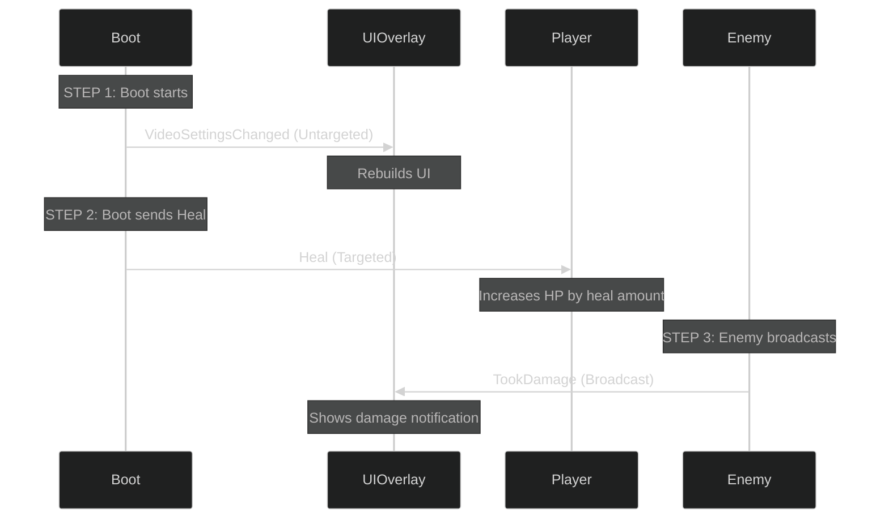

# Mini Combat Walkthrough

> **Deep Dive**: Ready to understand HOW it works? This walkthrough explains every line of code and shows the complete message flow.

## Who This Is For

- ✅ **You've imported and run the sample** - now you want to understand it
- ✅ **You want to build your own** - need to see the patterns in action
- ✅ **You're debugging something** - need to understand the flow

**Haven't run the sample yet?** Go back to [the sample README](README.md) and press Play first. Come back when you've seen it work.

---

## What You'll Understand By The End

After reading this walkthrough, you'll know:

1. **Why each message type was chosen** - the reasoning behind Untargeted vs Targeted vs Broadcast
2. **How the code flows** - step-by-step from [Boot.cs](./Boot.cs) through every script
3. **Common patterns** - Observer, Broadcaster, Orchestrator, and more
4. **Debugging strategies** - how to find and fix issues
5. **How to extend it** - add your own messages and handlers

**Estimated time:** 20-30 minutes for thorough understanding

---

## Table of Contents

- [Script Overview](#script-overview)
- [Complete Message Flow](#complete-message-flow)
- [Scene 1: Settings Update](#scene-1-settings-update)
- [Scene 2: Healing the Player](#scene-2-healing-the-player)
- [Scene 3: Enemy Takes Damage](#scene-3-enemy-takes-damage)
- [Understanding Targeting Decisions](#understanding-targeting-decisions)
- [Debugging Tips](#debugging-tips)
- [Common Patterns Explained](#common-patterns-explained)

---

## Script Overview

Let's understand what each script does:

### [Messages.cs](./Messages.cs)

**Purpose**: Defines all message types used in the sample

```csharp
// Message definitions (simplified for explanation)
- VideoSettingsChanged (untargeted)  // Global setting anyone can listen to
- Heal (targeted)                    // Directed at a specific component
- TookDamage (broadcast)             // Announced to all interested parties
```

**Why separate file?** Keeping messages in one place makes them easy to find and prevents circular dependencies.

### [Player.cs](./Player.cs)

**What it does**: Listens for healing messages targeted specifically at this player

**Key code pattern**:

- Registers to receive `Heal` messages **targeted at its Component**
- Only *this specific Player instance* receives the heal
- Other Player instances in the scene won't be affected

**Real-world analogy**: Like having your name called in a doctor's office—only you respond.

### [Enemy.cs](./Enemy.cs)

**What it does**: Broadcasts when it takes damage

**Key code pattern**:

- Emits `TookDamage` as a **broadcast from its GameObject**
- Any listener interested in damage events will hear it
- The Enemy doesn't need to know who's listening

**Real-world analogy**: Like ringing a bell—anyone nearby can hear it.

### [UIOverlay.cs](./UIOverlay.cs)

**What it does**: Monitors game events and updates the UI

**Key code pattern**:

- Listens to `VideoSettingsChanged` (untargeted)
- Listens to `TookDamage` from **all sources** using `RegisterBroadcastWithoutSource`
- Acts as a "dashboard" showing what's happening in the game

**Real-world analogy**: Like a news reporter watching everything and reporting it.

### [Boot.cs](./Boot.cs)

**What it does**: Starts the demo by simulating a sequence of events

**Key code pattern**:

- Sends messages to trigger the other scripts
- Acts as a "director" orchestrating the demo

---

## Complete Message Flow

Here's the full sequence that happens when you press Play:



---

## Scene 1: Settings Update

### What Happens

Boot sends a `VideoSettingsChanged` message (untargeted).

### Why Untargeted

Settings changes are **global events**—they don't target anyone specifically. Anyone interested in settings can listen.

### The Code Flow

1. **[Boot.cs](./Boot.cs)** calls: `var settings = new VideoSettingsChanged(); settings.Emit();`
1. **[UIOverlay.cs](./UIOverlay.cs)** receives it through its registered handler
1. **UIOverlay** rebuilds the UI with new settings

### Developer Notes

#### When to use untargeted messages:

- Global game state changes (settings, game mode, pause state)
- Events that multiple unrelated systems might care about
- Configuration updates

##### Pros:

- Simple and fast
- No need to know who's listening
- Easy to add new listeners

###### Cons:

- No targeting—everyone gets it
- Can't send to just one specific object

---

## Scene 2: Healing the Player

### What Happens

Boot sends a `Heal` message **targeted directly at the Player Component**.

### Why Targeted

We want to heal **one specific player**, not all players in the scene.

### The Code Flow

1. **[Boot.cs](./Boot.cs)** finds the Player Component reference
1. **[Boot.cs](./Boot.cs)** calls: `var heal = new Heal(amount); heal.EmitComponentTargeted(targetComponent);`
1. **Only the targeted [Player.cs](./Player.cs)** receives it through its handler
1. **Player** increases its HP

### Developer Notes

#### When to use targeted messages:

- Actions directed at specific objects (heal this player, damage this enemy)
- Commands for specific systems (open this door, activate this switch)
- Any time you need precision delivery

##### Pros:

- Precise delivery to one recipient
- Multiple instances can exist without crosstalk
- Clear intent in code

###### Cons:

- Need a reference to the target
- Can't easily notify multiple targets

---

## Scene 3: Enemy Takes Damage

### What Happens

Enemy broadcasts a `TookDamage` message from its GameObject.

### Why Broadcast

The Enemy doesn't know (or care) who needs to know about the damage. It just announces it.

### The Code Flow

1. **[Enemy.cs](./Enemy.cs)** detects it took damage
1. **Enemy** calls: `this.EmitBroadcast(new TookDamage(amount))`
1. **UIOverlay** receives it via `RegisterBroadcastWithoutSource`
1. **UIOverlay** displays the damage event

### Developer Notes

#### When to use broadcast messages:

- Events that multiple systems might monitor (damage, death, score)
- Audio triggers (play sound when anything explodes)
- Analytics/logging systems
- UI notifications

##### Pros:

- Publisher doesn't need to know about subscribers
- Easy to add new listeners without modifying emitter
- Great for cross-cutting concerns (audio, VFX, analytics)

###### Cons:

- Less efficient than targeted messages
- Every listener is notified (can't filter by source unless registered specifically)

---

## Understanding Targeting Decisions

### Why Player Uses Component-Targeted Registration

```csharp
// Player.cs registers like this:
token.RegisterComponentTargeted<Heal>(this, OnHeal);
```

#### Reasoning:

- Multiple Player instances might exist (multiplayer, AI companions)
- Each Player should only respond to heals directed at **itself**
- Component-level targeting provides this precision

##### What if we used untargeted instead?

- Problem: ALL players would be healed simultaneously
- Not realistic for gameplay
- Hard to control individual player states

### Why UIOverlay Uses Broadcast Without Source

```csharp
// UIOverlay.cs registers like this:
token.RegisterBroadcastWithoutSource<TookDamage>(OnTookDamage);
```

#### Reasoning:

- UI needs to monitor **all damage events** in the game
- Doesn't matter which enemy was damaged
- Acts as a global observer

##### Alternative approaches:

- `RegisterGameObjectBroadcast`: Listen only to broadcasts from specific GameObject
- `RegisterComponentBroadcast`: Listen only to broadcasts from specific Component

###### When to use each:

| Method | Use Case | Example |
|--------|----------|---------|
| `RegisterBroadcastWithoutSource` | Monitor all broadcasts of this type | Combat log showing all damage |
| `RegisterGameObjectBroadcast` | Monitor broadcasts from specific GameObject | Health bar for one enemy |
| `RegisterComponentBroadcast` | Monitor broadcasts from specific Component | Track specific weapon's fire events |

---

## Debugging Tips

### Enable Diagnostics

1. Select any GameObject with `MessagingComponent`
1. In the Inspector, find the MessagingComponent
1. Check the **"Enable Diagnostics"** box
1. Press Play

#### What you'll see:

- Real-time log of messages sent and received
- Message types and payloads
- Source and target information
- Timing information

### Debugging Checklist

#### Message not received?

- [ ] Is `MessagingComponent` attached to the GameObject?
- [ ] Did you call `MessagingComponent.Create(this)` to get a token?
- [ ] Is the handler method registered correctly?
- [ ] Does the message type match exactly?
- [ ] Is the targeting correct (Component vs GameObject vs Untargeted)?

##### Message received by wrong object?

- [ ] Check if using Broadcast when you meant Targeted
- [ ] Verify Component vs GameObject targeting
- [ ] Check registration method (`RegisterComponent` vs `RegisterGameObject`)

###### Message sent but nothing happens?

- [ ] Verify handler method signature matches
- [ ] Check if GameObject is active
- [ ] Ensure Component is enabled
- [ ] Look for exceptions in Console

---

## Common Patterns Explained

### Pattern 1: The Observer (UIOverlay)

**What**: A component that listens to many events without being directly involved

**Use for**: UI, analytics, audio, logging

**Key characteristic**: Uses `RegisterBroadcastWithoutSource` to monitor everything

### Pattern 2: The Direct Recipient (Player)

**What**: A component that receives targeted instructions

**Use for**: Entities receiving commands, objects being modified

**Key characteristic**: Uses `RegisterComponent` for precise delivery

### Pattern 3: The Broadcaster (Enemy)

**What**: A component that announces events without knowing who's listening

**Use for**: Events that multiple systems care about

**Key characteristic**: Uses `EmitBroadcast` to send messages

### Pattern 4: The Orchestrator (Boot)

**What**: A component that coordinates by sending multiple messages

**Use for**: Game flow, cutscenes, tutorials, state machines

**Key characteristic**: Publishes various message types to drive the system

---

## Key Takeaways

### For Beginners

1. **Messages replace direct references**: Instead of `player.Heal()`, use messages
1. **Three targeting types**: Untargeted (everyone), Targeted (someone specific), Broadcast (anyone listening)
1. **MessagingComponent is required**: It manages the lifecycle of your subscriptions
1. **Diagnostics are your friend**: Always enable them when learning

### For Intermediate Developers

1. **Choose targeting carefully**: Match the message type to your use case
1. **Broadcast doesn't mean inefficient**: DxMessaging is highly optimized
1. **Tokens prevent memory leaks**: They auto-unregister when destroyed
1. **Assembly definitions matter**: Configure them correctly for separate assemblies

### For Advanced Developers

1. **Source-filtered broadcasts exist**: Use `RegisterGameObjectBroadcast` for efficiency
1. **Message order can be controlled**: See the Interceptors & Ordering documentation
1. **Performance considerations**: Targeted > Broadcast in terms of overhead
1. **Consider message granularity**: Too many message types = harder maintenance

---

## What's Next

### Experiment and Extend

Try modifying the sample:

- Add a second Player and see targeted messages in action
- Create a `PlayerDied` broadcast and handle it in multiple places
- Add a UI button that sends messages when clicked
- Implement a damage-over-time system using messages

### Learn More

- **[Message Types Documentation](../../docs/concepts/message-types.md)** - Complete message type reference
- **[Targeting and Context Guide](../../docs/concepts/targeting-and-context.md)** - Deep dive into targeting
- **[Patterns Guide](../../docs/guides/patterns.md)** - Common messaging patterns
- **[Performance Guide](../../docs/architecture/performance.md)** - Optimization tips

---

## Quick Reference Card

| Want to... | Use... | Example |
|------------|--------|---------|
| Send to everyone | Untargeted | `var paused = new GamePaused(); paused.Emit();` |
| Send to specific Component | Targeted | `var heal = new Heal(10); heal.EmitComponentTargeted(playerComponent);` |
| Announce an event | Broadcast | `this.EmitBroadcast(new Exploded())` |
| Listen to everything | `RegisterBroadcastWithoutSource` | `token.RegisterBroadcastWithoutSource<Damage>(OnDamage)` |
| Listen to specific source | `RegisterComponentBroadcast` | `token.RegisterComponentBroadcast<Fire>(weapon, OnFire)` |
| Receive targeted messages | `RegisterComponentTargeted` | `token.RegisterComponentTargeted<Heal>(this, OnHeal)` |

---

**Remember**: Keep Player, Enemy, and UIOverlay GameObjects each with a `MessagingComponent` attached, and enable diagnostics to observe message traffic.
