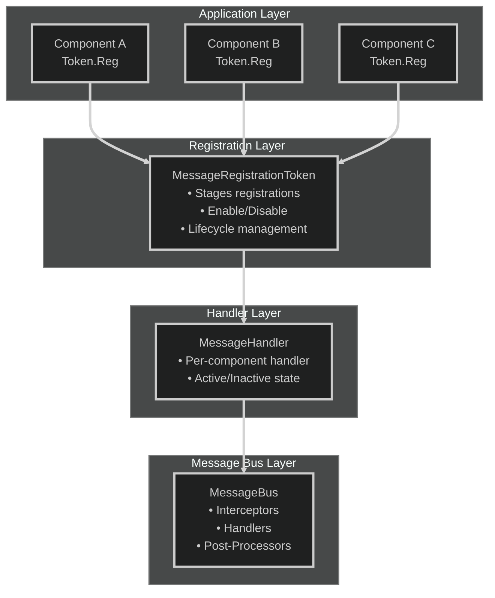

# Design & Architecture: Under the Hood

This document explains DxMessaging’s internal design, performance optimizations, and architectural decisions. Read this to understand how and why DxMessaging works the way it does.

## Table of Contents

- [Core Design Principles](#core-design-principles)
- [Architecture Overview](#architecture-overview)
- [Performance Optimizations](#performance-optimizations)
- [Message Type System](#message-type-system)
- [Registration and Lifecycle](#registration-and-lifecycle)
- [The Message Bus](#the-message-bus)
- [Why DxMessaging is Fast](#why-dxmessaging-is-fast)
- [Design Decisions and Tradeoffs](#design-decisions-and-tradeoffs)

## Core Design Principles

DxMessaging was built with these principles:

1. Zero‑Allocation Communication
   - Messages are `readonly struct` types passed by `ref`.
   - No boxing, no temporary objects, minimal GC pressure.
   - Handlers receive `ref` parameters for struct messages.

1. Type‑Safe by Default
   - Compile‑time guarantees via generic constraints.
   - No string‑based dispatch (unlike Unity’s `SendMessage`).
   - Source generators provide boilerplate‑free message definitions.

1. Predictable Execution
   - Priority‑based handler ordering (lower priority runs first).
   - Three‑stage pipeline: Interceptors → Handlers → Post‑Processors.
   - Deterministic behavior within each priority level.

1. Observable & Debuggable
   - Built‑in diagnostics via `CyclicBuffer`.
   - Registration logging with `RegistrationLog`.
   - Inspector integration for runtime visibility.

1. Lifecycle Safety
   - `MessageRegistrationToken` manages enable/disable.
   - Automatic cleanup prevents memory leaks.
   - Unity lifecycle integration via `MessageAwareComponent`.

1. Decoupled by Nature
   - Three semantic categories: Untargeted, Targeted, Broadcast.
   - No direct references between producers and consumers.
   - Context‑aware (who sent, who received) without tight coupling.

## Architecture Overview

### Layer Responsibilities

1. **Application Layer** - Your Unity components register message handlers
1. **Registration Layer** - Token manages handler lifecycle (enable/disable/cleanup)
1. **Handler Layer** - Per-component state management (active/inactive)
1. **Message Bus Layer** - Routes messages through interceptors → handlers → post-processors

## Performance Optimizations

- Struct messages passed by `ref` to avoid copying and GC.
- Minimal allocations in hot paths; logging and diagnostics use ring buffers.
- Pre‑allocated internal collections for common operations.
- Handlers are sorted by priority once during registration. Emitting a message iterates through all active handlers in that order.

## Message Type System

- Untargeted: broadcast‑like notifications without an explicit receiver.
- Targeted: deliver to a specific target (e.g., GameObject, `InstanceId`).
- Broadcast: deliver to all listeners (optionally capturing the source).

Attributes like `[DxTargetedMessage]` and `[DxBroadcastMessage]` (with source generators) provide strong typing with minimal boilerplate.

## Registration and Lifecycle

- `MessageRegistrationToken` groups per‑component registrations.
- Enable/disable toggles all component handlers together.
- Disposal cleans up handlers automatically, preventing leaks.
- `MessageAwareComponent` wires Unity lifecycles to tokens for safety.

## The Message Bus

Message flow: Interceptors → Handlers → Post‑Processors.

- Interceptors may transform or cancel messages before delivery.
- Handlers execute in priority order; lower number executes first.
- Post‑processors observe outcomes and can emit follow‑up messages.

## Why DxMessaging is Fast

- No reflection for dispatch; compile‑time generics and static typing.
- No string dispatch or dynamic lookup.
- Ref‑based delivery avoids copies and allocations.
- Tight internal data structures tuned for Unity hot loops.

## Design Decisions and Tradeoffs

- Priorities are numeric for clarity and control; predictable ordering beats implicit timing.
- Strong typing over dynamic flexibility; safer refactoring and IDE support.
- Diagnostics are opt‑in and lightweight to keep runtime overhead minimal.

See also:

- [Interceptors and Ordering](../concepts/interceptors-and-ordering.md)
- [Diagnostics](../guides/diagnostics.md)
- [Message Types](../concepts/message-types.md)
