# Mental Model: How to Think About DxMessaging

[← Concepts Index](index.md) | [Message Types](message-types.md) | [Getting Started](../getting-started/getting-started.md)

---

This guide explains how to think about DxMessaging from first principles. Understanding the mental model makes everything else easier.

## The Core Idea

DxMessaging is built around one principle: **it gets out of your way**.

You have data. You need to pass it around. That's the problem.

DxMessaging provides fast, simple primitives as building blocks. You model changes as message types with optional context, using game primitives (GameObjects, components) as that context. The library handles the plumbing.

You don't build your game INTO the messaging system. The messaging system is opt-in and optional - a tool you reach for when it helps.

## What Problem Does This Solve?

In a typical Unity project, you face a common challenge:

```text
Player takes damage
    ├── Health bar needs updating
    ├── Sound system plays damage audio
    ├── Camera shakes
    ├── Achievement system checks milestones
    ├── Analytics logs the event
    └── Tutorial system checks for tips
```

Traditional approaches require tight coupling: either the Player knows about all these systems, or they all hold references to the Player. Both paths lead to tangled dependencies.

DxMessaging inverts this relationship. The Player broadcasts a fact - "I took 25 damage" - and interested systems subscribe to receive it. Systems come and go without the Player knowing or caring.

## The Three Message Categories

DxMessaging models three fundamental patterns of communication. Each maps to a real-world analogy.

### Untargeted: The PA System

```mermaid
flowchart LR
    S[Someone] -->|announces| PA[📢 PA System]
    PA --> L1[Listener A]
    PA --> L2[Listener B]
    PA --> L3[Listener C]
```



Untargeted messages are announcements. No specific recipient. No specific sender that matters. Everyone who cares can hear it.

> 📝 **Note: No sender identity**
>
> Unlike a real PA system, untargeted messages carry no concept of "who announced it." There is no sender identity attached - only the message content itself.

#### Real examples

- "The game is paused"
- "Settings changed"
- "Scene finished loading"
- "Day/night cycle switched to night"

```csharp
// Define an untargeted message with attributes
[DxUntargetedMessage]
[DxAutoConstructor]
public readonly partial struct GamePaused
{
    public readonly bool isPaused;
}

// Multiple fields are supported
[DxUntargetedMessage]
[DxAutoConstructor]
public readonly partial struct SettingsChanged
{
    public readonly float volume;
    public readonly int quality;
}
```

**Use when:** You need to announce something to whoever might care. The sender doesn't know or care who's listening.

### Targeted: The Addressed Letter


Targeted messages are commands or directed events. They have a specific recipient. Only that recipient (and any interested observers) receives them.

#### Real examples

- "Player, heal for 10 HP"
- "Door #7, open"
- "This specific enemy, take 25 damage"
- "Inventory slot 3, equip this weapon"

```csharp
// Define a targeted message with attributes
[DxTargetedMessage]
[DxAutoConstructor]
public readonly partial struct Heal
{
    public readonly int amount;
}

// Emit to a specific target
Heal heal = new Heal(10);
heal.EmitGameObjectTargeted(playerGameObject);
```

**Use when:** You're commanding a specific entity to do something, or notifying a specific entity about something that happened to it.

### Broadcast: The Radio Station

```mermaid
flowchart LR
    Source[Enemy] -->|"I took damage!"| Radio[📻 Message Bus]
    Radio --> L1[Damage Numbers UI]
    Radio --> L2[Achievement Tracker]
    Radio --> L3[Analytics]
    Radio --> L4[Combat Log]
```



Broadcast messages are facts emitted by a specific source. Unlike targeted messages, there's no intended recipient - just an origin. Anyone who wants to observe can tune in.

#### Real examples

- "This enemy took 25 damage" (from the enemy)
- "The player picked up item X" (from the player)
- "This chest opened" (from the chest)
- "Projectile hit something" (from the projectile)

```csharp
// Define a broadcast message with attributes
[DxBroadcastMessage]
[DxAutoConstructor]
public readonly partial struct TookDamage
{
    public readonly int amount;
}

// Emit from a specific source
TookDamage damage = new TookDamage(25);
damage.EmitGameObjectBroadcast(thisEnemy);
```

**Use when:** Something happened to an entity, and other systems might want to know about it. The entity doesn't care who's listening.

## Deciding Which Type to Use


| Question                            | Untargeted | Targeted | Broadcast |
| ----------------------------------- | :--------: | :------: | :-------: |
| Has a specific sender that matters? |     ❌     |    ❌    |    ✅     |
| Has a specific recipient?           |     ❌     |    ✅    |    ❌     |
| Is it a command?                    |     ❌     |    ✅    |    ❌     |
| Is it an observable fact?           |   Maybe    |    ❌    |    ✅     |
| Is it a global announcement?        |     ✅     |    ❌    |    ❌     |

## Tokens and Lifecycle

Registration in DxMessaging happens through tokens. A `MessageRegistrationToken` collects your registrations and ties them to a lifecycle.

### The Pattern

```csharp
public class HealthDisplay : MessageAwareComponent
{
    protected override void RegisterMessageHandlers()
    {
        base.RegisterMessageHandlers();

        // Register handlers through the Token
        _ = Token.RegisterGameObjectBroadcast<TookDamage>(player, OnPlayerDamaged);
        _ = Token.RegisterUntargeted<GamePaused>(OnGamePaused);
    }

    private void OnPlayerDamaged(ref TookDamage msg) { /* update display */ }
    private void OnGamePaused(ref GamePaused msg) { /* pause animations */ }
}
```

> ⚠️ **Warning: Always call `base.RegisterMessageHandlers()`**
>
> When overriding `RegisterMessageHandlers()`, always call `base.RegisterMessageHandlers()` first. This ensures that any registrations from parent classes are preserved. Forgetting this call can silently break inherited behavior.

### What the Token Does


The token:

1. **Stages** registrations when you call `Register*` methods
1. **Activates** them when you call `Enable()`
1. **Deactivates** them when you call `Disable()`
1. **Cleans up** when the token is disposed or the component is destroyed

This maps directly to Unity's lifecycle: registrations activate in `OnEnable`, deactivate in `OnDisable`, and clean up in `OnDestroy`.

### Why Tokens Matter

Tokens prevent common event system bugs:

- **No forgotten unsubscribes**: The token tracks everything
- **No null reference handlers**: Disabled tokens don't receive messages
- **No memory leaks**: Token cleanup is automatic with `MessageAwareComponent`
- **Predictable timing**: Enable/disable follows Unity's enable state

## Context Through Game Primitives

DxMessaging uses Unity's primitives (GameObjects, Components) as natural context for messages.

### InstanceId

Every registration and emission uses an `InstanceId` - a lightweight identifier that wraps a Unity Object's instance ID. You rarely need to create these manually because extension methods handle the conversion:

```csharp
// These are equivalent:
heal.EmitGameObjectTargeted(playerGameObject);
heal.EmitTargeted((InstanceId)playerGameObject);

// Registering for a specific component
Token.RegisterComponentTargeted<Damage>(this, OnDamage);

// Registering for a whole GameObject
Token.RegisterGameObjectTargeted<Damage>(gameObject, OnDamage);
```

### GameObject vs Component Targeting

You can target at two levels:

**GameObject level**: All components on that GameObject can respond

```csharp
// Registration
Token.RegisterGameObjectTargeted<Command>(gameObject, HandleCommand);

// Emission (any component on playerGO can receive this)
command.EmitGameObjectTargeted(playerGO);
```

**Component level**: Only that specific component responds

```csharp
// Registration
Token.RegisterComponentTargeted<Command>(this, HandleCommand);

// Emission (only this specific component instance receives this)
command.EmitComponentTargeted(specificComponent);
```

## Observing Without Targeting

Sometimes you want to see all messages of a type, regardless of their target or source.

### Observing All Targeted Messages

```csharp
// See every Heal message, no matter who it's for
Token.RegisterTargetedWithoutTargeting<Heal>(OnAnyHeal);

void OnAnyHeal(ref InstanceId target, ref Heal msg)
{
    // 'target' tells you who was healed
    Debug.Log($"Someone healed {target} for {msg.amount}");
}
```

### Observing All Broadcast Messages

```csharp
// See every TookDamage message, no matter who broadcast it
Token.RegisterBroadcastWithoutSource<TookDamage>(OnAnyDamage);

void OnAnyDamage(ref InstanceId source, ref TookDamage msg)
{
    // 'source' tells you who took damage
    Debug.Log($"{source} took {msg.amount} damage");
}
```

These patterns are useful for:

- Analytics systems
- Combat logs
- Debug overlays
- Achievement tracking
- Network replication

## The "Gets Out of the Way" Philosophy

DxMessaging is designed to be invisible when you don't need it:

1. **No global state pollution**: Messages are just data. Define them anywhere.
1. **No inheritance requirements**: Implement an interface or add an attribute. That's it.
1. **No framework lock-in**: Your message structs are plain C#. They work outside DxMessaging.
1. **No ceremony**: Define a struct, emit it, handle it. Three steps.
1. **Optional everywhere**: Don't want to use it for something? Don't. Mix and match.

The library provides primitives. You compose them into patterns that fit your game.

## Common Patterns at a Glance

| Pattern               | Message Type | Registration                          | Emission                          |
| --------------------- | ------------ | ------------------------------------- | --------------------------------- |
| Global setting change | Untargeted   | `RegisterUntargeted<T>`               | `msg.EmitUntargeted()`            |
| Command to entity     | Targeted     | `RegisterGameObjectTargeted<T>`       | `msg.EmitGameObjectTargeted(go)`  |
| Something happened    | Broadcast    | `RegisterGameObjectBroadcast<T>`      | `msg.EmitGameObjectBroadcast(go)` |
| Observe all of type   | Targeted     | `RegisterTargetedWithoutTargeting<T>` | (normal emission)                 |
| Observe all sources   | Broadcast    | `RegisterBroadcastWithoutSource<T>`   | (normal emission)                 |

## Common Mistakes

When getting started with DxMessaging, watch out for these common pitfalls:

### Forgetting to Enable the Token

Registrations are **staged** when you call `Register*` methods, but they don't become active until the token is enabled. If you're using `MessageAwareComponent`, this is handled automatically. If managing tokens manually, remember to call `Token.Enable()` after registering.

### Targeting Component When You Meant GameObject (or Vice Versa)

Component-level targeting (`EmitComponentTargeted`) and GameObject-level targeting (`EmitGameObjectTargeted`) are distinct. A message emitted to a specific component won't be received by handlers registered at the GameObject level for the same object, and vice versa. Be deliberate about which level you're targeting.

### Forgetting to Call `base.RegisterMessageHandlers()`

See the warning in [The Pattern](#the-pattern) above. Always call the base method first when overriding `RegisterMessageHandlers()`.

### Not Understanding Synchronous Handler Execution

Message handlers are called **synchronously** and **immediately** when a message is emitted. This means:

- The emitting code blocks until all handlers complete
- Long-running handlers will cause frame hitches
- Handlers execute in registration order (modified by priority)
- Exceptions in handlers can affect other handlers if not caught

Design your handlers to be fast and non-blocking.

## Next Steps

- [Message Types](message-types.md): Detailed reference for all three types
- [Listening Patterns](listening-patterns.md): All the ways to receive messages
- [Getting Started](../getting-started/getting-started.md): Hands-on walkthrough
- [Patterns Guide](../guides/patterns.md): Real-world usage patterns
