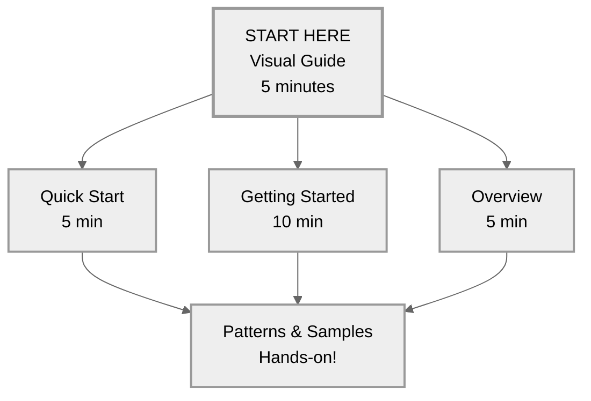
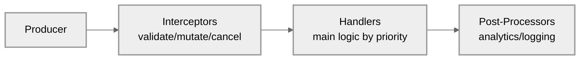

# DxMessaging Documentation Hub

This is the documentation for DxMessaging, a type-safe messaging system for Unity.

## Visual Documentation Map

## Table of Contents

- [New to DxMessaging](#new-to-dxmessaging)
- [Learning Path](#learning-path)
- [Core Documentation](#core-documentation)
- [Reference](#reference)
- [Examples and Samples](#examples-and-samples)
- [By Use Case](#by-use-case)
- [Quick Start Path](#quick-start-path)

---

## New to DxMessaging

**Never used a messaging system before?** Start here:

1. **[Mental Model](../concepts/mental-model.md)** - How to think about DxMessaging (10 min)
1. **[Visual Guide](visual-guide.md)** - Beginner-friendly visual introduction (5 min)
1. **[Getting Started Guide](getting-started.md)** - Comprehensive guide with examples (10 min)
1. **[Quick Start](quick-start.md)** - Your first working message (5 min)
1. **[Overview](overview.md)** - What DxMessaging is and why it exists (5 min)

## Learning Path

### For Absolute Beginners (Never Used Messaging Before)

1. Read [Mental Model](../concepts/mental-model.md) (10 min) - Philosophy first!
1. Read [Visual Guide](visual-guide.md) (5 min) - Pictures and analogies!
1. Read [Getting Started](getting-started.md) (10 min) - Complete introduction
1. Try [Quick Start](quick-start.md) (5 min) - Hands-on tutorial
1. Understand [Message Types](../concepts/message-types.md) (10 min) - When to use what
1. Study [Common Patterns](../guides/patterns.md) (15 min) - Real examples

### For Advanced Users

1. Master [Interceptors & Ordering](../concepts/interceptors-and-ordering.md)
1. Explore [Listening Patterns](../concepts/listening-patterns.md)
1. Deep dive into [Design & Architecture](../architecture/design-and-architecture.md)
1. Review [Advanced Topics](../guides/advanced.md)

## Core Documentation

### Essentials

- **[Visual Guide](visual-guide.md)** - Beginner-friendly visual introduction with pictures and analogies
- **[Getting Started](getting-started.md)** - Complete beginner's guide with mental models
- **[Overview](overview.md)** - What and why
- **[Quick Start](quick-start.md)** - First message in 5 minutes
- **[Message Types](../concepts/message-types.md)** - When to use Untargeted/Targeted/Broadcast
- **[Comparisons](../architecture/comparisons.md)** - DxMessaging vs C# Events, UnityEvents, SendMessage

### Core Concepts

- **[Interceptors & Ordering](../concepts/interceptors-and-ordering.md)** - Validate, transform, control execution
- **[Listening Patterns](../concepts/listening-patterns.md)** - All the ways to receive messages
- **[Targeting & Context](../concepts/targeting-and-context.md)** - GameObject vs Component
- **[Patterns](../guides/patterns.md)** - Real-world usage patterns

### Unity Integration

- **[Unity Integration](../guides/unity-integration.md)** - MessagingComponent, MessageAwareComponent
- **[Diagnostics](../guides/diagnostics.md)** - Inspector tools, debugging, observability

### Architecture & Performance

- **[Design & Architecture](../architecture/design-and-architecture.md)** - Deep dive into internals and optimizations
- **[Performance Benchmarks](../architecture/performance.md)** - OS-specific tables auto-generated by tests
- **[Advanced](../guides/advanced.md)** - Lifecycles, safety, manual control

## Reference

### Quick Lookups

- **[Glossary](../reference/glossary.md)** - All terms explained in plain English
- **[Quick Reference](../reference/quick-reference.md)** - API cheat sheet
- **[API Reference](../reference/reference.md)** - Complete API documentation
- **[FAQ](../reference/faq.md)** - Common questions
- **[Troubleshooting](../reference/troubleshooting.md)** - Solving common issues

### Tools & Utilities

- **[Helpers](../reference/helpers.md)** - Source generators, attributes, extensions
- **[Message Bus Providers](../advanced/message-bus-providers.md)** - Provider system and MessageBusProviderHandle for flexible bus configuration
- **[Runtime Configuration](../advanced/runtime-configuration.md)** - Setting message buses at runtime, re-binding registrations
- **[Registration Builders](../advanced/registration-builders.md)** - Fluent API for building message registrations
- **[Emit Shorthands](../advanced/emit-shorthands.md)** - `Emit`/`EmitAt`/`EmitFrom` usage and pitfalls
- **[String Messages](../advanced/string-messages.md)** - Prototyping and debugging
- **[Compatibility](../reference/compatibility.md)** - Unity versions and render pipelines
- **[Install](install.md)** - Installation guide

## Examples and Samples

### Unity Samples (Importable!)

**Located in `Samples~/` directory** - Import via Unity Package Manager!

- **[Mini Combat](https://github.com/wallstop/DxMessaging/blob/master/Samples~/Mini%20Combat/README.md)** - Interactive combat demo with Heal/Damage messages
  - Perfect first example to understand message flow
  - Shows Targeted and Broadcast messages in action
  - Complete working scene you can play with

- **[UI Buttons + Inspector](https://github.com/wallstop/DxMessaging/blob/master/Samples~/UI%20Buttons%20%2B%20Inspector/README.md)** - Interactive diagnostics demo
  - See the Inspector diagnostics in action
  - Explore message history and handler registrations
  - Great for debugging and understanding the system

### Code Examples (In Docs)

- **[End-to-End Example](../examples/end-to-end.md)** - Complete feature walkthrough
- **[Scene Transitions Example](../examples/end-to-end-scene-transitions.md)** - Scene management pattern

### Real-World Patterns

From [Common Patterns](../guides/patterns.md):

- Scene-wide events (Untargeted)
- Directed commands (Targeted)
- Observability (Broadcast)
- Validation with Interceptors
- Analytics with Post-Processors
- Local bus islands for testing

## By Use Case

### "I want to..."

- **Decouple my systems** - Start with [Getting Started](getting-started.md)
- **Replace C# events** - See [Comparisons](../architecture/comparisons.md)
- **Send a command to one object** - Use [Targeted Messages](../concepts/message-types.md#targeted-messages)
- **Broadcast an event** - Use [Broadcast Messages](../concepts/message-types.md#broadcast-messages)
- **Notify globally** - Use [Untargeted Messages](../concepts/message-types.md#untargeted-messages)
- **Validate messages before execution** - Learn [Interceptors](../concepts/interceptors-and-ordering.md)
- **Track all damage/events** - See [Listening Without Context](../concepts/listening-patterns.md)
- **Debug message flow** - Use [Diagnostics](../guides/diagnostics.md)
- **Optimize performance** - Read [Performance Tips](../architecture/design-and-architecture.md#performance-optimizations)
- **Isolate tests** - Create [Local Bus Islands](../guides/patterns.md#6-local-bus-islands)
- **Use dependency injection** - [DxMessaging + Zenject](../integrations/zenject.md), [DxMessaging + VContainer](../integrations/vcontainer.md), [DxMessaging + Reflex](../integrations/reflex.md)
- **Configure buses at runtime** - See [Runtime Configuration](../advanced/runtime-configuration.md)
- **Use message bus providers** - Learn [Message Bus Providers](../advanced/message-bus-providers.md)

## Visual: Message Pipeline

Every message flows through 3 stages:

## Learning Resources

### Must-Read Docs (In Order)

1. **[Getting Started](getting-started.md)** - Start here! (10 min)
1. **[Message Types](../concepts/message-types.md)** - Choose the right type (10 min)
1. **[Patterns](../guides/patterns.md)** - See real examples (15 min)
1. **[Diagnostics](../guides/diagnostics.md)** - Debug like a pro (10 min)
1. **[Design & Architecture](../architecture/design-and-architecture.md)** - Understand the internals (30 min)

### Feature-Specific

- **Priority & Ordering** - [Interceptors & Ordering](../concepts/interceptors-and-ordering.md)
- **Global Observers** - [Listening Patterns](../concepts/listening-patterns.md)
- **Unity Lifecycle** - [Unity Integration](../guides/unity-integration.md)
- **Performance** - [Design & Architecture](../architecture/design-and-architecture.md)

## Comparison Charts

### DxMessaging vs Alternatives

From [Comparisons](../architecture/comparisons.md):

| Feature          | DxMessaging | C# Events | UnityEvents | Static Bus |
| ---------------- | ----------- | --------- | ----------- | ---------- |
| Decoupling       | Full        | Tight     | Hidden      | Yes        |
| Lifecycle Safety | Auto        | Manual    | Unity       | Manual     |
| Execution Order  | Priority    | Random    | Random      | Random     |
| Observability    | Built-in    | No        | No          | No         |
| Performance      | Zero-alloc  | Good      | Boxing      | Good       |

## Search by Topic

### Concepts

- **Messages** - [Message Types](../concepts/message-types.md), [Getting Started](getting-started.md)
- **Handlers** - [Listening Patterns](../concepts/listening-patterns.md), [Unity Integration](../guides/unity-integration.md)
- **Lifecycle** - [Advanced](../guides/advanced.md), [Unity Integration](../guides/unity-integration.md)
- **Performance** - [Design & Architecture](../architecture/design-and-architecture.md)
- **Testing** - [Patterns](../guides/patterns.md#6-local-bus-islands), [Testing Guide](../guides/testing.md)

### Features

- **Interceptors** - [Interceptors & Ordering](../concepts/interceptors-and-ordering.md)
- **Post-Processors** - [Interceptors & Ordering](../concepts/interceptors-and-ordering.md)
- **Priorities** - [Interceptors & Ordering](../concepts/interceptors-and-ordering.md)
- **Global Accept-All** - [Listening Patterns](../concepts/listening-patterns.md)
- **Diagnostics** - [Diagnostics](../guides/diagnostics.md)
- **Local Buses** - [Design & Architecture](../architecture/design-and-architecture.md)

### Components

- **MessageBus** - [Design & Architecture](../architecture/design-and-architecture.md#the-message-bus)
- **MessageHandler** - [API Reference](../reference/reference.md)
- **MessageRegistrationToken** - [Unity Integration](../guides/unity-integration.md), [Advanced](../guides/advanced.md)
- **MessageAwareComponent** - [Unity Integration](../guides/unity-integration.md), [Getting Started](getting-started.md)
- **MessagingComponent** - [Unity Integration](../guides/unity-integration.md)

## Complete Document List

### Getting Started

- [Visual Guide](visual-guide.md) - Perfect for beginners
- [Getting Started Guide](getting-started.md)
- [Overview](overview.md)
- [Quick Start](quick-start.md)
- [Install](install.md)

### Core Concepts

- [Message Types](../concepts/message-types.md)
- [Interceptors & Ordering](../concepts/interceptors-and-ordering.md)
- [Listening Patterns](../concepts/listening-patterns.md)
- [Targeting & Context](../concepts/targeting-and-context.md)

### Unity

- [Unity Integration](../guides/unity-integration.md)
- [Diagnostics](../guides/diagnostics.md)
- [Patterns](../guides/patterns.md)

### Deep Dives

- [Design & Architecture](../architecture/design-and-architecture.md)
- [Advanced](../guides/advanced.md)
- [Comparisons](../architecture/comparisons.md)

### Reference

- [Quick Reference](../reference/quick-reference.md)
- [API Reference](../reference/reference.md)
- [Helpers](../reference/helpers.md)
- [FAQ](../reference/faq.md)
- [Troubleshooting](../reference/troubleshooting.md)

### Dependency Injection

- [Runtime Configuration](../advanced/runtime-configuration.md) - Setting and overriding message buses, re-binding registrations
- [Message Bus Providers](../advanced/message-bus-providers.md) - Provider system and MessageBusProviderHandle
- [DxMessaging + Zenject](../integrations/zenject.md) - Zenject integration guide
- [DxMessaging + VContainer](../integrations/vcontainer.md) - VContainer integration guide
- [DxMessaging + Reflex](../integrations/reflex.md) - Reflex integration guide

### Miscellaneous

- [String Messages](../advanced/string-messages.md)
- [Compatibility](../reference/compatibility.md)
- [End-to-End Example](../examples/end-to-end.md)
- [Scene Transitions Example](../examples/end-to-end-scene-transitions.md)
- [Mini Combat Sample](https://github.com/wallstop/DxMessaging/blob/master/Samples~/Mini%20Combat/README.md)
- [UI Buttons + Inspector Sample](https://github.com/wallstop/DxMessaging/blob/master/Samples~/UI%20Buttons%20%2B%20Inspector/README.md)

---

## Quick Start Path

**Absolute Beginner?** Follow this 40-minute path:

1. 10 min: [Mental Model](../concepts/mental-model.md) - Understand the philosophy first!
1. 5 min: [Visual Guide](visual-guide.md) - Pictures & analogies
1. 10 min: [Getting Started](getting-started.md) - Deep dive
1. 5 min: [Quick Start](quick-start.md) - Hands-on code
1. 10 min: Try a [Sample](https://github.com/wallstop/DxMessaging/blob/master/Samples~/Mini%20Combat/README.md) - See it in action

**Want to go deep?** Continue with:

1. 15 min: [Patterns](../guides/patterns.md)
1. 20 min: [Interceptors & Ordering](../concepts/interceptors-and-ordering.md)
1. 30 min: [Design & Architecture](../architecture/design-and-architecture.md)

---

Need help? Check [FAQ](../reference/faq.md) or [Troubleshooting](../reference/troubleshooting.md).
