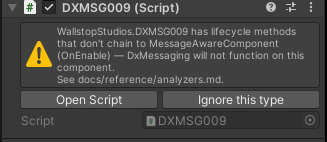
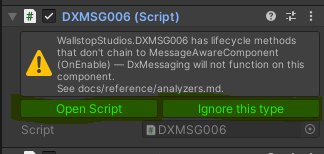
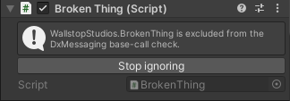
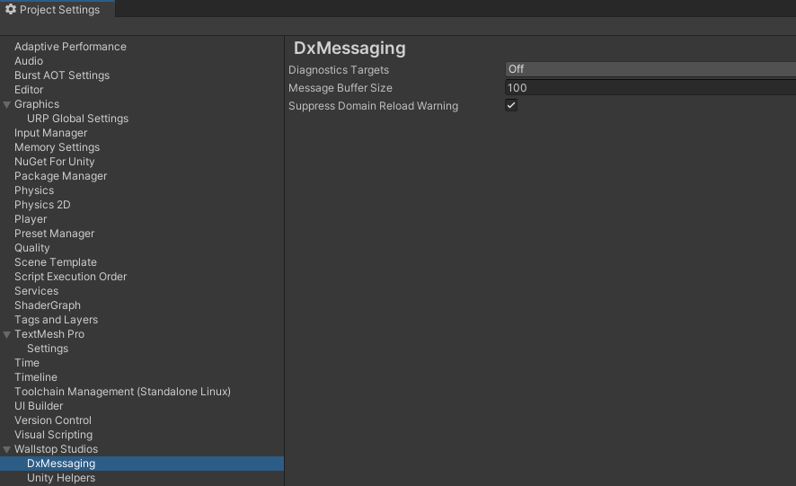
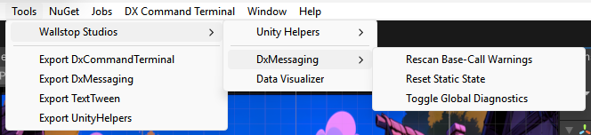
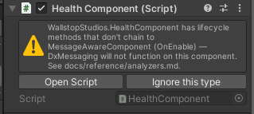
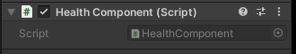

# Inspector Overlay & Base-Call Warnings

DxMessaging ships a Roslyn analyzer and a companion Unity Inspector overlay
that catch the most common authoring mistake when subclassing
`MessageAwareComponent`: forgetting to call `base.OnEnable()` (and friends)
in your override. Without those base calls the messaging system does
nothing -- every handler you registered silently fails to fire. This page
is the user-facing tour of how the package surfaces the problem and how
you fix it.

This guide covers when warnings appear, what the Inspector HelpBox looks
like, the three actions it offers, the Project Settings panel, and the
manual rescan menu. For the comprehensive reference -- every diagnostic id,
exact detection policy, suppression precedence, and Unity 2021 setup
notes -- see [Roslyn Analyzers & Diagnostics](../reference/analyzers.md).

## When a Warning Appears

Whenever your code triggers one of the base-call diagnostics
([DXMSG006](../reference/analyzers.md#dxmsg006-missing-base-call),
[DXMSG007](../reference/analyzers.md#dxmsg007-new-hides-unity-method),
[DXMSG009](../reference/analyzers.md#dxmsg009-implicit-hide-and-missing-modifier),
or [DXMSG010](../reference/analyzers.md#dxmsg010-broken-transitive-base-call-chain)),
two things happen in parallel:

1. **At compile time**, the Roslyn analyzer (`WallstopStudios.DxMessaging.Analyzer.dll`,
   shipped under `Editor/Analyzers/`) emits a warning into Unity's
   Console with the corresponding `DXMSG###` id and a message that
   names the offending type and method.
1. **At Inspector time**, the overlay reads the cached scan from
   `Library/DxMessaging/baseCallReport.json` and renders a HelpBox at
   the very top of every `MessageAwareComponent` subclass's Inspector
   that has at least one missing base call.

You see both surfaces by default. The Console warning is authoritative
for CI builds (the analyzer is registered for the C# compiler via
`csc.rsp`, so it runs on every Unity-driven compile); the Inspector
overlay is the in-Editor reminder you cannot ignore while wiring a
prefab.

!!! tip
Severity is per-project tunable. Add lines like `dotnet_diagnostic.DXMSG006.severity = error` to your `.editorconfig` to upgrade missing base calls into a build break, or `severity = none` to silence one project-wide. See [Suppression precedence](../reference/analyzers.md#suppression-precedence) for the full ordering.

## The HelpBox

When the overlay decides to render, it draws a single Unity `HelpBox`
above your component's Inspector body, followed by a horizontal row of
action buttons.



The text follows this shape:

> `<FullyQualifiedTypeName>` has lifecycle methods that don't chain to
> MessageAwareComponent (`<comma-separated method list>`) -- DxMessaging will
> not function on this component.
> See docs/reference/analyzers.md.

When the cache is stale (immediately after a domain reload, before the
first post-reload scan completes), the message above is followed by a
trailing `(cached from previous session -- refreshing...)` line on a new
paragraph -- see
[Cached-from-previous-session annotation](#cached-from-previous-session-annotation)
below.

`<comma-separated method list>` is taken straight from the analyzer's
per-type report -- typically one of `Awake`, `OnEnable`, `OnDisable`,
`OnDestroy`, or `RegisterMessageHandlers`. A single component can list
multiple methods if more than one override is broken.

### Cached-from-previous-session annotation

After a domain reload -- when you enter Play Mode, recompile, or open the
Editor -- the overlay needs a moment to rebuild its scan. Rather than
flashing an empty Inspector and then suddenly showing a warning, the
package eagerly loads the previous session's cache from
`Library/DxMessaging/baseCallReport.json` so the HelpBox is visible
immediately.

While that cached data is being refreshed, the HelpBox annotates the
trailing line of its message with `(cached from previous session --
refreshing...)`.

Once the first post-reload scan completes (typically within a single
editor tick after assembly reload completes), the harvester flips its
`IsFreshThisSession` flag and the suffix disappears. You do not need to
do anything -- the Inspector repaints automatically. The annotation
exists so you understand the data is from the previous session in the
unlikely event you have just edited the offending source code and the
Inspector is showing a warning that the latest compile would have
fixed.

## Three Inspector Actions

Below the HelpBox the overlay draws a horizontal action row. The
buttons that appear depend on whether the component's fully-qualified
type name is currently in the project ignore list.

### Default (warning) state

When the component is **not** ignored, you see two buttons:



- **Open Script** -- opens the offending component's source file at the
  top; when the legacy console bridge is enabled and a line number is
  available, the file opens at that line.
- **Ignore this type** -- appends the component's fully-qualified type
  name to `Assets/Editor/DxMessaging.BaseCallIgnore.txt`. The next
  Inspector repaint flips the HelpBox into its info shape (below).
  The mutation is deferred to the next editor frame so the current
  GUI cycle completes cleanly -- there is no perceptible delay.

### Ignored state

When the component **is** in the ignore list, the HelpBox is the blue
info shape -- the analyzer noticed this would normally be a problem,
but you have explicitly opted out -- and the action row collapses to a
single button:



- **Stop ignoring** -- removes the component's fully-qualified type
  name from the ignore list. On the next frame the HelpBox flips back
  to its warning shape if the underlying analyzer warnings still
  apply.

!!! warning
Adding a type to the ignore list silences the **overlay**, but it does not change the runtime behaviour. If the override genuinely never reaches `base.OnEnable()`, the messaging system on that component is still dead. The compile-time analyzer also continues to emit `DXMSG006/007/009/010` to the Console unless you suppress them via `.editorconfig` (see [Suppression precedence](../reference/analyzers.md#suppression-precedence)). For finer-grained control, the source-level `[DxMessaging.Core.Attributes.DxIgnoreMissingBaseCall]` attribute suppresses the analyzer at the class or method level and is checked **before** the project ignore list -- see the [Suppression precedence ordering](../reference/analyzers.md#suppression-precedence) for the full priority. Use either suppression path only when the silencing is genuinely intentional (for example, a deliberate adapter that should not participate in messaging) and document the reason somewhere your team can find it.

## Project Settings Panel

The package registers a Project Settings page under **Project
Settings > Wallstop Studios > DxMessaging**. The currently-rendered controls are:



- **Diagnostics Targets** -- flags-enum field (`Off`, `Editor`,
  `Runtime`, `All`) controlling where global diagnostics are enabled.
  See [Diagnostics](diagnostics.md) for what this toggle activates.
- **Message Buffer Size** -- integer; the default ring-buffer size
  used by every newly-created bus and token when diagnostics are
  active. Defaults to `IMessageBus.DefaultMessageBufferSize`.
- **Suppress Domain Reload Warning** -- checkbox; disables the warning
  Unity shows when "Enter Play Mode Options" skips a domain reload.
  DxMessaging still resets its statics, so the warning is noise on
  most projects.

The settings asset itself lives at
`Assets/Editor/DxMessagingSettings.asset` and stores additional
fields the overlay relies on:

- The master toggle for the base-call check, exposed on the asset
  Inspector field `DxMessagingSettings.BaseCallCheckEnabled`. When
  `false`, the overlay is silenced; the underlying analyzer still
  emits the Console warning unless `.editorconfig` says otherwise.
- The project ignore list
  (`DxMessagingSettings.BaseCallIgnoredTypes`), edited from the asset
  Inspector at `Assets/Editor/DxMessagingSettings.asset` (the Project
  Settings panel does not currently expose the ignore list). Mirrored
  to the sidecar `Assets/Editor/DxMessaging.BaseCallIgnore.txt` that
  the analyzer reads via `csc.rsp`'s `-additionalfile:` switch.
- An opt-in legacy console-scrape bridge, exposed on the asset
  Inspector field `DxMessagingSettings.UseConsoleBridge`, that
  augments the IL-reflection scanner's snapshot with warnings
  harvested from Unity's `LogEntries` store. Default off.

!!! note
The Inspector overlay's **Ignore this type** / **Stop ignoring** buttons read and write the same ignore-list field that the settings asset exposes. You can also bulk-edit the list directly from the asset Inspector.

For the field-by-field semantics -- including the ScriptableObject
behaviour around `OnValidate` regenerating the sidecar -- see
[Inspector integration](../reference/analyzers.md#inspector-integration)
in the analyzer reference.

## Tools > Wallstop Studios > DxMessaging > Rescan Base-Call Warnings

The package adds a manual rescan menu entry:



Click **Tools > Wallstop Studios > DxMessaging > Rescan Base-Call Warnings** to
re-run the harvester on demand. You normally do not need to invoke
this -- the package re-scans automatically on every assembly reload
and after every per-assembly compilation event -- but it is useful
when you have just toggled the master setting, edited the ignore
list outside of Unity, or want to confirm that a fix has cleared a
warning before the next domain reload.

The rescan is a no-op while Unity is mid-compile or mid-import; the
menu entry is a no-op when the harvester is mid-compile and
reschedules itself for the next safe tick.

## Worked Example

Let's walk through the most common case end-to-end. Suppose you have
a `HealthComponent` that derives from `MessageAwareComponent`:

```csharp
using DxMessaging.Unity;
using DxMessaging.Core.Messages;
using UnityEngine;

public sealed class HealthComponent : MessageAwareComponent
{
    protected override void OnEnable()
    {
        // Forgot base.OnEnable() -- Token.Enable() never runs,
        // every handler this component registered is dead.
        Debug.Log("HealthComponent enabled");
    }

    protected override void RegisterMessageHandlers()
    {
        base.RegisterMessageHandlers();
        _ = Token.RegisterComponentTargeted<TookDamage>(this, OnHit);
    }

    private void OnHit(ref TookDamage m) => Debug.Log($"hit for {m.amount}");
}
```

### What you see

After the next compile, the Console shows a `DXMSG006` warning
naming `Game.HealthComponent.OnEnable`. When you click into a
GameObject that has `HealthComponent` attached, the Inspector
renders the overlay HelpBox at the top of the component:



The HelpBox names `OnEnable` in its missing-method list and points
you at the analyzer reference. **Open Script** jumps you to the
offending override.

### Fixing it

Add the base call:

```csharp
protected override void OnEnable()
{
    base.OnEnable();   // <-- the fix
    Debug.Log("HealthComponent enabled");
}
```

After the next compile (or **Tools > Wallstop Studios > DxMessaging > Rescan Base-Call
Warnings**), the HelpBox disappears and the `DXMSG006` Console entry
is gone:



That is the entire loop: warning > fix > silence.

### When the fix is intentional

If your override genuinely needs to skip the base implementation, or your fix delegates the base call into a helper method (a known false positive of the textual matcher -- see [Detection policy (good-faith textual match)](../reference/analyzers.md#detection-policy-good-faith-textual-match)), suppress the analyzer at the class or method level with `[DxIgnoreMissingBaseCall]`:

```csharp
using DxMessaging.Core.Attributes;

public sealed class FlashyComponent : MessageAwareComponent
{
    [DxIgnoreMissingBaseCall]
    protected override void Awake() => CallHelperThatChainsToBase();

    private void CallHelperThatChainsToBase() => base.Awake();
}
```

Each suppression emits an audit-only [`DXMSG008`](../reference/analyzers.md#dxmsg008-opt-out-marker) so the opt-out shows up in your build report.

## Related

- [Roslyn Analyzers & Diagnostics](../reference/analyzers.md) -- the
  comprehensive reference for every diagnostic id, the
  suppression-precedence ordering, and the Unity 2021 setup notes.
- [Unity Integration](unity-integration.md) -- the inheritance contract
  the analyzer enforces and the recommended `MessageAwareComponent`
  patterns.
- [Diagnostics](diagnostics.md) -- diagnostics targets, registration
  logging, and emission history.
- [Troubleshooting](../reference/troubleshooting.md) -- runtime symptoms
  ("my handler never fires") and how they map back to base-call
  mistakes.
